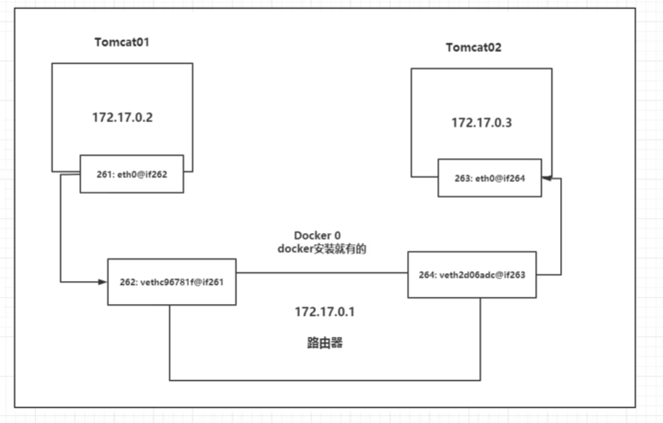
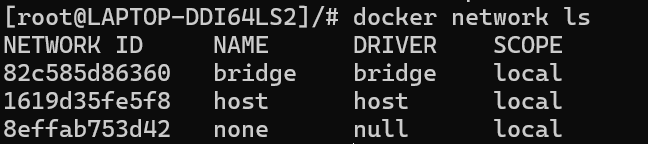
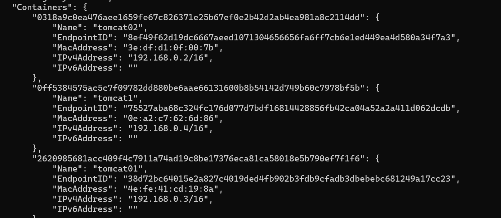

# Docker网络

1. 每启动一个docker容器，docker就会给容器分配一个ip，只要安装了docker，就会有一个网卡docker0，它是桥接模式的一种体现，使用的是veth-pair技术！
2. 默认情况下容器之间可以互相通信，容器可以与外部互联网通信，但是容器不能与宿主机直接通信（可以自定义网络绕过这一点），对于wsl来说，容器既不能与wsl2虚拟机通信，也不能与windows宿主机通信

~~~shell
# 我们发现每启动一个容器都会带来一对网卡，一个位于容器内部，一个位于宿主机内部
# veth-pair就是一对的虚拟设备接口，它们都是成对出现，两端分别连接不同的网络命名空间
# 正因为有这个特性，veth-pair充当一个桥梁，用于连接各种虚拟网络设备，常用与桥接网络模型
~~~

结论：tomcat01,tomcat02共用同一个路由器，docker0

所有容器不指定网络的情况下，都是docker0路由的，它会为容器分配一个可用的ip地址

## --link

>
>
>思考一个场景，我们编写了一个微服务，连接数据库需要使用ip地址，项目不重启，数据库ip发生了变化，希望可以直接通过名称来访问容器

~~~shell
#显然无法直接ping通
[root@LAPTOP-DDI64LS2]/# docker exec -it tomcat01 ping tomcat02
ping: tomcat02: Name or service not known

#通过--link就可以解决名字-ip问题
[root@LAPTOP-DDI64LS2]/# docker run -d -P --name tomcat03 --link tomcat02 tomcat:7.0
b7b9476d0e8ce3382b2e13db1ee17b19fc2fabcd96f832513e5d36fd2b6fd45e
[root@LAPTOP-DDI64LS2]/# docker exec -it tomcat03 ping tomcat02
PING tomcat02 (172.17.0.3) 56(84) bytes of data.
64 bytes from tomcat02 (172.17.0.3): icmp_seq=1 ttl=64 time=0.324 ms
64 bytes from tomcat02 (172.17.0.3): icmp_seq=2 ttl=64 time=0.116 ms
64 bytes from tomcat02 (172.17.0.3): icmp_seq=3 ttl=64 time=0.070 ms
64 bytes from tomcat02 (172.17.0.3): icmp_seq=4 ttl=64 time=0.137 ms
~~~

原理探究：

~~~shell
[root@LAPTOP-DDI64LS2]/# docker exec -it tomcat03 cat /etc/hosts
127.0.0.1       localhost
::1     localhost ip6-localhost ip6-loopback
fe00::  ip6-localnet
ff00::  ip6-mcastprefix
ff02::1 ip6-allnodes
ff02::2 ip6-allrouters
172.17.0.3      tomcat02 e6f52f6e34ca		#将容器名，ID自动解析成对应ip地址
172.17.0.4      b7b9476d0e8c
~~~

似乎同样无法实现ip-名称映射！！！现在docker同样不推荐使用--link，大多使用自定义网络

## 自定义网络

>
>
>查看所有docker网络

### 网络模式

1. bridge: 桥接 docker（默认）
2. none： 不配置网络
3. host： 与宿主机共享网络
4. container： 容器网络连接（用的少！局限大）

~~~shell
#直接启动（没有--net参数）的容器就和下面等价，默认使用bridge网络，docker0作为网关
[root@LAPTOP-DDI64LS2]/ docker run -d -P --name tomcat01 --net bridge tomcat:7.0

#docker0特点：默认，域名不能访问，--link可以打通连接（使用域名访问）

#自定义网络
# driver默认为bridge，必须指定子网掩码和网关
[root@LAPTOP-DDI64LS2]/ docker network create --driver bridge --subnet 192.168.0.0/16 --gateway 192.168.0.1 mynet
981a6ccd5dfa6eccd3cbdbb4147f5d1d510f819ca551273aab03ffb38074aafa
[root@LAPTOP-DDI64LS2]/ docker network ls
NETWORK ID     NAME      DRIVER    SCOPE
82c585d86360   bridge    bridge    local
1619d35fe5f8   host      host      local
981a6ccd5dfa   mynet     bridge    local
8effab753d42   none      null      local

#再次测试ping，发现可以通过名字ping通，且映射不是写死在hosts文件中的
[root@LAPTOP-DDI64LS2]/# docker exec -it tomcat02 ping 192.168.0.2
PING 192.168.0.2 (192.168.0.2) 56(84) bytes of data.
64 bytes from 192.168.0.2: icmp_seq=1 ttl=64 time=0.109 ms
64 bytes from 192.168.0.2: icmp_seq=2 ttl=64 time=0.139 ms
64 bytes from 192.168.0.2: icmp_seq=3 ttl=64 time=0.127 ms
64 bytes from 192.168.0.2: icmp_seq=4 ttl=64 time=0.065 ms
64 bytes from 192.168.0.2: icmp_seq=5 ttl=64 time=0.088 ms
64 bytes from 192.168.0.2: icmp_seq=6 ttl=64 time=0.124 ms
64 bytes from 192.168.0.2: icmp_seq=7 ttl=64 time=0.169 ms
^C
--- 192.168.0.2 ping statistics ---
7 packets transmitted, 7 received, 0% packet loss, time 136ms
rtt min/avg/max/mdev = 0.065/0.117/0.169/0.032 ms
[root@LAPTOP-DDI64LS2]/# docker exec -it tomcat02 cat /etc/hosts
127.0.0.1       localhost
::1     localhost ip6-localhost ip6-loopback
fe00::  ip6-localnet
ff00::  ip6-mcastprefix
ff02::1 ip6-allnodes
ff02::2 ip6-allrouters
192.168.0.3     0318a9c0ea47
~~~

使用docker network connect 网络名 容器名可以将一个容器添加到一个网络中，同样可以使用disconnect将容器从网络中删除，添加后就是在网络的Container配置中加入相应的容器信息

据此我们可以分析得出，一个容器可以在不同的网络中，并且在每个网络中拥有一个唯一的ip地址

## 实战：部署Redis集群

~~~shell
# shell脚本
docker network create redis --subnet 172.38.0.0/16

#通过脚本创还能6个redis配置
for port in {1..6}; \
do \
mkdir -p ./mydata/redis/node-${port}/conf
touch ./mydata/redis/node-${port}/conf/redis.conf
cat << EOF > ./mydata/redis/node-${port}/conf/redis.conf
port 6379
bind 0.0.0.0
cluster-enabled yes
cluster-config-file nodes.conf
cluster-node-timeout 5000
cluster-announce-ip 172.38.0.1${port}
cluster-announce-port 6379
cluster-announce-bus-port 16379
appendonly yes
EOF
done

# 启动redis容器
for i in {1..6}; do
  client_port=$((6370 + i))
  bus_port=$((16370 + i))
  
  docker run -p ${client_port}:6379 -p ${bus_port}:16379 --name redis-${i} \
    -v ./mydata/redis/node-${i}/data:/data \
    -v ./mydata/redis/node-${i}/conf/redis.conf:/etc/redis/redis.conf \
    -d --net redis --ip 172.38.0.1${i} redis:7.4 redis-server /etc/redis/redis.conf
done

# 最后在redis容器的、data目录下使用以下命令创建集群
redis-cli --cluster create 172.38.0.11:6379 172.38.0.12:6379 172.38.0.13:6379 172.38.0.14:6379 172.38.0.15:6379 172.38.0.16:6379 --cluster-replicas 1
~~~

