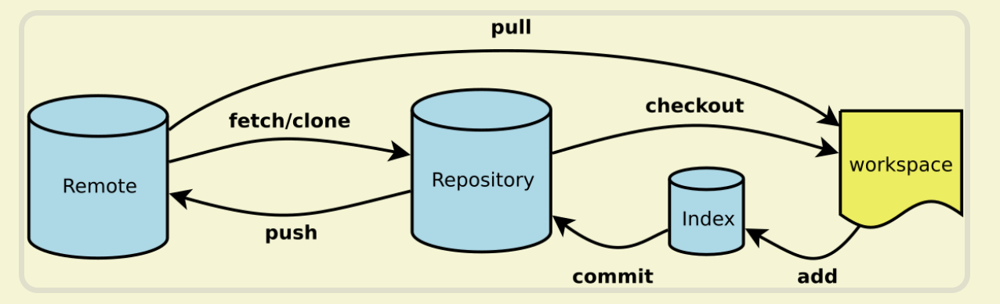
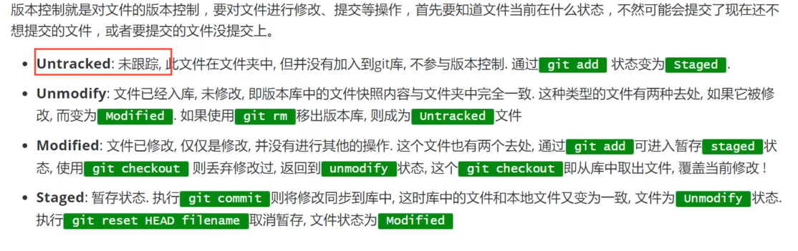
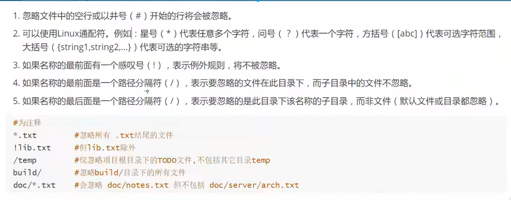
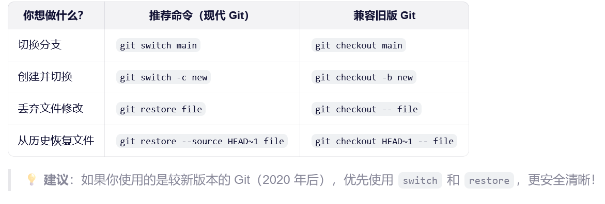
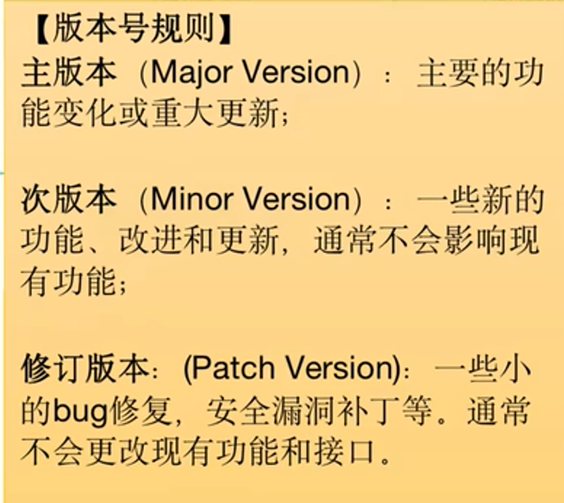

# Git

相关博客：https://www.ruanyifeng.com/blog/2015/12/git-cheat-sheet.html

## 命令大全

~~~shell
git init                                                  # 初始化本地git仓库（创建新仓库）
git config --global user.name "xxx"                       # 配置用户名
git config --global user.email "xxx@xxx.com"              # 配置邮件
git config --global color.ui true                         # git status等命令自动着色
git config --global color.status auto
git config --global color.diff auto
git config --global color.branch auto
git config --global color.interactive auto
git config --global --unset http.proxy                    # remove  proxy configuration on git
git clone git+ssh://git@192.168.53.168/VT.git             # clone远程仓库
git status                                                # 查看当前版本状态（是否修改）
git add xyz                                               # 添加xyz文件至index
git add .                                                 # 增加当前子目录下所有更改过的文件至index
git commit -m 'xxx'                                       # 提交
git commit --amend -m 'xxx'                               # 合并上一次提交（用于反复修改）
git commit -am 'xxx'                                      # 将add和commit合为一步
git rm xxx                                                # 删除index中的文件
git rm -r *                                               # 递归删除
git log                                                   # 显示提交日志
git log -1                                                # 显示1行日志 -n为n行
git log -5
git log --stat                                            # 显示提交日志及相关变动文件
git log -p -m
git show dfb02e6e4f2f7b573337763e5c0013802e392818         # 显示某个提交的详细内容
git show dfb02                                            # 可只用commitid的前几位
git show HEAD                                             # 显示HEAD提交日志
git show HEAD^                                            # 显示HEAD的父（上一个版本）的提交日志 ^^为上两个版本 ^5为上5个版本
git tag                                                   # 显示已存在的tag
git tag -a v2.0 -m 'xxx'                                  # 增加v2.0的tag
git show v2.0                                             # 显示v2.0的日志及详细内容
git log v2.0                                              # 显示v2.0的日志
git diff                                                  # 显示所有未添加至index的变更
git diff --cached                                         # 显示所有已添加index但还未commit的变更
git diff HEAD^                                            # 比较与上一个版本的差异
git diff HEAD -- ./lib                                    # 比较与HEAD版本lib目录的差异
git diff origin/master..master                            # 比较远程分支master上有本地分支master上没有的
git diff origin/master..master --stat                     # 只显示差异的文件，不显示具体内容
git remote add origin git+ssh://git@192.168.53.168/VT.git # 增加远程定义（用于push/pull/fetch）
git branch                                                # 显示本地分支
git branch --contains 50089                               # 显示包含提交50089的分支
git branch -a                                             # 显示所有分支
git branch -r                                             # 显示所有原创分支
git branch --merged                                       # 显示所有已合并到当前分支的分支
git branch --no-merged                                    # 显示所有未合并到当前分支的分支
git branch -m master master_copy                          # 本地分支改名
git checkout -b master_copy                               # 从当前分支创建新分支master_copy并检出
git checkout -b master master_copy                        # 上面的完整版
git checkout features/performance                         # 检出已存在的features/performance分支
git checkout --track hotfixes/BJVEP933                    # 检出远程分支hotfixes/BJVEP933并创建本地跟踪分支
git checkout v2.0                                         # 检出版本v2.0
git checkout -b devel origin/develop                      # 从远程分支develop创建新本地分支devel并检出
git checkout -- README                                    # 检出head版本的README文件（可用于修改错误回退）
git merge origin/master                                   # 合并远程master分支至当前分支
git cherry-pick ff44785404a8e                             # 合并提交ff44785404a8e的修改
git push origin master                                    # 将当前分支push到远程master分支
git push origin :hotfixes/BJVEP933                        # 删除远程仓库的hotfixes/BJVEP933分支
git push --tags                                           # 把所有tag推送到远程仓库
git fetch                                                 # 获取所有远程分支（不更新本地分支，另需merge）
git fetch --prune                                         # 获取所有原创分支并清除服务器上已删掉的分支
git pull origin master                                    # 获取远程分支master并merge到当前分支
git mv README README2                                     # 重命名文件README为README2
git reset --hard HEAD                                     # 将当前版本重置为HEAD（通常用于merge失败回退）
git rebase
git branch -d hotfixes/BJVEP933                           # 删除分支hotfixes/BJVEP933（本分支修改已合并到其他分支）
git branch -D hotfixes/BJVEP933                           # 强制删除分支hotfixes/BJVEP933
git ls-files                                              # 列出git index包含的文件
git show-branch                                           # 图示当前分支历史
git show-branch --all                                     # 图示所有分支历史
git whatchanged                                           # 显示提交历史对应的文件修改
git revert dfb02e6e4f2f7b573337763e5c0013802e392818       # 撤销提交dfb02e6e4f2f7b573337763e5c0013802e392818
git ls-tree HEAD                                          # 内部命令：显示某个git对象
git rev-parse v2.0                                        # 内部命令：显示某个ref对于的SHA1 HASH
git reflog                                                # 显示所有提交，包括孤立节点
git show HEAD@{5}
git show master@{yesterday}                               # 显示master分支昨天的状态
git log --pretty=format:'%h %s' --graph                   # 图示提交日志
git show HEAD~3
git show -s --pretty=raw 2be7fcb476
git stash                                                 # 暂存当前修改，将所有至为HEAD状态
git stash list                                            # 查看所有暂存
git stash show -p stash@{0}                               # 参考第一次暂存
git stash apply stash@{0}                                 # 应用第一次暂存
git grep "delete from"                                    # 文件中搜索文本“delete from”
git grep -e '#define' --and -e SORT_DIRENT
git gc
git fsck
~~~

.gitignore文件：

github提供的官方模板：

- 网址：https://github.com/github/gitignore#

- ssh：git@github.com:github/gitignore.git

应该忽略哪些文件：

- 系统或软件自动生成的文件
- 编译产生的中间文件和结果文件，例如java的.class，c的.o文件
- 运行时生成的日志我呢间、缓存文件、临时文件
- 带有敏感信息的文件

|      规则       |                             含义                             |
| :-------------: | :----------------------------------------------------------: |
|      #开头      |                        注释，会被忽略                        |
|      空行       |                       忽略，提升可读性                       |
|      *.log      |                       忽略所有.log文件                       |
|      /temp      | /开头则表示根目录，该规则表示忽略根目录下的temp文件或temp目录 |
|      temp/      |     /结尾表示这是一个目录，规则表示忽略所有叫temp的目录      |
|    ！one.txt    |          ！开头表示不忽略，该规则表示不忽略one.txt           |
|     debug*      |               忽略所有以debug开头的文件或目录                |
|   logs/*.txt    |       忽略logs目录下所有.txt文件，但不会忽略子目录中的       |
| logs/\** /*.log |             忽略logs目录及所有子目录下的.log文件             |
|   \** /*.log    |         忽略所有.log文件，**表示匹配任意层级的子目录         |

配置ssh公钥：

1. 进入~/.ssh目录
2. `ssh-keygen -t rsa -b  4096 -C "email@wxample.com"` ,-t指定秘钥类型为rsa（目前最通用），也可以使用`-t ed25519`（更现代、更安全），-b指定秘钥长度为4096位，比默认的2048更安全，-C添加注释（通常使用邮箱），方便识别秘钥用途。
3. 如果是首次配置，则输入文件名时直接回车即可，将会生成id_rsa和id_rsa.pub文件。如果不是首次配置，则一定要手动输入文件名，否则会覆盖之前的秘钥文件。

**git reset**的三种参数：

- --soft：回退到之前某个版本，保留工作区和暂存区的所有内容，简而言之，只会更改git log查看的内容，并将之后提交的文件的状态设置为untraced
- --hard：回退版本，丢弃工作区和暂存区的所有内容，就是完全回退到之前的版本，清除所有之后发生的修改
- --mixed：回退版本，只保留工作区的修改内容

soft和mixed参数主要是当连续提交了多个版本，又觉得这些提交没多大意义则可以考虑回退版本再合并为一次提交。

**注意：**如果不小心使用hard参数误回退了，可以使用git reflog参数找到回退之前的版本号，再进行回退即可

**git diff**命令可以用来查看文件在工作区、暂存区、版本库之间的差异，还可以查看文件在两个特定版本之间的差异，或者文件在两个分支之间的差异。

默认情况下，即后面没有参数时，比较工作区和暂存区之间的差异，只能比较已经添加到暂存区文件和工作区文件的差异，无法提示哪些文件没有在暂存区中。

其他参数：

- --cached：比较暂存区与head版本之间的差异，可以在后面指定版本，如head^
- head： 比较工作区与head版本之间的差异
- commit1 commit2：比较两个commit版本之间的差异
- branch1 branch2：比较两个分支之间的差异

**删除文件**的两种方式：

1. 先使用rm将文件从工作区中删除，然后使用git add filename命令将暂存区中的文件也删除
2. 使用git rm filename可以将文件从工作区和暂存区中全部移除
   - git rm --cached filename：将文件从暂存区删除，但保留在工作区
   - git rm -r folder：递归删除某个目录下的所有文件或文件夹
3. 最后提交即可

**关联本地仓库和远程仓库：**

~~~shell
# origin即远程仓库默认别名，当然也可以自定义
git remote add orgin git@github.com:username/repository_name.git 

# 查看当前仓库对应远程仓库的别名和地址
git remote -v

# 修改当前分支名字为main，为了方便后面的映射
git branch -M main

# 将本地仓库的某个分支推送到远程仓库的某个分支，如果两个分支名相同则可以只写一个
# 如果没将本地分支更名的话应该是：git push -u origin master:main
git push -u origin main

# 拉取远程仓库的内容
git pull <远程仓库名> <远程分支名>:<本地分支名>
~~~

**分支：**

- 查看分支列表：git branch
- 创建分支：git branch branch-name
- 切换分支：
  - git checkout branch-name，也用来检出版本，检出暂存区的文件并丢弃工作区文件
  - git switch branch-name（推荐）
- 合并分支：身处主干分支，git merge branch-name，命令后跟要被合并的分支
- 删除分支：
  - git branch -d name，删除已经完成合并的分支
  - git branch -D name，删除尚未合并的分支
- 创建并切换分支：git switch -c name

git checkout命令：

**合并冲突**：

​	如果合并时遇到冲突，需要手动在主干分支中将发生冲突的文件进行修改，然后提交即可自动完成合并，可以使用`git mergetool`进入冲突解决界面，然后使用`diffget i`来选择某个版本，1表示当前分支，2表示父节点分支，3表示被合并的分支。也可以使用`git merge --abort`来中断此次合并。

rebase**变基**（危险，不推荐使用）：

- 在当前分支上执行git rebase main，则当前分支的从共同祖先到最后的提交记录就会嫁接到main分支最后一次提交之后，成为main分支的两次提交，在main分支也可以变基到其他分支，同理。最后分支不是汇合，而是直接变成一条直线。

使用git tag命令标记版本号：

x.x.x：一次表示主版本，次版本，修订版本

**gitflow**：核心分支（长期分支）：主分支(main)和开发分支(development)，此外有基于主分支的bug修复分支（hotfix），基于开发分支的功能分支（feature或feat)以及预发布分支（release）

 **github flow**:核心分支（main），以及成员无法直接在主分支上进行合并，必须先发起pull request经评审后才能合并到主分支