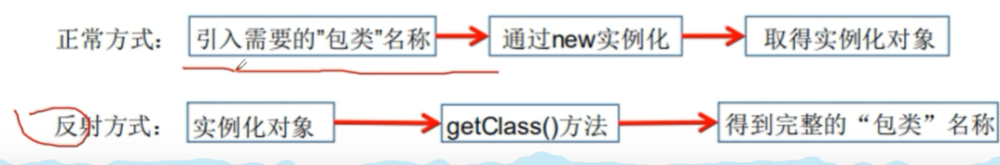

# Java反射

动态语言：在运行时可以改变其结构的语言：例如新的函数、对象甚至代码可以被引进，已有的函数可以被删除或是其他结构的变化，通俗来说就是在运行时代码可以根据某些条件改编自身结构。例如：Object-C、C#、JavaScript、PHP、Python

静态语言：与动态语言相对的，在运行时结构不可以改变的语言，如Java、C、C++

**反射机制**允许程序在执行期借助Reflection API取得任何类的内部信息，并能直接操作任意对象的内部属性及方法

当一个类被加载后，在堆内存的方法区就产生了一个对应的Class类型的对象（一个类只有一个Class对象），该对象包含了完整的类的结果信息

反射提供的功能：

- 在运行时判断任意一个对象所属的类
- 在运行时构造任意一个类的对象
- 在运行时判断任意一个类所具有的成员变量和方法
- 在运行时获取泛型信息
- 在运行时调用任意一个对象的成员变量和方法
- 在运行时处理注解
- 生成动态代理
- ...

优点：可以实现动态创建对象和编译，具有极大的灵活性

缺点：性能慢于正常方式

反射相关的主要API：

- java.lang.Class：代表一个类
- java.lang.reflect.Method：代表类的方法
- java.lang.reflect.Filed：代表类的成员变量
- java.lang.reflect.Contructor：代表类的构造器

class类的常用方法：

- ClassforName，返回指定类名的Class对象
- newInstance，返回Class对象的一个实例（缺省构造函数构造
- getName，返回该class对象的名称
- getSupperClass，获取父类的class对象
- getinterfaces，返回当前class对象的接口
- getClassLoader，返回该类的类加载器
- getConstructors，返回包含Constructor对象的数组
- getMethod（String name， Class T），返回一个Method对象
- getDeclaredFileds，返回Filed对象的数组

获取Class类的实例：

- Person.class，如果知道类名，可以直接获取
- person.getClass()，通过类的对象直接获取
- 通过Class.forName()获得，需要类的完整类名
- 基本内置类型的包装类的属性TYPE，Interger.TYPE

拥有Class对象的类型：

- class：外部类，成员（成员内部类，静态内部类），局部内部类，匿名内部类
- interface：接口
- []：数组
- enum：枚举
- annotation：注解
- primitive type：基本数据类型
- void