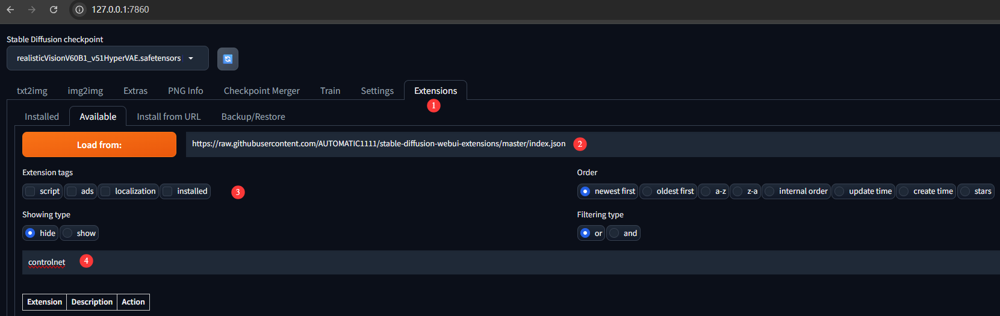

# Markdown语法

## 标题

#后面跟空格，内容，多少个#代表是几级标题

## 字体样式

**加粗**

*斜体*

***加粗斜体***

==变黄==

~~中划线~~

<u>下划线</u>

## 引用

>
>
>欢迎成为一名程序员！

## 分割线

---

***

## 图片

## 超链接

[点击跳转](https://www.bilibili.com/)

## 列表

### 有序列表

1. A

2. B
3. C

### 无序列表

- A
- B
- C

## 表格

|      |      |      |
| ---- | ---- | ---- |
|      |      |      |
|      |      |      |
|      |      |      |

## 代码

`内联代码`

~~~java

~~~

