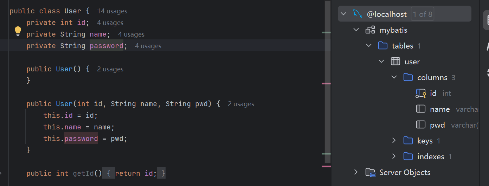
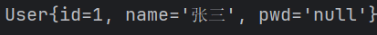
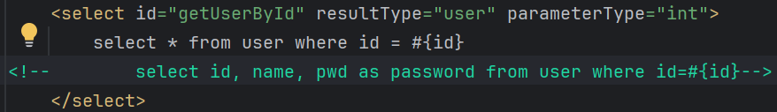
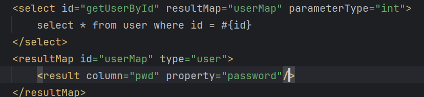

## Mybatis解决实体类与数据库字段不一致问题

### 成因

Mybatis的核心工作之一就是将数据库查询返回的ResultSet（结果集）自动映射到定义的java实体类对象中，但实体类的字段名和数据库的类名不一致时， Mybatis的默认映射器就不知道将哪个列赋值给哪个字段， 从而导致映射失败， 对应字段值就为默认值

默认映射规则：根据查询结果列名寻找对象中同名的属性，并通过对应的setter方法进行赋值

同样的，当实体类对应字段没有setter方法时，赋值时同样为默认值

### 解决方法

 **1.查询时使用as为列起别名**

其实这种方法时ResultMap在幕后为我们创建了一个映射

**2.结果集映射**

select语句中的ResultMap的值为对应映射ResultMap标签中的id， 映射的对象为type，此处使用了别名，最后将不同的字段名进行映射即可

- ResultMap是Mybatis中最强大的元素
- ResultMap的设计思想是， 对于简单的语句根本不需要配置显示的结果映射，只要描述他们的关系即可