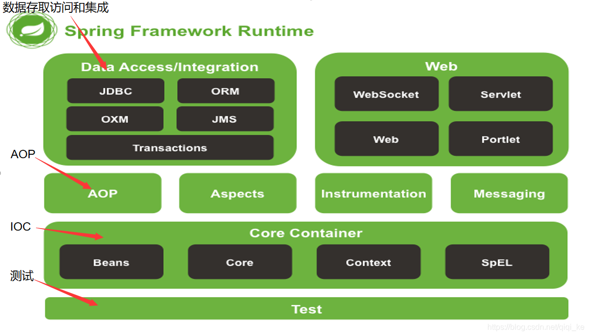
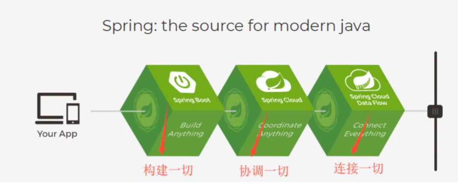
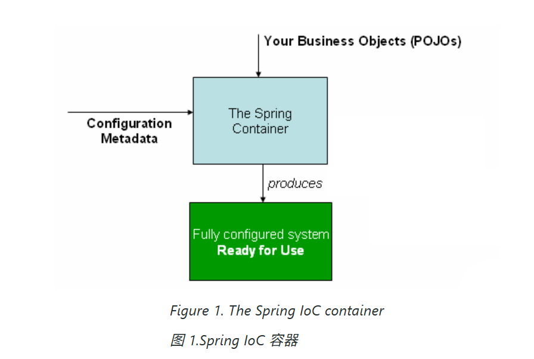
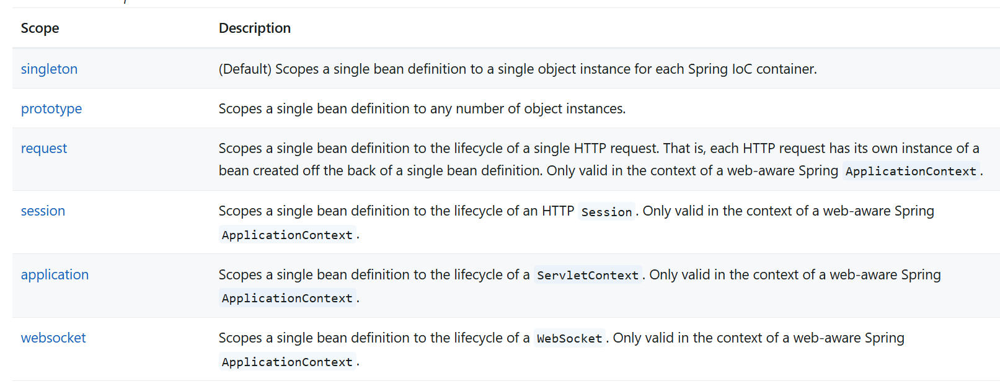
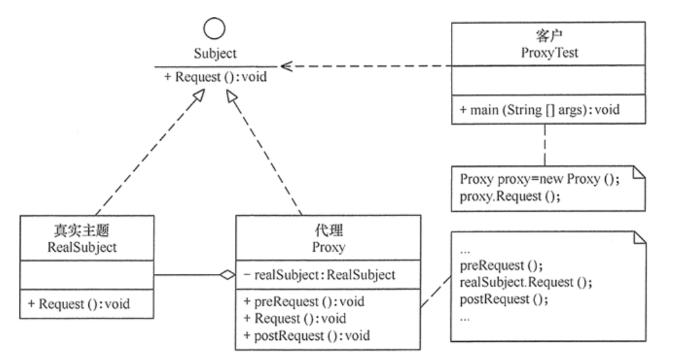
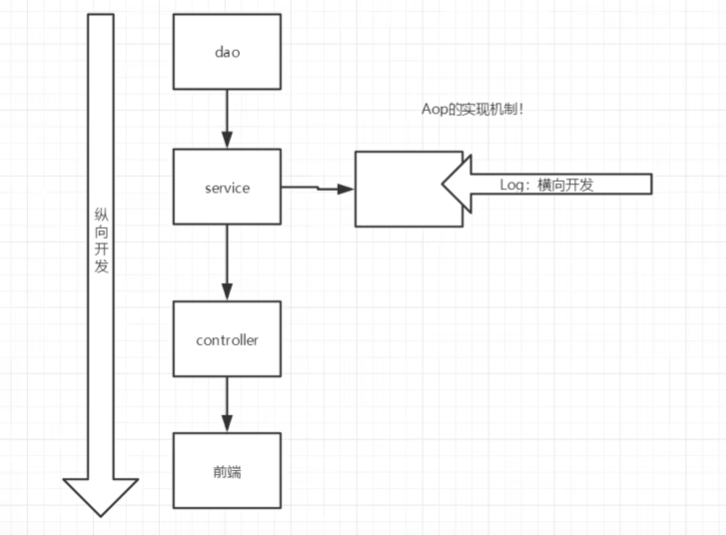
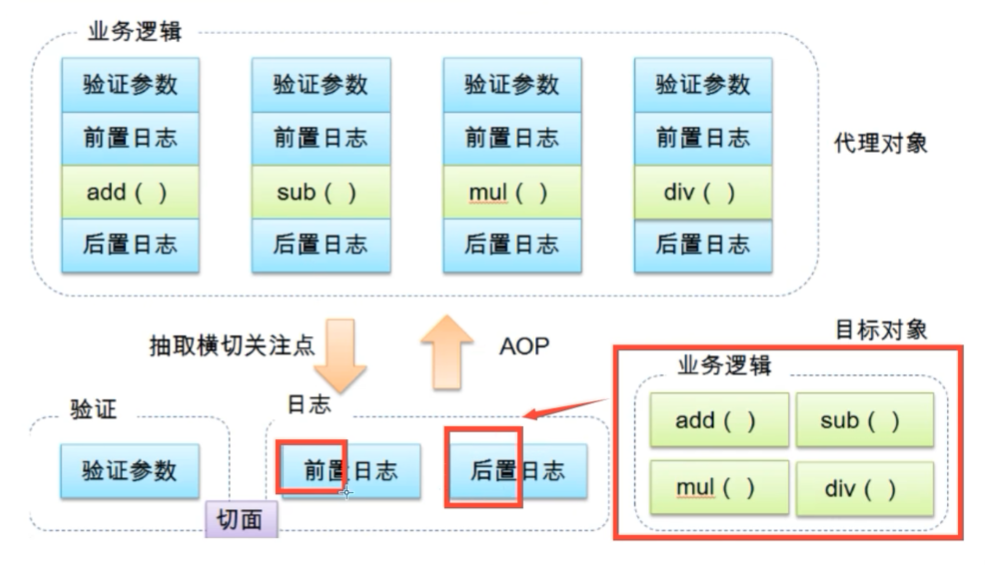
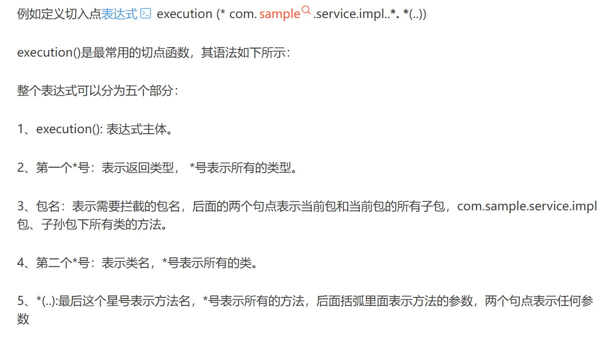

# Spring


## 1、介绍


### 1.1、简介

- 2002年首次推出了Spring框架的出行：interface21框架！
- Spring框架以interface21为基础，经过重新设计并不断丰富其内涵，于2004年3月24日发布了1.0版本
- spring理念：使现有的技术更加容易使用，简化企业应用开发，本身是一个大杂烩

文档下载地址：https://repo1.maven.org/maven2/org/springframework/spring/

github地址： [GitHub - spring-projects/spring-framework: Spring Framework](https://github.com/spring-projects/spring-framework) 


~~~xml
<!-- https://mvnrepository.com/artifact/org.springframework/spring-webmvc -->
<dependency>
    <groupId>org.springframework</groupId>
    <artifactId>spring-webmvc</artifactId>
    <version>6.2.10</version>
</dependency>
~~~

~~~xml
<?xml version="1.0" encoding="UTF-8"?>
<beans xmlns="http://www.springframework.org/schema/beans"
       xmlns:xsi="http://www.w3.org/2001/XMLSchema-instance"
       xsi:schemaLocation="http://www.springframework.org/schema/beans
		https://www.springframework.org/schema/beans/spring-beans.xsd">
    
</beans>
~~~


### 1.2、优点

- Spring是一个开源的框架（容器）
- Spring是一个轻量级的、非入侵式的框架
- 核心特点：控制反转（IOC）、面向切面编程（AOP）
- 支持事务的处理，对框架整合的支持


### 1.3、组成

 


### 1.4、扩展

 现代java的开发基本都是基于spring的开发

- Spring Boot：
  - 一个快速开发的脚手架
  - 基于SpringBoot可以快速的开发单个微服务
  - 约定大于配置！
- Sprint Cloud
  - Spring Cloud是基于Spring Boot实现的


弊端：发展了太久，违背了原来的理念导致配置十分繁琐，人称配置地狱


## 2 、IOC理论推导

1. UserDao接口
2. UserDaoImpl实现类
3. UserService业务接口
4. UserServiceImpl业务实现类


~~~java
public class UserServiceImpl implements UserService {
    private UserDao userDao = new UserDaoMysqlImpl();
    public void getUser() {
        userDao.getUser();
    }
}
~~~

使用上面这种方式灵活性太差，加入UserDao存在多个实现类，就必须根据用户需求修改原代码，代价高昂

~~~java
public class UserServiceImpl implements UserService {
    private UserDao userDao ;
    
    public void setUserDao(UserDao userDao) {
        this.userDao = userDao;
    }
    public void getUser() {
        setUserDao(new UserDaoMysqlImpl());
        userDao.getUser();
    }
}
~~~

使用set注入后，程序不再具有主动性，而是变成了被动的接收对象！

这种思想，从本质上解决了问题，程序猿不用再去管理对象的创建，系统的耦合性大大降低，程序猿可以更加专注于业务逻辑的实现上！这是IOC的原型！





### IOC本质

**控制反转IOC（Inversion Of Control）**是一种设计思想，**DI（依赖注入）**是实现IOC的一种方法。在没有IOC的程序中，我们使用面向对象编程，对象的创建和对象之间的依赖关系完全硬编码在程序中，对象的创建由程序自己控制，控制反转后将对象的创建转移给第三方，所谓控制反转也就是获取依赖对象的方式反转了。

控制反转是一种通过描述（XML文件或注解）并通过第三方生产或获取特定对象的方式，在Spring中实现控制反转的是IOC容器，其实现方法时依赖注入（Dependency Injection）。


## 3、IOC创建对象的方式

使用XML文件配置元信息：

~~~xml
<?xml version="1.0" encoding="UTF-8"?>
<beans xmlns="http://www.springframework.org/schema/beans"
       xmlns:xsi="http://www.w3.org/2001/XMLSchema-instance"
       xsi:schemaLocation="http://www.springframework.org/schema/beans
		https://www.springframework.org/schema/beans/spring-beans.xsd">

    <!--使用Spring来创还能对象，在Spring中这些都成为Bean
        类型 变量名 = new 类型（）

        id相当于变量名
        class指明创建的对象类型（全类名）
        property告知各字段的属性，使用ref可以引用之前创建的对象
        默认情况就是先使用无参构造创建对象，然后使用set方法，没有set方法或无参构造将会报错
    -->
    <bean id="hello" class="org.wuming.pojo.Hello">
        <property name="name" value="Spring"/>
    </bean>
    
    <!--使用有参构造器的几种形式-->
    
    <!--为对应下标的参数赋值-->
    <bean id="user" class="org.wuming.pojo.User">
        <constructor-arg index="0" value="wuming"/>
    </bean>
    
    <!--通过参数类型传递，必须所有参数类型均不同,不建议使用-->
    <bean id="user" class="org.wuming.pojo.User">
        <constructor-arg type="java.lang.String" value="wuming"/>
    </bean>
    
    <!--直接通过参数名赋值或传递引用-->
    <bean id="user" class="org.wuming.pojo.User">
        <constructor-arg name="name" value="wuming"/>
    </bean>

</beans>
~~~

~~~java
public void test() {
        //获取Spring的上下文对象，此处可以传递多个xml文件，获取context对象后所有bean已经被创建完成
        ApplicationContext context = new ClassPathXmlApplicationContext("beans.xml");
        //我们的对象现在都在Spring中管理了，现在要使用直接去里面取出来即可
        Hello hello = (Hello) context.getBean("hello");
        System.out.println(hello);
    }
~~~

到了现在，我们彻底不需要再程序中进行改动，要实现不同的操作只需要改动配置文件即可。目前IOC可以总结为：对象由Spring创建、管理、装配。


## 4、Spring配置


### 4.1、别名


```
<!--在beans.xml中为创建好的bean对象取别名，该对象除了通过id还可以通过别名获取-->
<alias name="user" alias="U"/>
```


### 4.2、bean的配置

~~~xml
    <!--
        id：bean对象的标识符，相当于变量名
        class：该对象对应的类的全限定名，包名+类名
        name：也是别名，可以无须额外配置alias，而且name更高级，可以同时取多个别名,可以使用多种分隔符，最常用的是逗号
    -->
    <bean id="userT" class="org.wuming.pojo.User" name="u1,u2 u3;u4">
        <property name="name" value="wuming2"/>
    </bean>
~~~


### 4.3、import

一般用于团队开发使用，可以将多个配置文件，导入合并为一个.

项目往往由多个人开发，每个人会负责不同类的开发，他们会分别创建相应的配置文件和类的对象，最后就可以使用import将所有人的配置文件合并，这样也方便针对性的修改和追责。最终配置文件约定叫applicationContext.xml。

 

## 5、依赖注入（DI）


### 5.1、构造器注入

已经说过了，利用`<constructor-arg ...>`

### 5.2、Set方式注入【重点】

- 依赖注入：Set注入！

  - 依赖：bean对象的创建依赖于容器
  - 注入：bean对象中的所有属性有容器来赋予

  

  复杂类型

  ~~~java
  package org.wuming.pojo;
  
  public class Address {
      private String address;
  
      public String getAddress() {
          return address;
      }
  
      public void setAddress(String address) {
          this.address = address;
      }
  }
  ~~~

  测试对象

  ~~~java
  package org.wuming.pojo;
  
  import java.util.*;
  
  public class Student {
      private String name;
      private Address address;
      private String[] books;
      private List<String> hobbies;
      private Map<String, String> card;
      private Set<String> games;
      private Properties info;
      private String wife;
  }
  ~~~

  applicationContext.xml配置

  ~~~xml
  <?xml version="1.0" encoding="UTF-8"?>
  <beans xmlns="http://www.springframework.org/schema/beans"
         xmlns:xsi="http://www.w3.org/2001/XMLSchema-instance"
         xsi:schemaLocation="http://www.springframework.org/schema/beans
  		https://www.springframework.org/schema/beans/spring-beans.xsd">
      <bean id="address" class="org.wuming.pojo.Address">
          <property name="address" value="China"/>
      </bean>
      <bean id="student" class="org.wuming.pojo.Student">
          <property name="name" value="wuming"/>
  
          <!--引用类型-->
          <property name="address" ref="address"/>
  
          <!--数组类型-->
          <property name="books">
              <array>
                  <value>红楼梦</value>
                  <value>西游记</value>
                  <value>三国演义</value>
                  <value>水浒传</value>
              </array>
  
          <!--集合类型-->
          </property>
          <property name="hobbies">
              <list>
                  <value>听歌</value>
                  <value>看电影</value>
                  <value>读小说</value>
              </list>
          </property>
  
          <!--map类型-->
          <property name="card">
              <map>
                  <entry key="身份证" value="123456789012345678"/>
                  <entry key="玉兰卡" value="12345678901"/>
              </map>
          </property>
  
          <!--set类型-->
          <property name="games">
              <set>
                  <value>王者荣耀</value>
                  <value>和平精英</value>
              </set>
          </property>
  
          <!--资源类型-->
          <property name="info">
              <props>
                  <prop key="age">18</prop>
                  <prop key="gender">男</prop>
              </props>
          </property>
  
          <!--空类型-->
          <property name="wife">
              <null/>
          </property>
      </bean>
  </beans>
  ~~~

  测试类

  ~~~java
  package org.wuming;
  
  import org.junit.Test;
  import org.springframework.context.ApplicationContext;
  import org.springframework.context.support.ClassPathXmlApplicationContext;
  import org.wuming.pojo.Student;
  
  public class CustomTest {
      @Test
      public void test1(){
          ApplicationContext context = new ClassPathXmlApplicationContext("applicationContext.xml");
          Student student = (Student) context.getBean("student");
          System.out.println(student);
      }
  }
  ~~~

  

### 5.3、拓展注入

可以使用p命名空间和c命名空间进行注入

- p：property，对应无参构造和set方法
- c：constructor，对应有参构造

使用p、c命名空间需要先引入：

- xmlns:p="http://www.springframework.org/schema/p"
- xmlns:c="http://www.springframework.org/schema/c"

~~~xml
<?xml version="1.0" encoding="UTF-8"?>
<beans xmlns="http://www.springframework.org/schema/beans"
       xmlns:xsi="http://www.w3.org/2001/XMLSchema-instance"
       xmlns:p="http://www.springframework.org/schema/p"
       xmlns:c="http://www.springframework.org/schema/c"
       xsi:schemaLocation="http://www.springframework.org/schema/beans
		https://www.springframework.org/schema/beans/spring-beans.xsd">

<!--    p命名空间注入，直接注入属性的值property-->
    <bean id="user" class="org.wuming.pojo.User" p:name="wuming" p:age="18"/>

<!--    c命名空间注入，通过构造器注入：constructor-->
    <bean id="user2" class="org.wuming.pojo.User" c:name="wuming" c:age="20"/>
</beans>
~~~

需要注意的是，要使用c命名空间有更严格的限制

~~~java
	@Test
    public void test(){
        Constructor<?>[] constructors = User.class.getConstructors();
        for (Constructor<?> constructor : constructors) {
            Parameter[] parameters = constructor.getParameters();
            for (Parameter param : parameters) {
                System.out.println("参数名: " + param.getName());
            }
        }
    }

	//测试结果如下
	//参数名: arg0, \n 参数名: arg1
~~~

因此必须在maven中配置编译时保留参数名称信息才能使用name和age（无法使用args0和args1作为参数）

~~~xml
<plugin>
    <groupId>org.apache.maven.plugins</groupId>
    <artifactId>maven-compiler-plugin</artifactId>
    <version>3.8.1</version>
    <configuration>
        <source>8</source>
        <target>8</target>
        <compilerArgs>
            <arg>-parameters</arg>
        </compilerArgs>
    </configuration>
</plugin>
~~~

或者可以使用其他方式：

~~~xml
    <bean id="user2" class="org.wuming.pojo.User" c:_0="wuming" c:_1="20"/>
~~~


### 5.4、bean的作用域

在bean标签中指定scope即可



- singleton：单例模式（默认实现）
- prototype：原型模式，每次取出都将创建一个新的对象
- 其余的request、session、application、websocket都只在web开发中使用到


## 6、Bean的自动装配

自动装配式Spring满足bean依赖的一种方式！Spring会在上下文中自动寻找并自动给bean装配助兴


在Spring中有三种装配属性的方式

1. 在xml中显式地配置
2. 在java中显式地配置
3. 隐式的自动装配【重要】


### 6.1、测试

环境配置

~~~java
package org.wuming.pojo;

public class Cat {
    public void shout(){
        System.out.println("mia u ~");
    }
}
~~~

~~~java
package org.wuming.pojo;

public class Dog {
    public void shout(){
        System.out.println("woof ~");
    }
}
~~~

~~~java
package org.wuming.pojo;

public class People {
    private Dog dog;
    private Cat cat;
    private String name;

    public Dog getDog() {
        return dog;
    }

    public void setDog(Dog dog) {
        this.dog = dog;
    }

    public Cat getCat() {
        return cat;
    }

    public void setCat(Cat cat) {
        this.cat = cat;
    }

    public String getName() {
        return name;
    }

    public void setName(String name) {
        this.name = name;
    }
}

~~~


### 6.2、自动装配的方式

~~~xml
 	<bean id="cat" class="org.wuming.pojo.Cat"/>
    <bean id="dog" class="org.wuming.pojo.Dog"/>

    <!--
        byName:通过自己对象的set方法后面的小写名称，在容器上下文中自动查找对应的beanid，必须保证完全相同
        byType：通过自己对象的属性类型，在容器上鞋问中自动查找对应类型的bean对象，但是如果存在多个相同类型的对象会报错
    -->
    <bean id="people" class="org.wuming.pojo.People" autowire="byName">
        <property name="name" value="wuming"/>
    </bean>
~~~


### 6.3、使用注解实现自动装配

要使用注解须知：

1. 导入约束：xmlns:context="http://www.springframework.org/schema/context"
2. 导入注解的支持：<context:annotation-config/>

~~~xml
<!--导入支持后可以使用几乎所有注解而不是仅仅autowired-->
<?xml version="1.0" encoding="UTF-8"?>
<beans xmlns="http://www.springframework.org/schema/beans"
	xmlns:xsi="http://www.w3.org/2001/XMLSchema-instance"
	xmlns:context="http://www.springframework.org/schema/context"
	xsi:schemaLocation="http://www.springframework.org/schema/beans
		https://www.springframework.org/schema/beans/spring-beans.xsd
		http://www.springframework.org/schema/context
		https://www.springframework.org/schema/context/spring-context.xsd">

	<context:annotation-config/>

</beans>
~~~


**@Autowired**：

- 一般放在需要自动装配的属性或set方法（对象作为参数）上
- 使用Autowired可以让我们不用编写set方法，前提是这个自动装配的属性要在IOC容器中能找到相应的对象
- Autowired自动装配规则，首先byType，其次byName
- Autowired中有一个参数required参数默认为true，可以显式定义为false表明该属性可以为null
- 可以配合@Qualifier（value=“beanid”）使用，在存在多个同类型对象时指定装配对象的id，但是此时beanid将成为唯一装配条件，只有beanid相符的才能被装配，没有则报错

~~~java
@Nullable  标记这个字段可以为null，可以作用在方法，属性，参数上
~~~

~~~java
public @interface Autowired {

	/**
	 * Declares whether the annotated dependency is required.
	 * <p>Defaults to {@code true}.
	 */
	boolean required() default true;

}
~~~

~~~java
@Autowired
@Qualifier(value = "dog222")
private Dog dog;
~~~

~~~xml
<bean id="dog222" class="org.wuming.pojo.Dog"/>
<bean id="dog333" class="org.wuming.pojo.Dog"/>
~~~


## 7、使用注解开发

在Spring4之后，要使用注解开发，必须要导入aop的包，导入context约束，增加注解支持

~~~xml
<?xml version="1.0" encoding="UTF-8"?>
<beans xmlns="http://www.springframework.org/schema/beans"
	xmlns:xsi="http://www.w3.org/2001/XMLSchema-instance"
	xmlns:context="http://www.springframework.org/schema/context"
	xsi:schemaLocation="http://www.springframework.org/schema/beans
		https://www.springframework.org/schema/beans/spring-beans.xsd
		http://www.springframework.org/schema/context
		https://www.springframework.org/schema/context/spring-context.xsd">

	<context:annotation-config/>

</beans>
~~~


1. bean

~~~xml
<!--指定要扫描的包，该包下的组件注解将会生效-->
<context:component-scan base-package="org.wuming.pojo"/>
~~~

~~~java
//与上面的配置搭配使用等价于配置文件中的<bean id="user" class="org.wuming.pojo.User"/>
//id默认为类名首字母小写
@Component
public class User {
    public String name;
}
~~~

2. 属性如何注入

~~~java
@Component
public class User {
    //相当于<property name="name" value="wuming"/>
    @Value("wuming")
    public String name;
}
//这两种都能成功注入
@Component
public class User {
    public String name;
    
    @Value("wuming")
    public void setName(String name) {
        this.name = name;
    }
}
~~~


3. 衍生的注解

   @Component有几个衍生注解，在web开发中，会按照mvc三层架构分层：

   - dao	[@Repository]
   - service  [@Service]
   - controller  [@Controller]

   这四个注解的功能是相同的，都代表将某个类注册到Spring容器中

4. 自动装配

5. 作用域

   ~~~
   @Scope("singleton")		//singleton可以替换为其他作用域参数
   ~~~

6. 小结

   xml与注解：

   - xml更加万能，适用于任何场合！维护简单方便
   - 注解不是自己类使用不了，维护相对复杂

   最佳实践：

   - xml用于创建bean
   - 注解用于属性的注入
   - 在使用时只需要注意一个问题：让注解生效要导入支持并扫描相应包下的组件


## 8、使用Java的方式配置Spring

现在尝试完全不适用Spring的xml配置，全权交给Java来做！

JavaConfig是Spring的一个项目，在Spring4后成为了核心项目


实体类

~~~java
package org.wuming.pojo;

import org.springframework.beans.factory.annotation.Autowired;
import org.springframework.beans.factory.annotation.Value;

public class User {
    private String name;
    @Autowired(required = false)
    private User user;

    public String getName() {
        return name;
    }

    @Value("wuming")
    public void setName(String name) {
        this.name = name;
    }

    @Override
    public String toString() {
        return "User{" +
                "name='" + name + '\'' +
                '}';
    }
}
~~~


配置类

~~~java
package org.wuming.config;

import org.springframework.beans.factory.annotation.Autowired;
import org.springframework.context.annotation.Bean;
import org.springframework.context.annotation.ComponentScan;
import org.springframework.context.annotation.Configuration;
import org.wuming.pojo.User;


//Configuration本质上也是一个Component
//使用这个注解会将该类注册到Spring容器中
//Configuration就代表这是一个配置类，功能等价与之前的beans.xml
@Configuration
//@ComponentScan("org.wuming.pojo")
public class Config {

    /*
    * @Bean就相当于注册bean
    * 方法名相当于bean对象的id
    * 返回值相当于bean对象的类
    * */
    @Bean
    public User getUser(){
        return new User();
    }
}

package org.wuming.config;

import org.springframework.context.annotation.Configuration;
import org.springframework.context.annotation.Import;

@Configuration
//可以使用@Import引入其他配置类，类似配置文件中的import标签
@Import({Config2.class})
public class Config2 {
}
~~~


测试类

~~~java
package org.wuming;

import org.junit.Test;
import org.springframework.context.ApplicationContext;
import org.springframework.context.annotation.AnnotationConfigApplicationContext;
import org.wuming.config.Config;
import org.wuming.pojo.User;

public class CustomTest {
    @Test
    public void test(){
        //如果完全使用了配置类的方式去做，我们就只能通过AnnotationConfig上下文来获取容器
        ApplicationContext context = new AnnotationConfigApplicationContext(Config.class);
        User user = context.getBean("getUser", User.class);
        System.out.println(user);
        User user1 = context.getBean("getUser", User.class);
        System.out.println(user1 == user);	//true，说明还是单例模式
    }
}
~~~


## 9、代理模式

为什么要学习代理模式？因为这就是SpringAOP的底层！【SpringAOP和SpringMVC】

代理模式的分类：

- 静态代理
- 动态代理





### 9.1、静态代理

角色分析：

- 抽象角色：一般使用接口或抽象类
- 真实角色：被代理角色
- 代理角色：代理真实角色，代理后我们一般会做一些附属操作
- 客户：访问代理对象的人

代码步骤：

- 接口或抽象类

~~~java
package org.wuming;

//出租房屋
public interface Rent {
    void rent();
}
~~~


- 真实角色

~~~java
package org.wuming;

//房东
public class Host implements Rent {
    public void rent(){
        System.out.println("房东将房子租给了你");
    }
}
~~~


- 代理角色

~~~java
package org.wuming;

//中介，帮房东出租房屋
public class Proxy implements Rent {
    private Host host;

    public Proxy(Host host) {
        this.host = host;
    }

    public void rent() {
        seeHouse();
        sign();
        host.rent();
    }

    //看房
    public void seeHouse(){
        System.out.println("中介带你看房");
    }

    public void sign(){
        System.out.println("签合同");
    }
}
~~~


- 客户端访问代理角色

~~~java
package org.wuming;

public class Client {
    public static void main(String[] args) {
        //房东要出租房屋,但是不想太麻烦
        Host host = new Host();
        //代理，代理角色一般有一些附属操作
        //不用面对房东，直接找中介租房即可
        new Proxy(host).rent();
    }
}
~~~


代理模式的好处：

- 使真实角色的操作更加纯粹，可以更专注于分内之事，不用取去关注公共业务
- 公共业务交给了代理角色，实现了业务的分工
- 公共业务发生扩展的时候，方便集中

缺点：

- 一个真实角色就会产生一个代理角色，代码量会增加，开发变慢





### 9.2、动态代理

- 动态代理和静态代理角色相同

- 动态代理的代理类是动态生成的，不是我们写好的

- 动态代理分为两大类：基于接口的动态代理，基于类的动态代理

  - 基于接口---JDK 动态代理
  - 基于类：cglib
  - java字节码实现：javassist

  需要了解两个类：**Proxy**、**InvokationHandler**

代理类模版

~~~java
package org.wuming.demo04;

import java.lang.reflect.InvocationHandler;
import java.lang.reflect.Method;
import java.lang.reflect.Proxy;

public class ProxyInvocationHandler implements InvocationHandler {

    private Object target;

    public void setTarget(Object target) {
        this.target = target;
    }

    public Object getProxy(){
        return Proxy.newProxyInstance(this.getClass().getClassLoader(), target.getClass().getInterfaces(), this);
    }
    @Override
    public Object invoke(Object proxy, Method method, Object[] args) throws Throwable {
        log(method.getName());
        //可以在这里添加附属操作，类似日志之类的
        Object result = method.invoke(target, args);
        return result;
    }

    public void additional_op(){
        //TODO
    }
    public void log(String msg){
        System.out.println("执行了"+msg+"方法");
    }

}
~~~

测试

~~~java
package org.wuming.demo04;

import org.wuming.demo2.UserService;
import org.wuming.demo2.UserServiceImpl;

public class Client {
    public static void main(String[] args) {
        UserService userService = new UserServiceImpl();
        ProxyInvocationHandler ph = new ProxyInvocationHandler();
        ph.setTarget(userService);

        UserService proxy = (UserService) ph.getProxy();
        proxy.add();
    }
}
~~~


动态代理的优点：

- 兼顾静态代理的所有优点
- 一个动态代理类代理的是一个接口，一般对应一类业务
- 一个动态代理类可以代理多个类，只要实现了同一个接口


## 10、AOP

AOP（Aspect Oriented Programming）意为：面向切面编程，通过预编译方式和运行期间动态代理实现程序功能的统一维护的一种技术。AOP是OOP的延续，是软件开发中的一个热点，也是Spring框架中的一个重要内容，是函数式编程的衍生泛型。利用AOP可以对业务逻辑的各个部分进行隔离，从而使得业务逻辑各部分之间的耦合度降低，提高程序的可重用性，同时提高了开发的效率。



### 10.1、AOP在Spring中的作用

提供声明式事务；允许用户自定义切面

关键词：

- 横切关注点：跨越应用程序多个模块的方法或功能。即使，与业务逻辑无关的，但是人需要关注的部分，如日志、缓存、安全、事务等等...
- 切面（ASPECT）：横切关注点被模块化的特殊对象，它是一个类
- 通知（Advice）：切面必须要完成的工作，它是类中的一个方法
- 目标（Target）：被通知的对象
- 代理（Proxy）：向目标对象应用通知之后创建的对象
- 切入点（PointCut）：切面通知执行的地点的定义
- 连接点（JointPoint）：与切入点匹配的执行点


在SpringAOP中，通过Advice定义横切逻辑，Spring中支持5中Advice


即AOP在不改变原有代码的情况下，去增加新的功能


### 10.2、在Spring中使用AOP

【重点】使用AOP织入，需要导入依赖

~~~xml
<!-- https://mvnrepository.com/artifact/org.aspectj/aspectjweaver -->
    <dependency>
        <groupId>org.aspectj</groupId>
        <artifactId>aspectjweaver</artifactId>
        <version>1.9.24</version>
        <scope>runtime</scope>
    </dependency>
~~~

切入点表达式




#### 方式一：使用Spring自带的AOP

1.创建通知类

~~~java
package org.wuming.log;

import org.springframework.aop.MethodBeforeAdvice;

import java.lang.reflect.Method;

public class Log implements MethodBeforeAdvice {

    //method：要执行的目标对象的方法
    @Override
    public void before(Method method, Object[] args, Object target) throws Throwable {
        System.out.println(target.getClass().getName()+"的"+method.getName()+"被执行了");
    }
}
~~~

~~~java
package org.wuming.log;

import org.springframework.aop.AfterAdvice;
import org.springframework.aop.AfterReturningAdvice;

import java.lang.reflect.Method;

public class AfterLog implements AfterReturningAdvice {

    @Override
    public void afterReturning(Object returnValue, Method method, Object[] args, Object target) throws Throwable {
        System.out.println("执行了"+method.getName()+"，返回结果为"+returnValue);
    }
}
~~~

2.配置xml

~~~xml
<?xml version="1.0" encoding="UTF-8"?>
<beans xmlns="http://www.springframework.org/schema/beans"
       xmlns:xsi="http://www.w3.org/2001/XMLSchema-instance"
       xmlns:aop="http://www.springframework.org/schema/aop"
       xsi:schemaLocation="http://www.springframework.org/schema/beans
		https://www.springframework.org/schema/beans/spring-beans.xsd
        http://www.springframework.org/schema/aop
        https://www.springframework.org/schema/aop/spring-aop.xsd">

<!--    创建被通知对象-->
    <bean id="userService" class="org.wuming.service.UserServiceImpl"/>

<!--    Advice定义-->
    <bean id="log" class="org.wuming.log.Log"/>
    <bean id="afterLog" class="org.wuming.log.AfterLog"/>

    <!--配置aop,需要导入aop约束-->
    <aop:config>
        <!--切入点定义-->
        <aop:pointcut id="pointcut" expression="execution(* org.wuming.service.UserService.*(..))"/>-->
		 
        <!--将通知与切入点关联，注意通知必须实现了spring提供的接口-->
        <aop:advisor advice-ref="log" pointcut-ref="pointcut"/>-->
        <aop:advisor advice-ref="afterLog" pointcut-ref="pointcut"/>-->
    </aop:config>
~~~


#### 方式二：使用Aspectj实现切面（普通POJO的实现方式）

1.创建切面

~~~java
package org.wuming.diy;

public class DiyPointCut {
    public void before(){
        System.out.println("========方法执行前===========");
    }

    public void after(Jointpoint jPoint){
        System.out.println(jPoint.getSignature());	//获取方法签名
        System.out.println("========方法执行后===========");
    }
}
~~~

2.配置xml

~~~xml

<bean id="diy" class="org.wuming.diy.DiyPointCut"/>
	<!--自定义切面：支持Jointpoint参数-->
    <aop:config>
		<!--自定义切面，ref需要切面类-->
        <aop:aspect ref="diy">
            <!--定义切入点-->
            <aop:pointcut id="pointcut" expression="execution(* org.wuming.service.UserService.*(..))"/>
            <!--前置通知-->
            <aop:before method="before" pointcut-ref="pointcut"/>
            <!--后置通知(无论是否发生异常都执行)-->
            <aop:before method="after" pointcut-ref="pointcut"/>
        </aop:aspect>
    </aop:config>
~~~

#### 方式三：使用注解实现

~~~java
package org.wuming.diy;

import org.aspectj.lang.JoinPoint;
import org.aspectj.lang.ProceedingJoinPoint;
import org.aspectj.lang.Signature;
import org.aspectj.lang.annotation.After;
import org.aspectj.lang.annotation.Around;
import org.aspectj.lang.annotation.Aspect;
import org.aspectj.lang.annotation.Before;

import java.util.Random;

@Aspect //标注这个类是一个切面
public class AnnotationPointCut {
    @Before("execution(* org.wuming.service.UserService.*(..))")
    public void before(){
        System.out.println("======方法执行前========");
    }

    @After("execution(* org.wuming.service.UserService.*(..))")
    public void after(){
        System.out.println("======方法执行后=====");
    }
    //在环绕增强中，需要给定一个参数代表我们要获取处理切入的点
    //环绕通知与其他通知有本质的区别，它可以控制方法的执行与否，修改方法的参数
    @Around("execution(* org.wuming.service.UserService.*(..))")
    public Object around(ProceedingJoinPoint pjp) throws Throwable {
        System.out.println("=====环绕前=====");
        Signature signature = pjp.getSignature();
        System.out.println("signature:"+signature);
        Random random = new Random();
        Object proceed = null;
        Object[] args = pjp.getArgs();
        for(Object arg:args){
            arg = arg.toString();
        }
        if(random.nextInt()>5)
            proceed = pjp.proceed();//这里表示方法的执行
        else
            proceed = pjp.proceed(args);
        System.out.println("=====环绕后=====");
        return proceed;
    }
}
~~~

~~~xml
    <bean id="annotationPointCut" class="org.wuming.diy.AnnotationPointCut"/>
    <aop:aspectj-autoproxy/>
~~~


## 11、整合Mybatis

步骤：

1. 导入相关jar包
   - junit
   - mybatis
   - mysql数据库连接
   - spring相关
   - aop织入
   - mybatis-spring【new】
   
   ~~~xml
   <project xmlns="http://maven.apache.org/POM/4.0.0" xmlns:xsi="http://www.w3.org/2001/XMLSchema-instance"
            xsi:schemaLocation="http://maven.apache.org/POM/4.0.0 http://maven.apache.org/xsd/maven-4.0.0.xsd">
       <modelVersion>4.0.0</modelVersion>
       <parent>
           <groupId>org.wuming</groupId>
           <artifactId>Spring</artifactId>
           <version>1.0-SNAPSHOT</version>
       </parent>
   
       <artifactId>spring-10-mybatis</artifactId>
       <packaging>jar</packaging>
   
       <name>spring-10-mybatis</name>
       <url>http://maven.apache.org</url>
   
       <properties>
           <project.build.sourceEncoding>UTF-8</project.build.sourceEncoding>
       </properties>
   
       <dependencies>
           <dependency>
               <groupId>junit</groupId>
               <artifactId>junit</artifactId>
               <version>4.13.1</version>
               <scope>test</scope>
           </dependency>
           <dependency>
               <groupId>com.mysql</groupId>
               <artifactId>mysql-connector-j</artifactId>
               <version>9.4.0</version>
           </dependency>
           <dependency>
               <groupId>org.mybatis</groupId>
               <artifactId>mybatis</artifactId>
               <version>3.5.19</version>
           </dependency>
           <dependency>
               <groupId>org.springframework</groupId>
               <artifactId>spring-webmvc</artifactId>
               <version>6.2.10</version>
           </dependency>
           <dependency>
               <groupId>org.aspectj</groupId>
               <artifactId>aspectjweaver</artifactId>
               <version>1.9.24</version>
           </dependency>
           <!-- https://mvnrepository.com/artifact/org.springframework/spring-jdbc -->
           <dependency>
               <groupId>org.springframework</groupId>
               <artifactId>spring-jdbc</artifactId>
               <version>6.2.10</version>
           </dependency>
           <!-- https://mvnrepository.com/artifact/org.mybatis/mybatis-spring -->
           <dependency>
               <groupId>org.mybatis</groupId>
               <artifactId>mybatis-spring</artifactId>
               <version>3.0.5</version>
           </dependency>
       </dependencies>
   </project>
   ~~~
   
   
   
2. 编写配置文件

3. 测试

#### 11.1、回忆mybatis

1. 编写实体类

~~~java
package org.wuming.pojo;

import lombok.Data;

@Data
public class User {
    private int id;
    private String username;
    private String password;
}
~~~

2. 编写核心配置文件mybatis-config.xml

   ~~~xml
   <?xml version="1.0" encoding="UTF-8" ?>
   <!DOCTYPE configuration
           PUBLIC "-//mybatis.org//DTD Config 3.0//EN"
           "https://mybatis.org/dtd/mybatis-3-config.dtd">
   <configuration>
       <properties resource="db.properties"/>
   
       <settings>
           <setting name="mapUnderscoreToCamelCase" value="true"/>
           <setting name="logImpl" value="STDOUT_LOGGING"/>
           <setting name="cacheEnabled" value="true"/>
       </settings>
   
       <typeAliases>
           <package name="org.wuming.pojo"/>
       </typeAliases>
   
       <environments default="development">
           <environment id="development">
               <transactionManager type="JDBC"/>
               <dataSource type="POOLED">
                   <property name="driver" value="${driver}"/>
                   <property name="url" value="${urlname}"/>
                   <property name="username" value="${username}"/>
                   <property name="password" value="${password}"/>
               </dataSource>
           </environment>
       </environments>
   
   <mappers>
       <mapper class="org.wuming.mapper.UserMapper"/>
   </mappers>
   </configuration>
   ~~~

   ~~~properties
   driver=com.mysql.cj.jdbc.Driver
   urlname=jdbc:mysql://localhost:3306?smbms&useSSL=true&useUnicode=true&characterEncoding=UTF8
   username=root
   password=root12345
   ~~~

3. 编写接口

   ~~~java
   package org.wuming.mapper;
   
   import org.wuming.pojo.User;
   
   import java.util.List;
   
   public interface UserMapper {
       public List<User> getAllUsers();
   }
   ~~~

4. 编写Mapper.xml

   ~~~xml
   <?xml version="1.0" encoding="UTF-8" ?>
   <!DOCTYPE mapper
           PUBLIC "-//mybatis.org//DTD Config 3.0//EN"
           "https://mybatis.org/dtd/mybatis-3-mapper.dtd">
   <mapper namespace="org.wuming.mapper.UserMapper">
       <select id="getAllUsers" resultType="user">
           select * from smbms.user
       </select>
   </mapper>
   ~~~

   注意静态资源过滤问题

   ~~~xml
   	<build>
           <resources>
               <resource>
                   <directory>src/main/java</directory>
                   <includes>
                       <include>**/*.xml</include>
                       <include>**/*.properties</include>
                   </includes>
                   <filtering>true</filtering>
               </resource>
               <resource>
                   <directory>src/main/resources</directory>
                   <includes>
                       <include>*.xml</include>
                       <include>*.properties</include>
                   </includes>
                   <filtering>true</filtering>
               </resource>
           </resources>
       </build>
   ~~~

5. 测试

   ~~~java
   package org.wuming;
   
   import org.apache.ibatis.io.Resources;
   import org.apache.ibatis.session.SqlSession;
   import org.apache.ibatis.session.SqlSessionFactory;
   import org.apache.ibatis.session.SqlSessionFactoryBuilder;
   import org.junit.Test;
   import org.wuming.mapper.UserMapper;
   import org.wuming.pojo.User;
   
   import java.io.IOException;
   import java.io.InputStream;
   import java.util.List;
   
   public class CustomTest {
       @Test
       public void test() throws IOException {
           String reource = "mybatis-config.xml";
           InputStream inputStream = Resources.getResourceAsStream(reource);
   
           SqlSessionFactory sqlSessionFactory = new SqlSessionFactoryBuilder().build(inputStream);
           SqlSession sqlSession = sqlSessionFactory.openSession(true);
   
           UserMapper mapper = sqlSession.getMapper(UserMapper.class);
           List<User> users = mapper.getAllUsers();
           users.forEach(System.out::println);
           sqlSession.close();
   
       }
   
   }
   ~~~

   


#### 11.2、mybatis-spring

 MyBatis-Spring 会帮助你将 MyBatis 代码无缝地整合到 Spring 中。它将允许 MyBatis 参与到 Spring 的事务管理之中，创建映射器 mapper 和 `SqlSession` 并注入到 bean 中，以及将 Mybatis 的异常转换为 Spring 的 `DataAccessException`。 最终，可以做到应用代码不依赖于 MyBatis，Spring 或 MyBatis-Spring。 

1. 编写数据源

   ~~~xml
   <!--  DataSource：使用Spring的数据源替换Mybatis的配置，c3p0，dbcp，druid-->
       <bean id="datasource" class="org.springframework.jdbc.datasource.DriverManagerDataSource">
           <property name="driverClassName" value="com.mysql.cj.jdbc.Driver"/>
           <property name="url" value="jdbc:mysql://localhost:3306?smbms&amp;useSSL=true&amp;useUnicode=true&amp;characterEncoding=UTF8"/>
           <property name="username" value="root"/>
           <property name="password" value="root12345"/>
       </bean>
   ~~~

   有了这个就不用在mybatis-config中配置environment了

2. 注册sqlSessionFactory

   ~~~xml
<bean id="sqlSessionFactory" class="org.mybatis.spring.SqlSessionFactoryBean">
        <property name="dataSource" ref="datasource"/>
        <!--        绑定mybatis配置文件-->
        <property name="configLocation" value="classpath:mybatis-config.xml"/>
        <property name="mapperLocations" value="classpath:org/wuming/mapper/*.xml"/>
    </bean>
   ~~~

**注意：**如果在创建sqlSessionFactory时注入了mapperLocations属性，就不要再mybatis-config.xml中注册相同的mapper，会导致冲突，并且，为了项目中的配置文件能被成功扫描，需要在pom.xml中配置：

   ~~~xml
	<build>
        <resources>
            <resource>
                <directory>src/main/java</directory>
                <includes>
                    <include>**/*.xml</include>
                    <include>**/*.properties</include>
                </includes>
                <filtering>true</filtering>
            </resource>
            <resource>
                <directory>src/main/resources</directory>
                <includes>
                    <include>*.xml</include>
                    <include>*.properties</include>
                </includes>
                <filtering>true</filtering>
            </resource>
        </resources>
    </build>
   ~~~

3. sqlSessionTemplate

   ~~~xml
   <!--    sqlSessionTemplate就是我们使用的SqlSession，java获取形式为new SqlSessionTemplate(SqlSessionFactory sf)-->
       <bean id="sqlSession" class="org.mybatis.spring.SqlSessionTemplate">
           <!--        只能使用构造器方法注入，因为它没有set方法-->
           <constructor-arg index="0" ref="sqlSessionFactory"/>
       </bean>
   ~~~

4. 给接口加实现类

   因为我们创建了sqlSessionTemplate对象，但如果每次访问都要get这个对象再去获取相应的mappe会导致代码出现不必要的重复和麻烦，所以可以为接口添加实现类，将创建好的Template对象注入到实现类中，从而简化代码，相当于完成了service层的功能

   ~~~java
   package org.wuming.mapper;
   
   import org.mybatis.spring.SqlSessionTemplate;
   import org.wuming.pojo.User;
   
   import java.util.List;
   
   public class UserMapperImpl implements UserMapper {
       //原来所有操作都是SqlSession完成，现在改成SqlSessionTemplate
       private SqlSessionTemplate sqlSession;
       public void setSqlSession(SqlSessionTemplate sqlSession) {
           this.sqlSession = sqlSession;
       }
       @Override
       public List<User> getAllUsers() {
           return sqlSession.getMapper(UserMapper.class).getAllUsers();
       }
   }
   ~~~

5. 将自己写的实现类注册到spring中

   ~~~xml
   	<bean id="userMapper" class="org.wuming.mapper.UserMapperImpl">
           <property name="sqlSession" ref="sqlSession"/>
       </bean>
   ~~~

6. 测试

   ~~~xml
   	@Test
       public void test1(){
           ApplicationContext context = new ClassPathXmlApplicationContext("applicationContext.xml");
           UserMapper mapper = context.getBean("userMapper", UserMapper.class);
           List<User> users = mapper.getAllUsers();
           users.forEach(System.out::println);
       }
   ~~~

   **注意：**我们可以把数据库的配置放在单独的文件中，将来mvc的配置也可以放在单独的文件中，最后再统一导入即可。

   spring-dao.xml:

   ~~~xml
   <?xml version="1.0" encoding="UTF-8"?>
   <beans xmlns="http://www.springframework.org/schema/beans"
          xmlns:xsi="http://www.w3.org/2001/XMLSchema-instance"
          xmlns:aop="http://www.springframework.org/schema/aop"
          xsi:schemaLocation="http://www.springframework.org/schema/beans
   		https://www.springframework.org/schema/beans/spring-beans.xsd
           http://www.springframework.org/schema/aop
           https://www.springframework.org/schema/aop/spring-aop.xsd">
   
       <!--  DataSource：使用Spring的数据源替换Mybatis的配置，c3p0，dbcp，druid-->
       <bean id="datasource" class="org.springframework.jdbc.datasource.DriverManagerDataSource">
           <property name="driverClassName" value="com.mysql.cj.jdbc.Driver"/>
           <property name="url" value="jdbc:mysql://localhost:3306?smbms&amp;useSSL=true&amp;useUnicode=true&amp;characterEncoding=UTF8"/>
           <property name="username" value="root"/>
           <property name="password" value="root12345"/>
       </bean>
   
       <bean id="sqlSessionFactory" class="org.mybatis.spring.SqlSessionFactoryBean">
           <property name="dataSource" ref="datasource"/>
           <!--        绑定mybatis配置文件-->
           <property name="configLocation" value="classpath:mybatis-config.xml"/>
           <property name="mapperLocations" value="classpath:org/wuming/mapper/*.xml"/>
       </bean>
   
       <!--    sqlSessionTemplate就是我们使用的SqlSession，java获取形式为new SqlSessionTemplate(SqlSessionFactory sf)-->
       <bean id="sqlSession" class="org.mybatis.spring.SqlSessionTemplate">
           <!--        只能使用构造器方法注入，因为它没有set方法-->
           <constructor-arg index="0" ref="sqlSessionFactory"/>
       </bean>
   
   </beans>
   ~~~

   applicationContext.xml

   ~~~xml
   <?xml version="1.0" encoding="UTF-8"?>
   <beans xmlns="http://www.springframework.org/schema/beans"
          xmlns:xsi="http://www.w3.org/2001/XMLSchema-instance"
          xmlns:aop="http://www.springframework.org/schema/aop"
          xsi:schemaLocation="http://www.springframework.org/schema/beans
   		https://www.springframework.org/schema/beans/spring-beans.xsd
           http://www.springframework.org/schema/aop
           https://www.springframework.org/schema/aop/spring-aop.xsd">
   
       <import resource="spring-dao.xml"/>
   
       <bean id="userMapper" class="org.wuming.mapper.UserMapperImpl">
           <property name="sqlSession" ref="sqlSession"/>
       </bean>
   </beans>
   ~~~

   

#### 使用SqlSessionDaoSupport（本质上还是mybatis-spring）

1. 编写接口实现类继承SqlSessionDaoSupport类

   父类提供了方法直接获取sqlSessionTemplate对象（通过源码确认的确是Template对象）

   ~~~java
   package org.wuming.mapper;
   
   import org.mybatis.spring.support.SqlSessionDaoSupport;
   import org.wuming.pojo.User;
   
   import java.util.List;
   
   public class UserMapperImpl2 extends SqlSessionDaoSupport implements UserMapper {
       @Override
       public List<User> getAllUsers() {
           return getSqlSession().getMapper(UserMapper.class).getAllUsers();
       }
   }
   ~~~

2. 注册该实现类

   需要注入SqlSessionFactory对象

   ~~~xml
   	<bean id="userMapper2" class="org.wuming.mapper.UserMapperImpl2">
           <property name="sqlSessionFactory" ref="sqlSessionFactory"/>
       </bean>
   ~~~

   

## 12、声明式事务

1. 回顾事务
   - 把一系列操作当初一个原子操作，要么都成功，要么都失败
   - 确保完整性和一致性
2. 事务ACID原则
   - 原子性：取钱时银行卡内扣钱和ATM机吐钱要么都成功，要么都失败
   - 一致性：转账时两方的银行卡余额总和不变
   - 隔离性：一个事务的执行不影响其他事务，通过锁机制实现不同的隔离级别
   - 持久性：事务一旦提交就完成了对数据库的修改，不会再丢失

未进行配置时数据库操作的行为：

~~~java
public List<User> getAllUsers() {
        User user = new User(100, "wang", "abc");
        UserMapper userMapper = getSqlSession().getMapper(UserMapper.class);
        userMapper.addUser(user);
    	//当故意把deleteUser写错时，addUser能执行成功，违背了原子性要求，需要进行改变
        userMapper.deleteUser(100);
        return userMapper.getAllUsers();
    }
~~~


#### spring中的事务

- 声明式事务：AOP，交由容器管理
- 编程式事务：需要在代码中进行事务的管理


如何使用声明式事务？

1. 创建事务管理器，需要注入数据源

   ~~~xml
   	<!--    配置声明式事务-->
       <bean id="transactionManager" class="org.springframework.jdbc.datasource.DataSourceTransactionManager">
           <!--注意此处数据源必须与SqlSessionFactory中的数据源相同-->
           <constructor-arg ref="datasource"/>
       </bean>
   ~~~

2. 创建相应通知

   ~~~xml
   <beans xmlns="http://www.springframework.org/schema/beans"
          xmlns:xsi="http://www.w3.org/2001/XMLSchema-instance"
          xmlns:aop="http://www.springframework.org/schema/aop"
          xmlns:tx="http://www.springframework.org/schema/tx"
          xsi:schemaLocation="http://www.springframework.org/schema/beans
   		https://www.springframework.org/schema/beans/spring-beans.xsd
           http://www.springframework.org/schema/aop
           https://www.springframework.org/schema/aop/spring-aop.xsd
           http://www.springframework.org/schema/tx
           https://www.springframework.org/schema/tx/spring-tx.xsd">	
   
   	<!--配置事务的通知-->
       <!--将会拦截目标方法，在方法执行前后添加事务管理逻辑-->
       <tx:advice id="advice" transaction-manager="transactionManager">
           <!--给哪些方法配置事务-->
           <!--
               配置事务的传播特性：propagation
               配置事务的隔离级别：isolation
               只读事务：read-only=true
               事务最长执行时间，超过则回滚：timeout
               回滚异常，指定哪些异常触发回滚：rollbck-for
               不回滚异常：no-rollback-for
           -->
           <tx:attributes>
               <!--add*代表以add开头的方法-->
               <tx:method name="add*" propagation="REQUIRED"/>
               <tx:method name="delete*" propagation="REQUIRED"/>
               <tx:method name="update*" propagation="REQUIRED"/>
               <tx:method name="select*" read-only="true"/>
               <!--*代表所有方法-->
               <tx:method name="*" propagation="REQUIRED"/>
           </tx:attributes>
       </tx:advice>
       
   </beans>
   ~~~

3. 配置AOP，将通知织入目标方法

   ~~~xml
       <!--配置事务的切入点-->
       <aop:config>
           <aop:pointcut id="pointcut" expression="execution(* org.wuming.mapper.*Impl.*(..))"/>
           <aop:advisor advice-ref="advice" pointcut-ref="pointcut"/>
       </aop:config>
   ~~~

   

最终实现了对mapper包下以Impl结尾的类的所有add，delete，update，select开头的方法的事务管理