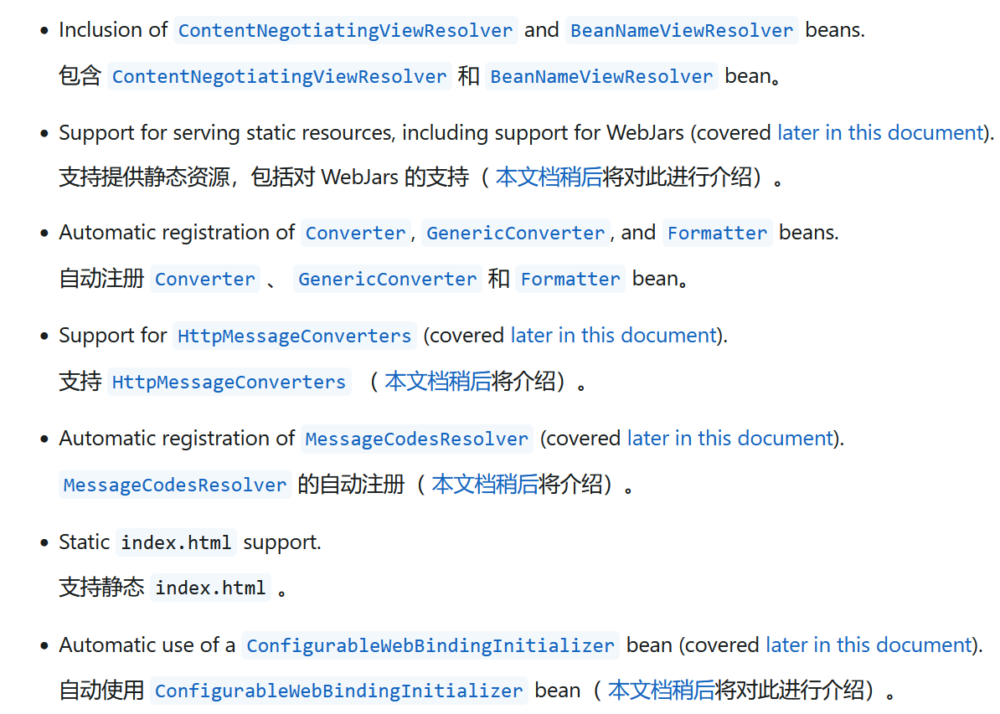
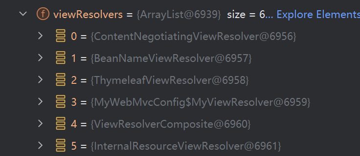
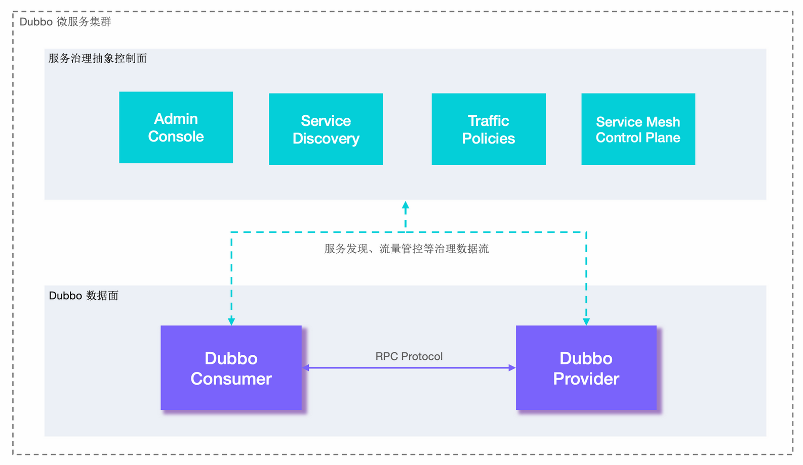
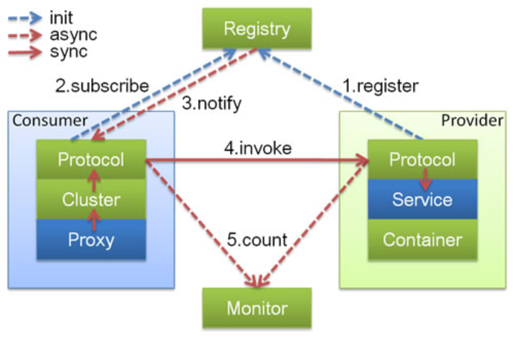

# SpringBoot

javase： OOP

mysql：  持久化

html+css+js+jQuery+框架： 视图

javaweb： Servlet

ssm：  使用Spring框架，简化开发流程

Spring再简化：SpringBoot，微服务架构

## 微服务

微服务是一种架构风格，它要求我们在开发一个应用的时候，这个应用必须构建成一系列小服务的组合；可以通过http的方式进行互通。相对微服务架构，还有过去的单体应用架构，顾名思义，将一个应用的所有服务封装在一个应用中，如将数据库访问、web访问等各个功能放在一个war包中。

https://blog.cuicc.com/blog/2015/07/22/microservices/

**单体应用架构**（all in one）的特点：

- 易于开发和测试，十分方便部署，方便扩展（复制war包做负载均衡）
- 细微的修改就要停掉整个服务

## 第一个SpringBoot程序

1. 可以在官网配置好下载后导入idea开发（ https://start.spring.io/ ）
2. 直接使用idea创建一个springboot项目（本质还是利用官网提供的工具）

使用方式二创建：选择初始化组件（Spring Web）即可自动构建基础项目

项目结构：

1. 一个主启动类
2. 一个application.properties配置文件
3. 一个测试文件
4. 一个pom.xml

**注意：**包必须与主启动类在同级目录，否则不会扫描，且想要被spring托管还要加上相应的组件注解

~~~xml
<?xml version="1.0" encoding="UTF-8"?>
<project xmlns="http://maven.apache.org/POM/4.0.0" xmlns:xsi="http://www.w3.org/2001/XMLSchema-instance"
         xsi:schemaLocation="http://maven.apache.org/POM/4.0.0 https://maven.apache.org/xsd/maven-4.0.0.xsd">
    <modelVersion>4.0.0</modelVersion>
    <!--继承了官方提供的父POM，预定义了一些资源-->
    <parent>
        <groupId>org.springframework.boot</groupId>
        <artifactId>spring-boot-starter-parent</artifactId>
        <version>3.5.7</version>
        <relativePath/> <!-- lookup parent from repository，表示从maven中央仓库下载 -->
    </parent>
    <groupId>org.wuming</groupId>   <!--组织或公司标识-->
    <artifactId>hello</artifactId>  <!--项目唯一ID-->
    <version>0.0.1-SNAPSHOT</version>
    <name>hello</name>
    <description>hello</description>
    <url/>
    <licenses>
        <license/>
    </licenses>
    <developers>
        <developer/>
    </developers>
    <scm>
        <connection/>
        <developerConnection/>
        <tag/>
        <url/>
    </scm>
    <properties>
        <java.version>21</java.version>
    </properties>
    <dependencies>
        <!--
            web依赖，内含启动web应用所需的一切
            内嵌tomcat（Jakarta Servlet API）
            SpringMVC
            Jackson
            日志，验证等
        -->
        <dependency>
            <groupId>org.springframework.boot</groupId>
            <artifactId>spring-boot-starter-web</artifactId>
        </dependency>

        <!--所有SpringBoot依赖都是以spring-boot-starter开头的-->

        <!--测试相关库-->
        <dependency>
            <groupId>org.springframework.boot</groupId>
            <artifactId>spring-boot-starter-test</artifactId>
            <scope>test</scope> <!--测试编译和运行时生效，不会打包进最终JAR-->
        </dependency>
    </dependencies>

    <!--打包插件-->
    <build>
        <plugins>
            <plugin>
                <groupId>org.springframework.boot</groupId>
                <artifactId>spring-boot-maven-plugin</artifactId>
            </plugin>
        </plugins>
    </build>

</project>
~~~

编写一个Http接口（Controller）：什么都不用配置，直接就可以请求到

~~~java
package org.wuming.hello.controller;

import org.springframework.web.bind.annotation.RequestMapping;
import org.springframework.web.bind.annotation.RestController;

@RestController
public class HelloController {
    @RequestMapping("/hello")
    public String hello(){
        return "Hello World"
    }
}
~~~

打包：只需要使用package命令即可

**修改端口号：**在application.xml中设置`server.port=8081`

彩蛋：在application.xml的同级目录下创建banner.txt文件，里面放置艺术字可以更改启动图标

## 原理初探

pom.xml:

- **spring-boot-dependencies**：核心依赖在父POM的父POM中，它统一管理SpringBoot的生态依赖版本，保证兼容，让我们在引入依赖时无需指定版本，它会自动使用兼容的定义好的版本，当然也可以显示指定version，但是可能会导致兼容性问题，也可以通过`<properties>`定义属性，下面是该POM文件的部分内容：

  ~~~xml
  <?xml version="1.0" encoding="UTF-8"?>
  <project xmlns="http://maven.apache.org/POM/4.0.0" xsi:schemaLocation="http://maven.apache.org/POM/4.0.0 https://maven.apache.org/xsd/maven-4.0.0.xsd" xmlns:xsi="http://www.w3.org/2001/XMLSchema-instance">
    <modelVersion>4.0.0</modelVersion>
    <groupId>org.springframework.boot</groupId>
    <artifactId>spring-boot-dependencies</artifactId>
    <version>3.5.7</version>
    <packaging>pom</packaging>
    <name>spring-boot-dependencies</name>
    <description>Spring Boot Dependencies</description>
    <url>https://spring.io/projects/spring-boot</url>
    <licenses>
      <license>
        <name>Apache License, Version 2.0</name>
        <url>https://www.apache.org/licenses/LICENSE-2.0</url>
      </license>
    </licenses>
    <developers>
      <developer>
        <name>Spring</name>
        <email>ask@spring.io</email>
        <organization>VMware, Inc.</organization>
        <organizationUrl>https://www.spring.io</organizationUrl>
      </developer>
    </developers>
    <scm>
      <url>https://github.com/spring-projects/spring-boot</url>
    </scm>
    <issueManagement/>
    <properties>
      <activemq.version>6.1.8</activemq.version>
      <angus-mail.version>2.0.5</angus-mail.version>
      <artemis.version>2.40.0</artemis.version>
      <aspectj.version>1.9.24</aspectj.version>
      <assertj.version>3.27.6</assertj.version>
      <awaitility.version>4.2.2</awaitility.version>
      <zipkin-reporter.version>3.5.1</zipkin-reporter.version>
      <brave.version>6.1.0</brave.version>
        ...
  </properties>
    <dependencyManagement>
      <dependencies>
        <dependency>
          <groupId>org.apache.activemq</groupId>
          <artifactId>activemq-console</artifactId>
          <version>${activemq.version}</version>
          <exclusions>
            <exclusion>
              <groupId>commons-logging</groupId>
              <artifactId>commons-logging</artifactId>
            </exclusion>
          </exclusions>
        </dependency>
        ...
      </dependencies>
    </dependencyManagement>
    <build>
      <pluginManagement>
        <plugins>
          <plugin>
            <groupId>org.codehaus.mojo</groupId>
            <artifactId>build-helper-maven-plugin</artifactId>
            <version>${build-helper-maven-plugin.version}</version>
          </plugin>
          <plugin>
            <groupId>org.cyclonedx</groupId>
            <artifactId>cyclonedx-maven-plugin</artifactId>
            <version>${cyclonedx-maven-plugin.version}</version>
          </plugin>
          <plugin>
            <groupId>org.flywaydb</groupId>
            <artifactId>flyway-maven-plugin</artifactId>
            <version>${flyway.version}</version>
          </plugin>
          <plugin>
            <groupId>io.github.git-commit-id</groupId>
            <artifactId>git-commit-id-maven-plugin</artifactId>
            <version>${git-commit-id-maven-plugin.version}</version>
          </plugin>
    		...  
        </plugins>
      </pluginManagement>
    </build>
  </project>
  ~~~

- **启动器：**

  ~~~xml
  		<dependency>
              <groupId>org.springframework.boot</groupId>
              <artifactId>spring-boot-starter</artifactId>
          </dependency>
  ~~~

  其实就是SpringBoot的启动场景，比如我们项目中使用的**spring-boot-starter-web**，它会自动导入web环境所需依赖，据此，我们可以得知，spring将所有的功能场景变成了一个个的启动器，根据需求选择启动器即可，启动器可以在这里看到：https://docs.spring.io/spring-boot/reference/using/build-systems.html#using.build-systems.starters

  向上追溯spring-boot-starter-web，看到POM中引入了如下依赖：

  ~~~xml
      <dependency>
        <groupId>org.springframework.boot</groupId>
        <artifactId>spring-boot-starter</artifactId>
        <version>3.5.7</version>
        <scope>compile</scope>
      </dependency>
      <dependency>
        <groupId>org.springframework.boot</groupId>
        <artifactId>spring-boot-starter-json</artifactId>
        <version>3.5.7</version>
        <scope>compile</scope>
      </dependency>
      <dependency>
        <groupId>org.springframework.boot</groupId>
        <artifactId>spring-boot-starter-tomcat</artifactId>
        <version>3.5.7</version>
        <scope>compile</scope>
      </dependency>
      <dependency>
        <groupId>org.springframework</groupId>
        <artifactId>spring-web</artifactId>
        <version>6.2.12</version>
        <scope>compile</scope>
      </dependency>
      <dependency>
        <groupId>org.springframework</groupId>
        <artifactId>spring-webmvc</artifactId>
        <version>6.2.12</version>
        <scope>compile</scope>
      </dependency>
  ~~~

**主程序：**

~~~java
package org.wuming.hello;

import org.springframework.boot.SpringApplication;
import org.springframework.boot.autoconfigure.SpringBootApplication;

@SpringBootApplication      //标注这个类是SpringBoot的一个应用
public class HelloApplication {

    //将应用程序启动
    public static void main(String[] args) {
        SpringApplication.run(HelloApplication.class, args);
    }

}
~~~

- 注解解读（深入探究）：

  ~~~java
  //这个注解被除了标准注解外以下注解修饰
  @SpringBootConfiguration	//顾名思义，这是SpringBoot的配置
  	@Configuration	//表明这是一个spring配置类
  		@Component	//说明这是一个spring组件
  
  @EnableAutoConfiguration		//顾名思义，允许自动配置
  	@AutoConfigurationPackage	//自动配置包
  		@Import(AutoConfigurationPackages.Registrar.class)  //注册主配置类所在的包
  	@Import(AutoConfigurationImportSelector.class)	//动态加载并筛选所有符合条件的自动配置类（xxxAutoConfiguration），并根据使用情况按需注册到 Spring 容器中
  
  @ComponentScan(excludeFilters = { @Filter(type = FilterType.CUSTOM, classes = TypeExcludeFilter.class),
  		@Filter(type = FilterType.CUSTOM, classes = AutoConfigurationExcludeFilter.class) })
  ~~~

  

  **注意：**[Spring Boot  自动配置原理](Springboot自动配置原理.md)

  自动配置的内容都在**org.springframework.boot:spring-boot-autoconfigure**包下

  结论：springboot所有配置都是在启动时扫描并在过滤后被加载：在发现候选自动配置类后，首先应用主类上的排除配置，然后对每个候选类评估条件注解`@ConditionalOnclass...`过滤掉不满足条件的配置类，然后进行注册。导入相应的starter可以满足部分条件注解，使相应类能被加载注册。

- 主程序的运行

  `SpringApplication`主要做了以下四件事情：

  - 推断应用的类型是普通的项目还是Web项目
  - 查找并加载所有可用初始化器，设置到initializers属性中
  - 找出所有的应用程序监听器，设置到listeners属性中
  - 推断并这是main方法的定义类，找到运行的主类

    

## SpringBoot配置文件：

SpringBoot使用一个全局的配置文件，文件名称固定，必须为application，可以使用不同的格式存储：

- application.properties（官方不推荐）：key=value，例`server.port=8080`
- application.yml：key: value，例`server: port: 8080`,注意：后面需要一个空格

### YAML

 **YAML** 是一种人类可读的数据序列化语言。它常用于配置文件以及需要存储或传输数据的应用程序。YAML 的目标应用与[可扩展标记语言 ](https://en.wikipedia.org/wiki/Extensible_Markup_Language)(XML) 类似，但[其语法](https://en.wikipedia.org/wiki/Syntax_(programming_languages))更为简洁，有意与[标准通用标记语言 ](https://en.wikipedia.org/wiki/Standard_Generalized_Markup_Language)(SGML) 有所区别。 它使用类似Python的缩进来表示嵌套 ，并且大多数字符串值不需要引号（它也支持在同一文件中混合使用 JSON 风格的 `[...]` 和 `{...}` ） 

基本语法规则如下：

- #代表注释，忽略到行尾
- 大小写敏感
- 使用缩进表示层级关系
- 缩进是不允许使用Tab键，只允许使用空格
- 缩进的空格数目不重要，只要相同层级的元素左对齐即可

支持三种数据结构：

- 对象：键值对的集合，又称为映射/哈希/字典
- 数组：又称为序列/列表
- 纯量：单个的、不可再分的值

~~~yml
# 对象
name: wuming
dog: {name: AHuang, age: 3}
dog:
  name: AHuang
  age: 3
  
# 数组
pets: [dog, cat, pig]
pets:	# <=> pets[[dog,cat,pig]]
 -
   - dog
   - cat
   - pig
   
# 复合结构,注意行首有缩进代表这是一个字典，相邻结构缩进相同代表在同一个字典
 languages:
  - java
  - python
  - c++
 websites:
  - java.com
  - python.org
  - c.com
 # <=> {languages:[java,python,c++], websites:[java.com,python.org,c.com]}
 
 # 纯量：字符串，布尔值，整数，浮点数，null，时间，日期
 # null用~表示
 student: ~
 # 时间采用ISO8601格式
 # 日期采用复合iso8601的年、月、日表示
 date: 2025-11-12
 
 # 字符串，默认不使用引号，如果包含空格或特殊字符需要加引号
 # 可以写成多行，从第二行开始必须有一个单空格缩进，换行符会被转为空格
 something: 'this
  is
  some
  thing'
# <=> something:"this is some thing"
~~~

使用yaml可以给对象配置属性：通过注解`@ConfigurationProperties(prefix="")`：

这种方式支持**松散绑定**，即中划线到驼峰映射，类似mybatis的下划线到驼峰映射，yml中字段**first-name**可以映射到类中的**firstName**

~~~java
@Data
@AllArgsConstructor
@NoArgsConstructor
@Component
public class Dog {
    @Value("旺财")
    private String name;
    @Value("3")
    private int age;
}
~~~

~~~java
@Data
@AllArgsConstructor
@NoArgsConstructor
@Component
@ConfigurationProperties(prefix="person")	//prefix=yaml中定义的对象名
public class Person {
    private String name;
    private int age;
    private Boolean happy;
    private Date birthday;
    private Map<String, Object> maps;
    private List<Object> list;
    private Dog dog;
}
~~~

~~~yaml
# 注意字段名必须一一对应
person:
  name: wuming
  age: 18
  happy: true
  birthday: 2006/06/18
  maps: {k1: v1, k2: v2}
  list:
    - code
    - music
    - girls
  dog:
    name: 旺财
    age: 3
~~~

~~~java
// 测试
import org.junit.jupiter.api.Test;
import org.springframework.beans.factory.annotation.Autowired;
import org.springframework.boot.test.context.SpringBootTest;
import org.wuming.hello.pojo.Dog;
import org.wuming.hello.pojo.Person;

@SpringBootTest
class HelloApplicationTests {
    @Autowired
    private Dog dog;
    @Autowired		//注意，一定要加上自动装配的注解，否则对象为null
    private Person person;
    @Test
    void contextLoads() {
        System.out.println(person);
    }

}
~~~

除了上面这种注解，还有一种注解`@PropertySource`，但是要麻烦一点：

Person.yml

~~~yml
person:
  name: wuming
  age: 18
  happy: true
  birthday: 2006/06/18
  maps: {k1: v1, k2: v2}
  list:
    - code
    - music
    - girls
  dog:
    name: 旺财
    age: 3
~~~

~~~java
@PropertySource(value="classpath:Person.yml")	//指定配置文件路径，也可以是properties文件
public class Person {
    @Value("${person.name}")	//对每个属性都必须指定它对应的字段，才能读取到，此处只配置name
    private String name;
    private int age;
    private Boolean happy;
    private Date birthday;
    private Map<String, Object> maps;
    private List<Object> list;
    private Dog dog;
}
~~~

yml拓展语法：

~~~yml
person:
  name: wuming${random.uuid}
  age: ${random.int[18,60]}	# springboot随机值，可以不加限定范围，注意不要加多余的空格
  happy: true
  birthday: 2006/06/18
  maps: {k1: v1, k2: v2}
  list:
    - code
    - music
    - girls
  dog:
    name: ${person.hello:旺财}	# 带默认值
    age: 3

state: ${person.happy}	# 引用其他配置项
Home: ${JAVA_HOME}		# 操作系统环境变量
~~~

   **YAML 中支持的“表达式”总结**

| 语法                  | 是否支持 | 说明                                |
| --------------------- | -------- | ----------------------------------- |
| `${other.property}`   | ✅        | 引用其他配置项                      |
| `${property:default}` | ✅        | 带默认值                            |
| `${random.int}`       | ✅        | Spring Boot 随机值                  |
| `${ENV_VAR}`          | ✅        | 引用操作系统环境变量                |
| `${system.property}`  | ✅        | 引用 JVM 系统属性（如 `user.home`） |
| `#{...}` (SpEL)       | ❌        | **不支持**                          |
| 算术/逻辑运算         | ❌        | 不支持                              |
| 方法调用              | ❌        | 不支持                              |

**注意：**当报找不到web依赖的错误时（依赖未满足，DispatcherServlet,tomcat等），可能是因为配置文件出错了，导致整个ApplicationContext初始化中断，自动配置未执行，导致后续检查web组件时发现确实，于是报web依赖未满足，实际上在发现yml文件错误时SpringBoot会抛出`BindException` 或`YAMLException`，后续SpringBoot错误处理器尝试兜底又会抛出web依赖未满足异常，所以最初的错误会在最底部。

## JSR303数据校验

springboot2.2以上版本需要手动导入依赖：

~~~xml
		<dependency>
            <groupId>org.springframework.boot</groupId>
            <artifactId>spring-boot-starter-validation</artifactId>
        </dependency>
~~~

在类上加上`@Validated`，在字段上加上相应的约束即可

~~~java
@Validated
public class Person {
    @Email(message = "邮箱格式错误")
    private String name;

    @Max(value=100,message = "age不能超过100")
    private int age;
}
~~~

常见约束如下：

~~~java
@Max(value=_,message=_)		验证对象是否小于等于value
@Min(value=_,message=_)		验证Numer或String对象是否大于等于value
@Email(message=_)			验证String对象是否符合邮箱格式
	
空检查
@Null			验证对象是否为null
@NotNull		验证对象是否不为null，无法查检长度为0的字符串
@NotBlank		检查字符串是否为不null且被trim后的长度是否大于0，且去掉前后空格
@NotEmpty		检查约束对象是否为null或empty，用于集合和String
    
Boolean检查
@AssertTrue		检查boolean对象是否为true
@AssertFalse	检查是否为false

长度检查
@Size(min=_,max=_)		验证对象（Array,Collection,Map,String）长度是否在给定范围内
@Length(min=_,max=_)	验证字符串长度是否在给定范围内

日期检查
@Past		验证Date和Calendar对象是否在当前时间之前
@Future		验证Date和Calendar对象是否在当前时间之后

@Pattern	验证String对象是否符合正则表达式的规则
~~~

## 配置文件位置及多文档配置

详见[SpringBoot外部配置](https://docs.spring.io/spring-boot/reference/features/external-config.html)

当程序启动时，SpringBoot会自动从以下位置查找并加载application.yml和application.properties文件：

1. 从classpath：
   - 类根路径
   - 类根路径下的config目录
2. 从项目根目录：
   - 从根目录
   - 根目录下的config子目录
   - config子目录的直接子目录

注意列表按优先级排序（优先级低的会覆盖优先级高的，也就是说当有其他配置文件存在是类根路径下的配置文件将始终被覆盖）,其实本质上是后定义的值覆盖了先读取的值 。如果同一个位置同时存在.properties文件和.yml文件，则以.properties文件为准。

在使用jar启动程序时，可以指定参数，例如`--name='wuming'`，则它会加载到Spring`Environment`中，且它的优先级是最高的，当然可以禁用。

### 多文档配置

springboot允许将一个物理文件拆分为多个逻辑文档，并且后面的文档可以覆盖前面文档定义的属性（用于多环境的公共基础配置或默认配置十分有效），yml使用`---`来分割多个文档，properties使用`#---`来分割，以yml为例：

~~~yml
# 默认配置，由所有profile共享
# 没有指定profile的配置成为无profile的基础配置（默认先执行），即使被分割也会合并
spring:
  datasource:
    url: jdbc:h2:mem:testdb
    driver-class-name: org.h2.Driver

---
# profile1
spring:
  config:
    activate:
      on-profile: dev	# 指定profile名称：dev
  datasource:
    url: jdbc:mysql://localhost:3306/myapp_dev
    username: devuser
    password: devpass

---
spring:
  config:
    activate:
      on-profile: prod
  datasource:
    url: jdbc:mysql://prod-db-server:3306/myapp_prod
    username: ${DB_USER}
    password: ${DB_PASS}
~~~

激活某个profile的方式：

1. 命令行参数：使用jar包启动时加上`--spring.profiles.active=dev`
2. 在基础配置中增加类似`spring.profiles.active=dev`
3. 环境变量:`export SPRING_PROFILES_ACTIVE=dev`

**多文档配置的加载顺序（从高到低）：**

- 命令行参数
- 系统属性
- 操作系统环境变量
- `application-{profile}.yml`文件，这种文件就是多文档文件的拆分形式，每个文档就是一份profile，中划线后面就是该profile的名字
- `application.yml`中的多文档配置（按profile匹配）
- 默认配置

## 再探原理

几乎所有需要配置属性的自动配置类上面的有这个注解`@ConfigurationProperties`，例如`org.springframework.boot.autoconfigure.web.ServerProperties`：

~~~java
// 注意没有@Component注解
@ConfigurationProperties("server")	// 指示从核心配置文件中读取以server字段开头的属性
public class ServerProperties {

	/**
	 * Server HTTP port.
	 */
	private Integer port;	// server后面紧跟着的属性
    ...
}
~~~

为上面的属性赋值：

~~~yml
server:
 port: 8080

# properties: server.port=8080
~~~

或者

~~~java
public class ErrorProperties {

	/**
	 * Path of the error controller.
	 */
	@Value("${error.path:/error}")
	private String path = "/error";
    
    @NestedConfigurationProperty	// 这个注解声明这是一个嵌套配置对象，需要递归绑定，
    // 所以server.http2.enabled=true能传递到http2对象中，可以省略，建议加上
	private final Http2 http2 = new Http2();
}
~~~

有些需要加上一些过滤条件：

~~~java
@AutoConfiguration

// 它告诉SpringBoot将ServerProperties注册为bean，然后这个类才能去取配置文件中对应的信息
@EnableConfigurationProperties(ServerProperties.class)	 // 这个类就是上面那个
@ConditionalOnWebApplication(type = Type.SERVLET)
@ConditionalOnClass(CharacterEncodingFilter.class)
@ConditionalOnBooleanProperty(name = "server.servlet.encoding.enabled", matchIfMissing = true)
public class HttpEncodingAutoConfiguration { ... }
~~~

- @ConditionalOnWebApplication(type = Type.SERVLET)，必须为web应用
- @ConditionalOnClass(CharacterEncodingFilter.class)，必须配置了字符编码过滤器

`@Conditional`的扩展注解

~~~java
@ConditionalOnBean： 		仅在当前上下文中存在某个对象时，才会实例化一个Bean。
@ConditionalOnClass：		某个class位于类路径上，才会实例化一个Bean。
@ConditionalOnExpression：	当表达式值为true的时候，才会实例化一个Bean。
@ConditionalOnMissingBean：	仅仅在当前上下文中不存在某个对象时，才会实例化一个Bean。
@ConditionalOnMissingClass：	某个class类路径上不存在的时候，才会实例化一个Bean。
@ConditionalOnNotWebApplication：非web应用，才会实例化一个Bean。
@ConditionalOnBean：			当容器中有指定Bean的条件下进行实例化。
@ConditionalOnMissingBean：	当容器里没有指定Bean的条件下进行实例化。
@ConditionalOnClass：		当classpath类路径下有指定类的条件下进行实例化。
@ConditionalOnMissingClass：	当类路径下没有指定类的条件下进行实例化。
@ConditionalOnWebApplication：当项目是一个Web项目时进行实例化。
@ConditionalOnNotWebApplication：当项目不是一个Web项目时进行实例化。
@ConditionalOnProperty：		当指定的属性有指定的值时进行实例化。
@ConditionalOnExpression：	基于SpEL表达式的条件判断。
@ConditionalOnJava：			当JVM(java)版本为指定的版本范围时触发实例化。
@ConditionalOnResource：		当类路径下有指定的资源时触发实例化。
@ConditionalOnJndi：			在JNDI存在的条件下触发实例化。
@ConditionalOnSingleCandidate：当指定的Bean在容器中只有一个，或者有多个但是指定了首选的Bean时，才会触发实例化。
~~~

使用`debug: true`查看详细信息，包括自动配置的类

**注意：**用户配置文件只在过滤被类似`@ConditionalOnProperty`修饰的自动配置类时生效，其他过滤条件就是看导入的依赖和应用类型等。

**tip：**被@Configuration注解修饰的类（配置类）中很多都有被**@Bean修饰的方法**，其作用就是将方法返回的对象注册到容器中，id就是返回值类型首字母小写

SpringBoot到底帮我们配置了什么？我们能不能进行修改？能修改哪些东西？能不能扩展？

- xxxxAutoConfiguration：向容器中自动配置组件
- xxxxProperties：自动配置类，装配配置文件中自定义的一些内容

## SpringBootWeb开发

要解决的问题：

- 导入静态资源，html、css、js
- 首页
- jsp，模板引擎Thymeleaf
- 装配扩展SpringMVC
- 增删改查
- 拦截器
- 国际化（可选）

### 静态资源导入探究

查看`WebMvcAutoConfiguration`类得到：

~~~java
@Override
public void addResourceHandlers(ResourceHandlerRegistry registry) {
    if (!this.resourceProperties.isAddMappings()) {
        logger.debug("Default resource handling disabled");
        return;
    }
    addResourceHandler(registry, this.mvcProperties.getWebjarsPathPattern(),
                       "classpath:/META-INF/resources/webjars/");
    addResourceHandler(registry, this.mvcProperties.getStaticPathPattern(), (registration) -> {
        registration.addResourceLocations(this.resourceProperties.getStaticLocations());
        if (this.servletContext != null) {
            ServletContextResource resource = new ServletContextResource(this.servletContext, SERVLET_LOCATION);
            registration.addResourceLocations(resource);
        }
    });
}

private void addResourceHandler(ResourceHandlerRegistry registry, String pattern, String... locations) {
    addResourceHandler(registry, pattern, (registration) -> registration.addResourceLocations(locations));
}

private void addResourceHandler(ResourceHandlerRegistry registry, String pattern,
                                Consumer<ResourceHandlerRegistration> customizer) {
    if (registry.hasMappingForPattern(pattern)) {
        return;
    }
    ResourceHandlerRegistration registration = registry.addResourceHandler(pattern);
    customizer.accept(registration);
    registration.setCachePeriod(getSeconds(this.resourceProperties.getCache().getPeriod()));
    registration.setCacheControl(this.resourceProperties.getCache().getCachecontrol().toHttpCacheControl());
    registration.setUseLastModified(this.resourceProperties.getCache().isUseLastModified());
    customizeResourceHandlerRegistration(registration);
}
~~~

1. 当`!this.resourceProperties.isAddMappings()`为true时立刻返回，查看源码发现可以追溯到`webProperties`类的`Resource`对象，该对象可在配置文件中使用`spring.web.resources`注入值，所这句话的意思就是当在配置文件中配置了这个属性后就会直接结束函数，导致无法注册默认的资源处理器
2. `addResourceHandler(registry, this.mvcProperties.getWebjarsPathPattern(),
                          "classpath:/META-INF/resources/webjars/");`，这个函数的第二个参数经追溯后发现值为 `/webjars/**`，意思应该是将请求路径中`/webjars/**`映射成为第三个参数去寻找对应的资源。例如，当**浏览器路径**为`http://localhost:8080/webjars/jquery/3.7.1/jquery.js`就能获取到对应前端资源
3. 后面那个函数的第二个参数可以追溯为`/**`，第三个参数的`this.resourceProperties.getStaticLocations()`可以追溯为`{ "classpath:/META-INF/resources/",       "classpath:/resources/", "classpath:/static/", "classpath:/public/" }`，意思应该是将请求路径下的任意资源映射到下面这四个位置，注意到sprintboot在创建时在resources文件夹下只创建了static目录，template目录和配置文件，所以我们可以自行创建其余两个目录及resources和public和`/META-INF/resources`文件夹，访问优先级依次为`/META-INF/resources`>resources>static>public，也就是说存在相同资源，优先访问优先级最高的路径。例如，当浏览器路径为`http://localhost:8080/1.js`时先去找/META-INF/resources下是否存在这个资源，然后是resources文件夹，然后是static文件夹，最后是public文件夹,可以在配置文件中使用`spring.web.resources.static-locations`自定义修改路径，可以包含多个，用逗号分隔，**一旦自定义，系统默认的三个路径全部失效**，所以最好不要这么做。

**拓展：**

-  **WebJars** 是一种将 **前端 Web 库（如 jQuery、Bootstrap、Vue.js、React 等）打包成 JAR 文件** 的方式，以便在基于 JVM 的 Web 项目（如 Spring Boot、Java EE 等）中通过 **Maven 或 Gradle** 进行依赖管理。所有webjars都可以在[找到](https://www.webjars.org/)，它们的结构都是

  

  即一定可以根据映射后的路径找到对应的前端资源，依赖需手动在POM中导入
  
- 注意SpringBoot创建时存在的resources文件夹下的所有内容将在运行时全部被加载到classpath中，但是只会将特定文件夹也就是上面说的四个文件夹中的资源暴露给Web，其他地方的静态资源即使在classpath中也无法被访问。

### 首页管理

同样在`WebMvcAutoConfiguration`类中：

~~~java
private <T extends AbstractUrlHandlerMapping> T createWelcomePageHandlerMapping(
				ApplicationContext applicationContext, FormattingConversionService mvcConversionService,
				ResourceUrlProvider mvcResourceUrlProvider, WelcomePageHandlerMappingFactory<T> factory) {
			TemplateAvailabilityProviders templateAvailabilityProviders = new TemplateAvailabilityProviders(
					applicationContext);
    		// 在上一节提到的默认静态资源路径
			String staticPathPattern = this.mvcProperties.getStaticPathPattern();
			// 在静态资源路径寻找首页，从下面可以知道首页名称必须为index.html
    		T handlerMapping = factory.create(templateAvailabilityProviders, applicationContext, getIndexHtmlResource(),
					staticPathPattern);
			handlerMapping.setInterceptors(getInterceptors(mvcConversionService, mvcResourceUrlProvider));
			handlerMapping.setCorsConfigurations(getCorsConfigurations());
			return handlerMapping;
}

private Resource getIndexHtmlResource() {
    for (String location : this.resourceProperties.getStaticLocations()) {
        Resource indexHtml = getIndexHtmlResource(location);
        if (indexHtml != null) {
            return indexHtml;
        }
    }
    ServletContext servletContext = getServletContext();
    if (servletContext != null) {
        return getIndexHtmlResource(new ServletContextResource(servletContext, SERVLET_LOCATION));
    }
    return null;
}

private Resource getIndexHtmlResource(String location) {
    return getIndexHtmlResource(this.resourceLoader.getResource(location));
}

private Resource getIndexHtmlResource(Resource location) {
    try {
        Resource resource = location.createRelative("index.html");
        if (resource.exists() && (resource.getURL() != null)) {
            return resource;
        }
    }
    catch (Exception ex) {
        // Ignore
    }
    return null;
}
~~~

所以只需要在`classpath下的META-INF/resources,resources/,static/,public/`定义index.html即可作为首页展示，后面我们会谈到限制使用controller才能访问首页

### 模板引擎

SpringBoot项目默认不支持jsp，我们无法动态显示数据，但是不可能全部使用静态页面，所以这时候就用到了模板引擎。jsp是一种类似模板引擎的技术，常见的模板引擎有freemarker、thymeleaf等。那么模板引擎到底是什么呢？ 模板引擎是Web开发中用于**分离**用户界面与业务数据的技术工具，通过生成标准HTML文档实现**动态内容**呈现。其核心目标在于提升代码可维护性，支持界面与逻辑的模块化设计 。

#### Thymeleaf

1. 首先导入相关依赖：

   ~~~xml
   <dependency>
               <groupId>org.springframework.boot</groupId>
               <artifactId>spring-boot-starter-thymeleaf</artifactId>
   </dependency>
   ~~~

2. 然后编写相应的controller即可：

   ~~~java
    @RequestMapping("/test")
       public String test(){
           return "test";
      }
   ~~~

3. 编写响应的页面响应：

   ~~~html
   <! DOCTYPE html>
   <html lang="zh-CN">
       <head>
           <meta charset="utf-8">
           <meta http-equiv="X-UA-Compatible" content="IE=edge">
           <meta name="viewport" content="width=device-width, initial-scale=1, shrink-to-fit=no">
           <title></title>
       </head>
       <body>
           test
       </body>
   </html>
   ~~~

**注意**：在源码中可以得到，thymeleaf的**默认查找路径前缀**为`classpath:/tempalates`，**默认后缀**为`.html`，即视图必须是html文件，且必须放在resources文件夹下的templates文件夹，即springboot默认生成的目录。可以在配置文件中使用`spring.thymeleaf.prefix/suffix`来自定义前缀与后缀

~~~java
@ConfigurationProperties("spring.thymeleaf")
public class ThymeleafProperties {

	private static final Charset DEFAULT_ENCODING = StandardCharsets.UTF_8;

	public static final String DEFAULT_PREFIX = "classpath:/templates/";

	public static final String DEFAULT_SUFFIX = ".html";
   ...
}
~~~

上面只是一个静态页面，下面以动态页面为例：

首先，要使用thymeleaf必须要在页面中添加`<html xmlns:th="http://www.thymeleaf.org">`引入th命名空间，否则无法使用th替换

~~~java
@RequestMapping("/test")
    public String test(Model model){
        model.addAttribute("msg", "hello world");
        return "test";
    }
~~~

~~~html
<! DOCTYPE html>
<html xmlns:th="http://www.thymeleaf.org" lang="zh-CN">
    <head>
        <meta charset="utf-8">
        <title></title>
    </head>
    <body>
        <!--所有html元素都可以被thymeleaf替换接管， 使用th：元素名即可-->
        <!--只有th命名空间中才能使用它的表达式-->
        
    </body>
</html>
~~~

thymeleaf语法：

- `th:text,th:utext`，是否转义，假设数据为`"<h1>hello</h1>"`，前者原样显示，后者视为h1标题

- 对于列表：

  ~~~html
  <!--model.addAttribute("list", Arrays.asList("item1", "item2", "item3"));-->
  
  <!--使用这种方式遍历列表-->
  
  ~~~

- 

  **注意：**简单表达式中的中括号其实全部都是大括号

- 字面量

  - 文本字面量：'one text', 'another one'
  - 数字字面量：0,34,12.3
  - 布尔字面量：true，false
  - 空字面量：null
  - 字面标记：one，sometext，main

- 文本操作

  - 字符串连接：+
  - 字面替换：`| The name is $[name]|`

- 算术运算

  - 二元：+，-，*，、，%*
  - 一元：负号 -

- 布尔运算：

  - 二元：and，or
  - 一元：！，not

- 比较：

  - <，>，>=，<=，==，！=
  - lt，gt，ge，le，eq，ne

- 条件运算符：

  - if-then：(if) ? (then)
  - if-then-else:  (if) ? (then) : (else)，例如，`a>0?1:0`
  - 默认值：(value)  ? (defaultvalue)

### SpringMVC的扩展

前面讲了SpringBoot的自动配置原理，并且就是以`WebMvcAutoConfiguration`类为例，这是在引入`spring-boot-starter-web`依赖后SpringBoot自动配置web依赖的关键自动配置类，它负责SpringMVC核心组件的自动配置，包括`DispacherServlet,ViewResolver等`,以下是[官方文档](https://docs.spring.io/spring-boot/reference/web/servlet.html#web.servlet.spring-mvc.auto-configuration)的描述：

如果想要保留SpringBoot的自动配置并扩展自定义设置（拦截器、格式化器，视图解析器等），可以添加自己的配置类（需实现WebMvcConfigurer接口，用@Configuration修饰），但不添加@EnableWebMvc，下面以自定义视图解析器为例：

~~~java
package org.wuming.config;  // 自定义配置类通常放在config包下

import org.springframework.context.annotation.Bean;
import org.springframework.context.annotation.Configuration;
import org.springframework.web.servlet.View;
import org.springframework.web.servlet.ViewResolver;
import org.springframework.web.servlet.config.annotation.WebMvcConfigurer;

import java.util.Locale;

// 自定义配置类只要放在启动程序统计目录的包下就能被springboot自动接管，无须额外配置
@Configuration
public class MyWebMvcConfig implements WebMvcConfigurer {
    // 自定义视图解析器为例
    @Bean
    public ViewResolver getViewResolver() {
        return new MyViewResolver();
    }

    public static class MyViewResolver implements ViewResolver {

        @Override
        public View resolveViewName(String viewName, Locale locale) throws Exception {
            return null;
        }
    }
}

~~~

只做如上配置，在`DispatcherServlet`中的`doDispatch`方法开始处打一个断点，调试时发现：

下面添加一个简单的视图解析：

~~~java
package org.wuming.config; 
import org.springframework.context.annotation.Configuration;
import org.springframework.web.servlet.config.annotation.ViewControllerRegistry;
import org.springframework.web.servlet.config.annotation.WebMvcConfigurer;

@Configuration
public class MyWebMvcConfig implements WebMvcConfigurer {

    @Override
    // 只能做简单的映射，根据请求路径转到特定的视图（在静态资源路径中寻找）,只能用于简单的视图或静态视图的跳转，如登录页，首页，错误页面
    // 并且如果在controller中定义了有着相同请求路径的逻辑将会覆盖这里的简单跳转
    public void addViewControllers(ViewControllerRegistry registry) {
        registry.addViewController("/").setViewName("test");
        registry.addViewController("/login").setViewName("login");
        registry.addViewController("/error").setViewName("error");  
    }
}

// 当然还可以注册类型转换器，拦截器，配置静态资源映射，全局配置CORS（跨域）等，下面按序列出
/*
	全局解析 yyyy-MM-dd 到 LocalDate
	registry.addConverter(String.class, LocalDate.class, 
source -> LocalDate.parse(source, DateTimeFormatter.ofPattern("yyyy-MM-dd")));
	
	registry.addInterceptor(new LoginInterceptor())
    .addPathPatterns("/admin/**")	拦截哪些路径
    .excludePathPatterns("/admin/login");	排除哪些路径
    
    registry.addResourceHandler("/static/**")
    .addLocations("classpath:/custom-static/", "file:/opt/assets/")
    .setCachePeriod(3600);
    
    registry.addMapping("/api/**")
    .allowedOrigins("https://example.com")
    .allowedMethods("GET", "POST")
    .allowCredentials(true)
    .maxAge(3600);

	还可以修改 Jackson 转换器的配置，可以美化
for (HttpMessageConverter<?> converter : converters) {
    if (converter instanceof MappingJackson2HttpMessageConverter) {
        MappingJackson2HttpMessageConverter jacksonConverter = (MappingJackson2HttpMessageConverter) converter;
        ObjectMapper mapper = jacksonConverter.getObjectMapper();
        mapper.disable(SerializationFeature.WRITE_DATES_AS_TIMESTAMPS);
    }
}
*/
~~~

**那么为什么不能添加@EnableWebMvc呢？**

让我们进入这个注解，发现它做的就是`@Import(DelegatingWebMvcConfiguration.class)`,然后我们发现这个类继承了`WebMvcConfigurationSupport`，然而`WebMvcAutoConfiguration`限定了一个条件`@ConditionalOnMissingBean(WebMvcConfigurationSupport.class)`，一旦引入了这个类，那么这个WebMvc的自动配置类就会在加载时被过滤掉，从而导致自动配置失效

### 国际化

在resources目录下新建一个i18n（internationalization）文件夹存放资源文件，新建一个login.properties文件，再新建一个login_zh_CN.properties文件，就会自动合并成为一个**Resources Bundle**文件夹，内部存放了login相关的本土与国际化配置资源，可以右键文件夹新建其他语言的资源文件，注意只对properties文件生效，yml文件不会合并

我们可以通过自定义区域解析器，然后注册即可让spring自动在相应资源文件中找到相应的区域值

~~~java
package org.wuming.config;

import jakarta.servlet.http.HttpServletRequest;
import jakarta.servlet.http.HttpServletResponse;
import org.springframework.cglib.core.Local;
import org.springframework.util.StringUtils;
import org.springframework.web.servlet.LocaleResolver;

import java.util.List;
import java.util.Locale;

public class MyLocaleResolver implements LocaleResolver {
    @Override
    public Locale resolveLocale(HttpServletRequest request) {
        String language = request.getParameter("l");
        Locale locale =  Locale.getDefault();
        if(!StringUtils.isEmpty(language)){
            String[] split = language.split("_");
            locale = new Locale(split[0], split[1]);
        }
        return locale;
    }

    @Override
    public void setLocale(HttpServletRequest request, HttpServletResponse response, Locale locale) {

    }
}
~~~

~~~java
package org.wuming.config;

import org.springframework.context.annotation.Bean;
import org.springframework.context.annotation.Configuration;
import org.springframework.web.servlet.LocaleResolver;
import org.springframework.web.servlet.config.annotation.ViewControllerRegistry;
import org.springframework.web.servlet.config.annotation.WebMvcConfigurer;

@Configuration
public class Config implements WebMvcConfigurer {

    @Override
    public void addViewControllers(ViewControllerRegistry registry){
        registry.addViewController("/").setViewName("index");
    }
    @Bean
    public LocaleResolver localeResolver(){
        return new MyLocaleResolver();
    }
}
~~~

注意，在写前端页面时，用#{}取消息，用（）包裹对应的请求参数，用@{}处理url链接

~~~html
			
		<link th:href="@{/asserts/css/bootstrap.min.css}" rel="stylesheet">

			<h1 class="h3 mb-3 font-weight-normal" th:text="#{login.tip}"/>
			<input type="password" class="form-control" th:placeholder="#{login.password}" required="">

			<a class="btn btn-sm" th:href="@{/(l=zh_CN)}">中文</a>

~~~

巧妙设计：**避免真实请求暴露，伪造请求路径，重定向到虚拟路径，再通过扩展自定义视图控制器增加映射**

~~~java
@RequestMapping("/dash")
    public String dashBoard(@RequestParam("username") String name, @RequestParam("password") String pwd, Model model){
        if("admin".equals(name) && "123".equals(pwd)){
            return "redirect:/main";
        }
        model.addAttribute("msg", "用户名或密码错误");
        return "index";
    }
~~~

~~~java
registry.addViewController("/main").setViewName("dashboard");
~~~

~~~html
<form class="form-signin" th:action="@{/dash}">
    

    <input type="text" class="form-control" name="username" th:placeholder="#{login.username}" required="" autofocus="">
    <input type="password" class="form-control" name="password" th:placeholder="#{login.password}" required="">
    <button class="btn btn-lg btn-primary btn-block" type="submit" th:text="#{login.btn}"></button>
</form>
~~~

表单如上，如果采用原来的方式直接返回dashboard则在新页面上的请求路径将会是/dash?username=_&password=__，因为直接返回是转发形式的，会携带传递的参数，这是就伪造一个/main请求，然后再被解析成正确的资源，这样**掩饰了内部的实现细节并且保持了路径的干净**

### 登录拦截器

~~~java
package org.wuming.config;

import jakarta.servlet.http.HttpServletRequest;
import jakarta.servlet.http.HttpServletResponse;
import org.springframework.web.servlet.HandlerInterceptor;
import org.springframework.web.servlet.ModelAndView;

public class LoginHandlerInterceptor implements HandlerInterceptor {
    @Override
    public boolean preHandle(HttpServletRequest request, HttpServletResponse response, Object handler) throws Exception {

        // 检查是否已登录
        Object username = request.getSession().getAttribute("username");
        if (username == null) {
            request.setAttribute("msg", "没有权限，请先登录");
            request.getRequestDispatcher("/").forward(request, response);
            return false; // 中断后续处理
        }

        return true; // 已登录，放行
    }
    
}
~~~

~~~java
@Override
    public void addInterceptors(InterceptorRegistry registry){
        registry.addInterceptor(new LoginHandlerInterceptor()).addPathPatterns("/**").excludePathPatterns("/", "/dash*","/static/**");
    }
~~~

**注意：**编写好拦截器后一定要记得在自定义配置类中添加进去，排除（**放行**）路径一定要记得配置**登录界面以及登录表单提交跳转的页面**（否则无法成功跳转），还需要放行**静态资源路径**防止样式无法被访问

### 错误处理

如果点击链接无法跳转，然后后台报了thymeleaef解析路径失败错误，类似`2025-11-18T17:47:12.653+08:00 ERROR 46584 --- [springboot-practice] [nio-8080-exec-6] s.e.ErrorMvcAutoConfiguration$StaticView : Cannot render error page for request [/toAdd] as the response has already been committed. As a result, the response may have the wrong status code.`那么极有可能是前端页面写错了，尤其是**th标签值为空**

SpringBoot为我们做了一个简化到极致的错误页面跳转，只要在resources资源目录下新建error目录，内部存放404,300,500等前端页面，在出现相应错误时springboot会自动帮我们定位到对应的错误页面

## Spring Data

对于数据访问层，无论是SQL还是NOSQL（非关系型数据库），SpringBoot底层都是采用[Spring Data](https://spring.io/projects/spring-data)的方式进行统一处理，Spring Data也是和SpringBoot、SpringCloud齐名的项目

**tip: **

- 连接数据库时最好统一配置时区，例如`serverTimezone=Asia/Shanghai`，否则可能出现Java应用和数据库时间不匹配的情况
- Spring自动配置了大量的xxxxTemplate，它们是操作模板工具类，用于简化对各种中间件（数据库、缓存、消息队列、HTTP等）的访问，**它们的核心设计思想是消除样板代码，封装了底层资源管理、异常转换和样板代码，让开发者只需关注核心业务逻辑即可**。至于为什么叫`Template`，是因为它们都基于模板方法模式，**模板类定义了操作的骨架**（如jdbc的获取连接->执行SQL->处理结果->关闭连接）,用户只需要通过回调**注入具体逻辑**（如SQL语句、参数、结果映射等）,想要使用只需导入相关的starter依赖并且使用注解自动注入即可

注意需要引入JDBCstarter：

~~~xml
<dependency>
            <groupId>org.springframework.boot</groupId>
            <artifactId>spring-boot-starter-jdbc</artifactId>
        </dependency>
~~~

下面是`DataSourceAutoConfiguration`的核心代码：

~~~java
@AutoConfiguration(before = SqlInitializationAutoConfiguration.class)
// 确保类路径中存在jdbc和嵌入式数据库支持时才开启自动配置
@ConditionalOnClass({ DataSource.class, EmbeddedDatabaseType.class })
// 如果项目使用的是R2DBC则跳过自动配置
@ConditionalOnMissingBean(type = "io.r2dbc.spi.ConnectionFactory")
// 将DataSourceProperties注册到spring中让其根据spring.datasource.*自动配置属性
@EnableConfigurationProperties(DataSourceProperties.class)
@Import({ DataSourcePoolMetadataProvidersConfiguration.class, DataSourceCheckpointRestoreConfiguration.class })
public class DataSourceAutoConfiguration {

	@Configuration(proxyBeanMethods = false)
    // 是否满足嵌入式数据库支持，查看源码更全面，首要是根据是否配置spring.datasource.url
    // 还要看类路径中是否存在类似Derby，H2之类嵌入式数据库的依赖，依赖需要手动引入
	@Conditional(EmbeddedDatabaseCondition.class)
    // 是否引入了下面这两个类，实际上任何数据源都实现了这两个接口，
    // 即仅当没有注入任何数据源时配置生效
	@ConditionalOnMissingBean({ DataSource.class, XADataSource.class })
	@Import(EmbeddedDataSourceConfiguration.class)
	protected static class EmbeddedDatabaseConfiguration {

	}

	@Configuration(proxyBeanMethods = false)
	@Conditional(PooledDataSourceCondition.class)
	@ConditionalOnMissingBean({ DataSource.class, XADataSource.class })
    // 排在前面的先被注册，后面的就会因为不满足依赖而不被注册，可以手动排除前面的类使用后面的数据源
    // hikari排在最前面正好是spring的选择，是有意之举
	@Import({ DataSourceConfiguration.Hikari.class, DataSourceConfiguration.Tomcat.class,
			DataSourceConfiguration.Dbcp2.class, DataSourceConfiguration.OracleUcp.class,
			DataSourceConfiguration.Generic.class, DataSourceJmxConfiguration.class })
	protected static class PooledDataSourceConfiguration {

		@Bean
		@ConditionalOnMissingBean(JdbcConnectionDetails.class)
		PropertiesJdbcConnectionDetails jdbcConnectionDetails(DataSourceProperties properties) {
			return new PropertiesJdbcConnectionDetails(properties);
		}
    }
~~~

~~~java
// 这是hikari的配置，类似的还有tomcat，dbcp2，Oracle UCP等
@Configuration(proxyBeanMethods = false)
@ConditionalOnClass(HikariDataSource.class)
@ConditionalOnMissingBean(DataSource.class)
// 表明如果配置文件中有spring.datasource.type配置的话匹配后面的才能使用该数据源，如果没有这项配置就默认存在这项配置
@ConditionalOnProperty(name = "spring.datasource.type", havingValue = "com.zaxxer.hikari.HikariDataSource",
                       matchIfMissing = true)
static class Hikari {

    @Bean
    static HikariJdbcConnectionDetailsBeanPostProcessor jdbcConnectionDetailsHikariBeanPostProcessor(
        ObjectProvider<JdbcConnectionDetails> connectionDetailsProvider) {
        return new HikariJdbcConnectionDetailsBeanPostProcessor(connectionDetailsProvider);
    }

    @Bean
    @ConfigurationProperties("spring.datasource.hikari")
    HikariDataSource dataSource(DataSourceProperties properties, JdbcConnectionDetails connectionDetails, Environment environment) {
        String dataSourceClassName = environment.getProperty("spring.datasource.hikari.data-source-class-name");
        HikariDataSource dataSource = createDataSource(connectionDetails, HikariDataSource.class,
           properties.getClassLoader(), dataSourceClassName == null);
        if (StringUtils.hasText(properties.getName())) {
            dataSource.setPoolName(properties.getName());
        }
        return dataSource;
    }
}

// 这是Generic的配置，它存在的意义就是当指定了type且与之前的值均不匹配，就使用第三方数据源
@Configuration(proxyBeanMethods = false)
	@ConditionalOnMissingBean(DataSource.class)
	@ConditionalOnProperty(name = "spring.datasource.type")
	static class Generic {

		@Bean
		DataSource dataSource(DataSourceProperties properties, JdbcConnectionDetails connectionDetails) {
			return createDataSource(connectionDetails, properties.getType(), properties.getClassLoader());
		}

	}
~~~

所以**SpringBoot配置数据源有三种途径**：

1. 其他数据源不存在，且类路径有嵌入式数据源驱动，则使用嵌入式数据源
2. 在配置文件中未指定spring.datasource.type，则默认使用hikari；在配置文件中指定了type且属于SpringBoot内置的几种数据源中的一种，则使用该数据源
3. 在配置文件中指定了不在内置数据源的数据源，则有Generic的配置为该数据源创建加载

**注意：**嵌入式数据库（Embedded Database）是一种 与应用程序运行在同一进程内、无需独立安装或启动数据库服务器 的数据库系统。它通常以库（library）的形式存在，由**应用程序直接调用**，数据可以存储在内存中或本地文件里，而我们常说的数据库指的是**数据库服务器**，数据库客户端通过数据库驱动文件如JDBC等访问数据库服务器，服务器再操作数据库文件，将数据与应用程序分离。

此处的数据源如Hikari指的是**连接池**，即管理连接的工具

spring为什么选择hikari？

Hikari是是业界最快的数据源，配置简单，适用高并发、低延迟场景。相较与Druid，虽然性能也很高，但还是比hikari慢不少，不过它对连接泄露检测、SQL防火墙/监控等方面都很强大，但是在spring中配置相对复杂，需要额外引入其他依赖

### 配置Druid

由于是第三方数据源，首先还是引入依赖

~~~xml
<dependency>
            <groupId>com.alibaba</groupId>
            <artifactId>druid-spring-boot-starter</artifactId>
            <version>1.2.27</version>
</dependency>
~~~

上面提到使用外部数据源，只需要在配置文件中指定type即可，注意需要为全类名：

~~~yml
spring:
  datasource:
    driver-class-name: com.mysql.cj.jdbc.Driver
    username: root
    password: root12345
    url: jdbc:mysql://localhost:3306/${dbName}?useUnicode=true&charsetEncoding=UTF-8&serverTimezone=Asia/Shanghai
    type: com.alibaba.druid.pool.DruidDataSource
~~~

为了能够监测SQL执行情况，阿里写了一个Servlet，我们只需要注册和初始化即可

~~~java
package org.wuming.config;

import com.alibaba.druid.pool.DruidDataSource;
import com.alibaba.druid.support.jakarta.StatViewServlet;
import com.alibaba.druid.support.jakarta.WebStatFilter;
import org.springframework.boot.context.properties.ConfigurationProperties;
import org.springframework.boot.web.servlet.FilterRegistrationBean;
import org.springframework.boot.web.servlet.ServletRegistrationBean;
import org.springframework.context.annotation.Bean;
import org.springframework.context.annotation.Configuration;

import javax.sql.DataSource;
import java.util.HashMap;
import java.util.Map;

@Configuration
public class DruidConfig {

    // 将配置文件中的属性绑定到druid中
    @Bean
    @ConfigurationProperties(prefix="spring.datasource")
    public DataSource druidSource(){
        return  new DruidDataSource();
    }

    // 后台监控功能，在浏览器中请求/druid就能访问到写好的页面查看执行状况了
    // 因为SpringBoot内置了Servlet容器，所以没有了web.xml，想要注册servlet就可以使用ServletRegistrationBean
    @Bean
    public ServletRegistrationBean a(){
        ServletRegistrationBean<StatViewServlet> bean =
                new ServletRegistrationBean<>(new StatViewServlet(), "/druid/*");
        HashMap<String, String> map = new HashMap<>();
        map.put("loginUsername","root");
        map.put("loginPassword","123456");

        // 允许谁可以访问，值为空则为所有人可以访问
        map.put("allow","localhost");

        // 禁止谁访问
        //map.put("deny","");

        bean.setInitParameters(map);
        return bean;
    }

    // 注册过滤器
    @Bean
    public FilterRegistrationBean b(){
        FilterRegistrationBean bean =new FilterRegistrationBean(new WebStatFilter());

        Map<String,String> map = new HashMap<>();
        // 不进行过滤的路径
        map.put("exclusions","*.js,*.css,/druid/*");
		bean.setInitParameters(bean);
        return bean;
    }
}
~~~

### 配置mybatis

首先引入依赖：

~~~xml
<dependency>
    <groupId>org.mybatis.spring.boot</groupId>
    <artifactId>mybatis-spring-boot-starter</artifactId>
    <version>3.0.5</version>
</dependency>
~~~

建立实体类后新建对应的mapper：

~~~java
@Mapper     // 注解表示这是mybatis的mapper,之前是通过注册到配置文件中
@Repository		// 注册到spring容器中
public interface UserMapper {
    List<User> getUsers();
    User getUserById(@Param("id") Integer id);
    void insert(User user);
    void update(User user);
    void delete(@Param("id") int id);
}
~~~

建立对应的mapper文件，不再在mapper包下建立了，而是在resources文件夹下的mybatis目录下的mapper目录下建立xml文件

~~~xml
<?xml version="1.0" encoding="UTF-8" ?>
<!DOCTYPE mapper
        PUBLIC "-//mybatis.org//DTD Mapper 3.0//EN"
        "https://mybatis.org/dtd/mybatis-3-mapper.dtd">
<mapper namespace="org.wuming.mapper.UserMapper">
    <select id="getUsers" resultType="user">
        select * from user
    </select>
    <select id="getUserById">
        select * from user where id=#{id}
    </select>
    <insert id="insert" parameterType="user">
        insert into user values (#{id},#{name},#{pwd})
    </insert>
    <update id="update" parameterType="user">
        update from user set name=#{name},pwd=#{pwd}
        where id=#{id}
    </update>
    <delete id="delete">
        delete from user where id=#{id}
    </delete>
</mapper>
~~~

注意我们并没有配置别名，也没有注册mybatis的mapper，在配置文件中配置，由mybatis的自动配置完成这些，同样在`MybatisAutoConfiguration`类下

~~~yml
mybatis:
  type-aliases-package: org.wuming.pojo
  mapper-locations: classpath:mybatis/mapper/*.xml
~~~

## SpringSecurity

在web开发中，安全往往是第一位的，利用过滤器和拦截器可以达到一些权限控制，但是还不够，需要能保护隐私信息

网站开发过程中，安全应该在设计之初就开始考虑了，一是已经发布了再修改会导致隐私泄露，二是架构一旦一旦确定，增加新的需求一定需要修改大量代码

框架：shiro、SpringSecurity

作用：身份认证，授权（vip等级）

SpringSecurity是针对Spring项目的安全框架，也是SpringBoot底层安全模块默认的技术选型，它可以实现强大的Web安全控制，对于安全控制，我们只需要引入spring-boot-starter-security模块，进行少量的配置，即可实现强大的安全管理！

核心的几个类：

- HttpSecurity：配置安全策略
- SecurityFilterChain：配置好策略后注册到spring中成为一条安全链
- @EnableWebSecurity：开启WebSecurity模式，Spring中经常使用@Enablexxxx来开启某个功能

Spring Security的两个主要目标是“认证”（Authentication）和“授权”（访问控制, Authorization），这两个概念在其他安全框架中也存在，是通用的。通过pom文件可以查找相应的依赖的版本，这里我们使用的是[6.5.6](https://docs.spring.io/spring-security/reference/6.5/index.html)。它是通过AOP实现的

首先还是引入依赖

~~~xml
<!-- Spring Boot 3.x 对应 Spring Security 6 -->
<dependency>
    <groupId>org.springframework.boot</groupId>
    <artifactId>spring-boot-starter-security</artifactId>
</dependency>
~~~

示例程序

~~~java
package org.wuming.config;

import org.springframework.context.annotation.Bean;
import org.springframework.context.annotation.Configuration;
import org.springframework.security.config.Customizer;
import org.springframework.security.config.annotation.web.builders.HttpSecurity;
import org.springframework.security.config.annotation.web.configuration.EnableWebSecurity;
import org.springframework.security.core.userdetails.User;
import org.springframework.security.core.userdetails.UserDetailsService;
import org.springframework.security.provisioning.InMemoryUserDetailsManager;
import org.springframework.security.web.SecurityFilterChain;

@EnableWebSecurity
// 如果不加上下面的注解且引入了Security依赖，SpringSecurity在启动时没有发现用户自定义的SecurityFilterChain，将自动启用默认的安全配置，即所有路径都需要认证
@Configuration
public class WebSecurityConfig {

    // 配置在内存中的用户
    public UserDetailsService userDetailsService() {
        InMemoryUserDetailsManager manager = new InMemoryUserDetailsManager();
        manager.createUser(User.withDefaultPasswordEncoder().username("user").password("pwd").roles("USER").build());
        return manager;
    }

    @Bean
    // 配置过滤链，也是实现springsecurity的一般动作
    // 详细可以查看HttpSecurity的源代码，里面包含了所有细节
    public SecurityFilterChain springSecurityFilterChain(HttpSecurity http) throws Exception {
        http
            // 配置入口地址，当请求路径为被括号包裹的内容时才会执行后面的操作
            .securityMatcher("/api/**")	
            // 参数详见源码，lambda表达式中的authorize可以替换为任意有意义的词语
            // 不过spring推荐使用auth->auth.xxxx()，约定俗成
            .authorizeHttpRequests((authorize) -> authorize
                                   .anyRequest().hasRole("ADMIN")
                                  )
            .httpBasic(Customizer.withDefaults());
        return http.build();
    }
}
~~~

authorizeHttpRequests内部详解：

~~~java
/*
	注意规则从上到下匹配，第一个匹配到的生效，所以需要从具体到通用
	如果前面使用securityMatcher指定了入口地址，requestMatchers函数的参数必须以入口地址为前缀
	.authorizeHttpRequests(auth -> auth
    .requestMatchers(匹配器).权限要求()
    .requestMatchers(...).权限要求()
    ...
    .anyRequest().兜底权限()
)
*/
/*
	权限要求常见：
	.permitAll()	无需认证
	.authenticated()	需要登录（任意用户）
	.hasRole("XXX")	需要 ROLE_XXX 角色
	.hasAnyRole("A", "B")	拥有任一角色即可
	.hasAuthority("XXX")	需要精确权限字符串
	.hasAnyAuthority("A", "B")	拥有任一权限即可
	.denyAll()	拒绝访问（可用于调试）
*/
~~~

为什么requestMatchers函数的参数必须以入口地址为前缀？

因为在securityMatcher指定了入口地址，只有符合pattern的请求才会进入这条安全链，然后authorizeHttpRequests是用于对已进入的请求进行权限细分，所以其实是可以不以入口地址为前缀，但是没有任何意义，永远不会应用这条规则

权限控制典型示例：

~~~java
// 帮我们创建几个用户，拥有不同的权限，就是我们的登录界面可以直接使用的用户
// 注意，这是弱加密，生产环境必须使用强密码编码器
@Bean
public UserDetailsService userDetailsService() {
    InMemoryUserDetailsManager manager = new InMemoryUserDetailsManager();
    manager.createUser(User.withDefaultPasswordEncoder().username("user1").password("pwd").roles("vip1").build());
    manager.createUser(User.withDefaultPasswordEncoder().username("user2").password("pwd").roles("vip1", "vip2").build());
    manager.createUser(User.withDefaultPasswordEncoder().username("user3").password("pwd").roles("vip1","vip2","vip3").build());
    return manager;
}

@Bean
public PasswordEncoder passwordEncoder() {
    return new BCryptPasswordEncoder();
}
// 创建用户时：.password(passwordEncoder().encode("pwd"))

@Bean
public SecurityFilterChain springSecurityFilterChain1(HttpSecurity http) throws Exception {
    // 注释的是自己写的错误版本
//        http
//                .securityMatcher("/**")
//                .authorizeHttpRequests(auth->auth
//                        .requestMatchers("/level1/**").hasRole("vip1")
//                        .requestMatchers("/level2/**").hasRole("vip2")
//                        .requestMatchers("/level3/**").hasRole("vip3")
//                        .anyRequest().permitAll()
//                )
//                .logout(auth->auth
//                        .logoutUrl("/logout")
//                )
//                .formLogin(auth->auth
//                        .loginPage("/toLogin*")
//                        .permitAll()
//                )
//                .httpBasic(Customizer.withDefaults());
        http
                .securityMatcher("/**")
                .authorizeHttpRequests(auth -> auth
                         // permitAll代表无须登录（认证）也可访问
                        .requestMatchers("/").permitAll()
                        .requestMatchers("/toLogin", "/css/**", "/js/**", "/images/**").permitAll() // 公开资源
                        .requestMatchers("/level1/**").hasRole("vip1")
                        .requestMatchers("/level2/**").hasRole("vip2")
                        .requestMatchers("/level3/**").hasRole("vip3")
                        .anyRequest().authenticated() // ← 关键：其他所有请求必须登录！
                )
            	// 登录验证要么通过
                .formLogin(form -> form
                        .loginPage("/toLogin")           // 自定义登录页
                        .loginProcessingUrl("/login")    // 处理登录的 POST 路径（可选，默认就是 /login）
                        // 需要和前端提交的表单对应，默认是下面这两个
                        // 可以查看FormLoginConfigurer源码了解有哪些可配置项
                        .usernameParameter("username")	
                        .passwordParameter("password")
                        .defaultSuccessUrl("/", true) // 登录成功后跳转到 /
                        .failureUrl("/toLogin?error=true") // 登录失败返回登录页带错误
                        .permitAll()	
                )
                .logout(logout -> logout
                        .logoutUrl("/logout")            // 触发登出的 URL（需 POST）
                        .logoutSuccessUrl("/") // 登出后跳转到主页（或 /toLogin）
                        .invalidateHttpSession(true)
                        .clearAuthentication(true)
                        .permitAll()
                 // 开启记住我功能，本质上就是设置了一个cookie，可以自行配置存活时间等
                .rememberMe(Customizer.withDefaults())
                );
        return http.build();
    }
~~~

**注意：**  `/login和/logout`请求都是SpringSecurity为我们自动创建的，它们实际上相当于两个controller，一个负责将正确登录的用户及权限注入到session中，然后在跳转到我们配置好的登录成功或失败页面，如果没有配置，则我们肯定是请求了某个页面触发了登录验证，这时则会跳转到我们请求的页面去；另一个就是将session中登录的用户信息进行销毁，然后重定向到预设的登出成功页面。它们**本质上是两个Filter**,分别监听`POST /login和  POST /logout`。注意，SpringSecurity为了防止跨域脚本攻击，要求触发登录和登出事件的请求必须是post方法，当然可以禁用，但是最好还是使用post方法。如果我们自己配置了相同路径的PostRequest就会覆盖掉默认的，从而导致默认配置无法生效。我们也可以手动请求对路径来进行登入登出

**tip**: 401表示未认证，不允许访问；403表示权限不足，不允许访问

前端不同权限显示不同内容（了解即可）：

~~~html
<!--根据是否登录进行显示-->
<!--如果未登录-->

    <a class="item" th:href="@{/toLogin}">
        <i class="address card icon"></i> 登录
    </a>

<!--如果已登录-->

    <a class="item">
        <i class="address card icon"></i>
        用户名：
        角色：
    </a>

    <form th:action="@{/logout}" method="post">
        <button type="submit">注销</button>
    </form>

<!--根据登录用户的权限进行显示-->
<!-- sec:authorize="hasRole('vip1')" -->

    

        

            

                <h5 class="content">Level 1</h5>
                

                
<a th:href="@{/level1/1}"><i class="bullhorn icon"></i> Level-1-1</a>

                
<a th:href="@{/level1/2}"><i class="bullhorn icon"></i> Level-1-2</a>

                
<a th:href="@{/level1/3}"><i class="bullhorn icon"></i> Level-1-3</a>

            

        

    

    

        

            

                <h5 class="content">Level 2</h5>
                

                
<a th:href="@{/level2/1}"><i class="bullhorn icon"></i> Level-2-1</a>

                
<a th:href="@{/level2/2}"><i class="bullhorn icon"></i> Level-2-2</a>

                
<a th:href="@{/level2/3}"><i class="bullhorn icon"></i> Level-2-3</a>

            

        

    

    

        

            

                <h5 class="content">Level 3</h5>
                

                
<a th:href="@{/level3/1}"><i class="bullhorn icon"></i> Level-3-1</a>

                
<a th:href="@{/level3/2}"><i class="bullhorn icon"></i> Level-3-2</a>

                
<a th:href="@{/level3/3}"><i class="bullhorn icon"></i> Level-3-3</a>

            

        

    

~~~

## Swagger（SpringDoc）

前后端分离：

- 后端：后端控制层，服务层，数据访问层
- 前端：前端控制层，视图层
  - 需要伪造后端数据，json格式
- 前后端如何交互？ ===> API
- 前后端相对独立，松耦合，甚至可以部署到不同的服务器上

产生一个问题：前后端联调时，前后端人员无法及时协商

解决方案：制定一个schema[计划的提纲]，实时更新最新API；后端提供接口，实时更新最新消息及改动，前端测试后端接口

早年间swagger比较流行，现在已经演进为了**OpenAPI**，在SpringBoot3+中即为[SpringDoc OpenAPI](https://springdoc.org/)

springboot项目中导入依赖：

~~~xml
   <!--注意它们不是spring下的依赖，启动器也不是springboot的-->
	<dependency>
      <groupId>org.springdoc</groupId>
      <artifactId>springdoc-openapi-starter-webmvc-ui</artifactId>
      <version>2.8.14</version>
   </dependency>
	   <dependency>
      <groupId>org.springdoc</groupId>
      <artifactId>springdoc-openapi-starter-webmvc-api</artifactId>
      <version>2.8.14</version>
   </dependency>
~~~

编写响应的请求：

~~~java
@RequestMapping("/hello")
    @ResponseBody
    public String hello(){
        return "hello";
    }
~~~

可以通过http://localhost:8080/swagger-ui/index.html访问swagger的接口界面

通过http://localhost:8080/v3/api-docs来获取接口文档

可以通过配置配置文件改变访问路径等信息：

~~~yml
springdoc:
  api-docs:
    path: /swagger-api
  swagger-ui:
    path: /swagger-ui
~~~

当然也可以通过JavaConfig来编辑信息，并且更推荐使用这种方式：

其中两个核心类：

- OpenAPI：整个API的全局规范，包含Info，servers（不同环境，如开发、生产等，方便测试）等
- Info：配置API文档的基本信息，如标题，版本，描述，联系方式等，必需

~~~java
package org.wuming.config;
import io.swagger.v3.oas.annotations.OpenAPIDefinition;
import io.swagger.v3.oas.annotations.tags.Tag;
import io.swagger.v3.oas.annotations.tags.Tags;
import io.swagger.v3.oas.models.ExternalDocumentation;
import io.swagger.v3.oas.models.OpenAPI;
import io.swagger.v3.oas.models.info.Contact;
import io.swagger.v3.oas.models.info.Info;
import io.swagger.v3.oas.models.info.License;
import io.swagger.v3.oas.models.servers.Server;
import org.springframework.context.annotation.Bean;
import org.springframework.context.annotation.Configuration;

import java.util.ArrayList;
import java.util.List;

@Configuration
@OpenAPIDefinition(
      // 同样可以在这里配置OpenAPI的信息
      // 注意不能既在方法中又在这里配置相同的属性
      tags = @Tag(name = "nothing");
)
public class SwaggerConfig {

    @Bean
    public OpenAPI customOpenAPI() {
        List<Server> servers = new ArrayList<>();
        servers.add(new Server().url("http://localhost:8080").description("prod"));
        servers.add(new Server().url("http://localhost:8081").description("dev"));
        return new OpenAPI()
                .info(this.getSwaggerInfo())
                // 配置多环境
                .servers(servers)
                // 配置外部文档
                .externalDocs(new ExternalDocumentation().url("docs.url").description("docs"))
                ;
    }

    private Info getSwaggerInfo() {
        return new Info()
                .title("SimpleTest")
                .contact(new Contact().name("wuming").email("111@example.com"))
                .version("1.0")
                .description("")
                .license(new License())
                ;
    }
}
~~~

默认情况下，SpringDoc会自动扫描所有controller，如果想要指定想要扫描的包，可以在配置文件中指定`springdoc.packages-to-scan: controller1,controller2`，可以使用`springdoc.paths-to-exclude:`来排除某些路径，或者可以通过`@Hidden`注解来屏蔽某个方法或某个controller的所有方法

怎么配置在生产环境中不生效呢？

1. 使用配置文件

   ~~~yml
   spring:
     application:
       name: hello
     profiles:
       active: dev
   
   springdoc:
     api-docs:
       path: /swagger-api
       enabled: false
     swagger-ui:
       path: /swagger-ui
       enabled: false
   server:
     port: 8080
   
   ---
   spring:
     config:
       activate:
         on-profile: prod
   server:
     port: 8081
   
   ---
   spring:
     config:
       activate:
         on-profile: dev
   # 利用覆盖原理，默认关闭，在开发环境中开启
   springdoc:
     api-docs:
       enabled: true
     swagger-ui:
       enabled: true
   server:
     port: 8082
   
   ~~~

2. 在之前配置信息的JavaConfig中配置即可

   ~~~java
   @Configuration
   @OpenAPIDefinition(
       // 同样可以在这里配置OpenAPI的信息
       tags = @Tag(name = "nothing")
   )
   @Profile({"dev"})	// 可以指定多个环境，意即为仅在这些环境时将OpenAPI注册到spring中
   public class SwaggerConfig {
       ...
   }
   ~~~

3. 配置分组：

   - 每个controller已经按照用途分类，各司其职，则可以直接在类上添加`@Tag(name='')`将该类下的所有接口划分到该组中，注意分组一定要明确有意义
   - 在方法上可以使用`@Tag(name='')`标记分组

   **注意：**一个API接口可以同时在多个分组中，如果接口没有被指定分组就会被划分到默认分组中。最佳实践是在Swagger配置类中的OpenAPI配置时预先定义存在哪些分组，然后使用注解将接口划分到这些分组中，预定义只负责描述，不会划分分组，注解时分组要和预定义的分组名对应，否则会创建新的分组

4. 通过`@ApiResponse和@ApiResponses`给生成的api及最后的文档加上注释，描述接口响应结果

## 拓展服务

### 异步任务

首先我们需要了解异步与同步、阻塞与非阻塞：

- 异步指的是两个或多个对象或事件不同时发生，意味着程序在执行一个耗时操作（如网络请求或文件读写）时不会等待该操作完成后再继续执行后续操作（调用发出后直接返回），而是继续执行其他任务，并在操作完成后接受结果的通知，同步则与之相对，它们关心的是消息通信机制
- 阻塞是指程序在等待数据（调用结果返回）时当前线程会被挂起，即进程有运行状态转为等待状态，关注的主要是进程状态
- 同步与异步是程序设计模型，阻塞与非阻塞是系统调用行为

一个简单的同步阻塞任务：

~~~java
@Service
public class AsyncService {
    public void hello(){
        try {
            Thread.sleep(3000);
        } catch (InterruptedException e) {
            e.printStackTrace();
        }
        System.out.println("数据正在处理");
    }
}

@RequestMapping("/hello")
public String hello(){
    asyncService.hello();
    return "OK";
}
~~~

想要实现异步，即调用直接返回只需要标注相应的任务是异步任务，同时在启动类中开启异步功能即可：

~~~java
// 本质上是导入了一个配置选择器，选择默认的JDK代理还是AspectJ
@EnableAsync	// 让spring扫描所有带@Async的方法，给它们加上异步执行的代理逻辑
@SpringBootApplication
public class SpringbootAsyncApplication {

    public static void main(String[] args) {
        SpringApplication.run(SpringbootAsyncApplication.class, args);
    }

}

@Async
public void hello(){
    try {
        Thread.sleep(3000);
    } catch (InterruptedException e) {
        e.printStackTrace();
    }
    System.out.println("数据正在处理");
}
~~~

优点：

- 提升响应速度与吞吐量：主线程无须等待耗时操作（发邮件，调用外部api），用户请求快速返回
- 代码简洁，侵入性低，主要通过AOP加入，无须手动管理线程
- 与Spring生态无缝集成
- 资源可控（需要配合自定义线程池）：通过`ThreadPoolTaskExecutor`控制并发数、队列大小、拒绝策略

弊端：

- 默认线程池极不安全：默认不使用线程池，使用`SimpleAsyncTaskExecutor`，即每次新建线程，不复用
- 上下文丢失问题严重：由于会新建线程，事务无法传递，日志难以追踪，SpringSecurity用户信息丢失等问题
- 异常静默，难以监控，异步方法不会抛出异常给调用方，如果没有配置全局异常处理器，错误会**完全静默**，任务消失
- 无法保证执行顺序与可靠性
- 调试困难

注意事项：

- 一定要自定义线程池，防止每次新建线程：

  ~~~java
  // 在Config配置类中如下配置即可，参数可按需调整
  @Bean("taskExecutor")
  public Executor taskExecutor() {
      ThreadPoolTaskExecutor executor = new ThreadPoolTaskExecutor();
      executor.setCorePoolSize(5);
      executor.setMaxPoolSize(10);
      executor.setQueueCapacity(100);
      executor.setThreadNamePrefix("async-");
      executor.setRejectedExecutionHandler(new ThreadPoolTaskExecutor.CallerRunsPolicy());
      executor.initialize();
      return executor;
  }
  ~~~

- 处理异常

  ~~~java
  @Component
  public class AsyncExceptionHandler implements AsyncUncaughtExceptionHandler {
      @Override
      public void handleUncaughtException(Throwable ex, Method method, Object... params) {
          log.error("异步任务失败 [{}]", method.getName(), ex);
          // 可接入告警系统
      }
  }
  ~~~

**总结**：轻量异步用 @Async，线程池必自定义；上下文要手动传，异常监控不能少； 关键业务靠 MQ，非阻塞才真高效！

### 邮件任务

首先引入依赖：

~~~xml
<dependency>
    <groupId>org.springframework.boot</groupId>
    <artifactId>spring-boot-starter-mail</artifactId>
</dependency>
~~~

然后在配置文件中配置一些基本属性，具体可以查看`MailSenderAutoCOnfiguration和MailProperties`源码：

~~~properties
spring.mail.password=授权码
spring.mail.username=12345@qq.com
spring.mail.host=smtp.qq.com
# qq邮箱需要开启加密
spring.mail.properties.mail.smtp.ssl.enable=true
~~~

然后即可进行实践：

~~~java
@Autowired
private JavaMailSender mailSender;

@Test
void contextLoads() {
    // 简单邮件
    SimpleMailMessage msg = new SimpleMailMessage();
    msg.setFrom("");
    msg.setSubject("springboot test");
    msg.setText("thank you, kuangshen");
    msg.setTo("3289601798@qq.com");
    msg.setFrom("3289601798@qq.com");
    mailSender.send(msg);
}
@Test
void contextLoads2() throws MessagingException {
    // 复杂邮件
    // 除了这种方式也可以直接new一个MimeMessage对象
    MimeMessage msg = mailSender.createMimeMessage();

    // 存在多种构造函数，可以自行查看，主要还是指定编码方式、支持附件
    MimeMessageHelper helper = new MimeMessageHelper(msg, true);
    helper.setSubject("wuming");
    helper.setText("<h1>wuming</h1>", true);    // 存在重载
    helper.setText("wuming");    
    helper.setTo("3289601798@qq.com");
    helper.setFrom("3289601798@qq.com");
    helper.addAttachment("1.jpg", new File("C:\\Users\\Lenovo\\OneDrive\\图片\\WallpaperEngineLockOverride_randomSGOWQG.jpg"));
    helper.addAttachment("2.jpg", new File("C:\\Users\\Lenovo\\OneDrive\\图片\\WallpaperEngineLockOverride_randomSGOWQG.jpg"));

    mailSender.send(msg);
}
~~~

### 定时任务

核心代码：

- TaskExecutor
- TaskScheduler
- @EnableScheduling：开启定时任务，本质上是注册了一个bean
- @Scheduled：标记方法为定时任务，表明什么时候执行，注意cron表达式

示例：

~~~java
@EnableScheduling
@SpringBootApplication
public class SpringbootAsyncApplication {

    public static void main(String[] args) {
        SpringApplication.run(SpringbootAsyncApplication.class, args);
    }

}

// cron表达式 秒 分 时 日 月 周几，*表示范围内所有数值
@Scheduled(cron="0 * * * * *")  //每分钟执行一次
public void hello(){
    Date date = new Date();
    System.out.println("time："+date+" hello");
}
~~~

cron表达式解析：

~~~md
位置		含义		允许值					允许的特殊字符
1		  秒		  0-59					, - * /
2		  分		  0-59					, - * /
3		  时		  0-23					, - * /
4		  日		  1-31					, - * ? / L W
5		  月		 1-12或JAN-DEC			, - * /
6		  周		0-7（0 和 7 都是周日）或 SUN-SAT	, - * ? / L #
字符  含义     			示例
*	所有值			* 在“分”字段 → 每分钟
?	不指定值（用于“日”或“周”互斥）	15 10 ? * MON → 每周一 10:15
-	范围			10-12 在“时” → 10点到12点
,	枚举			MON,WED,FRI → 周一、三、五
/	步长			0/5 在“分” → 从 0 开始，每 5 分钟一次（0,5,10,...）
L	Last（最后）	L 在“日” → 每月最后一天；6L 在“周” → 每月最后一个周五
W	最近的工作日		15W → 15号最近的工作日（避免周末）
#	第几个周几		6#3 → 每月第 3 个周五

日和周位置不能同时指定具体值，必须有一个为？
~~~

**核心机制**：应用启动时`@EnableScheduling`注册一个` ScheduledAnnotationBeanPostProcessor`的bean对象，它hi扫描所有Spring组件找出带有`@Scheduled`注解的方法，将这些方法注册为调度方法，Spring使用`ConcurrentTaskScheduler(继承自TaskScheduler)`作为调度器，它默认情况下内部持有一个单线程的调度线程池，调度器为每个任务计算下一次执行时间，时间一到，特定任务就执行了。Spring底层维护了一个延迟队列，队列按执行时间排序，线程不断take最近的任务

## 分布式系统

**什么是分布式系统？**、

分布式系统是由多个通过网络互联的计算机节点组成的系统，这些节点相互协作，共同完成一个或多个任务。从外部用户的视角来看，整个系统通常表现为一个统一的整体。分布式系统的核心目标是----扩展能力、高可用和高容错、资源共享和负载均衡、地理分布支持。

RPC（Remote Procedure Call）：远程过程调用，两个核心模块----通信与序列化

### Dubbo

官网地址：https://cn.dubbo.apache.org/zh-cn/overview/home/

Dubbo是一款高性能的RPC服务开发框架，用于解决微服务架构下的服务治理与通信问题。

以上是Dubbo的工作原理图，从抽象架构上分为两层：服务治理抽象控制面和Dubbo数据面

- 服务治理控制面：控制面包含协调服务发现的注册中心、流量管控策略、DubboAdmin控制台等
- Dubbo数据面：数据面代表集群部署的所有Dubbo进程，进程之间通过RPC协议实现数据交换
  - 服务消费者：发起业务调用或RPC通信的Dubbo进程
  - 服务提供者：接收业务调用或RPC通信的Dubbo进程

这张图能更直观地体现Dubbo的工作原理

### ZooKeeper

 ZooKeeper 是一个集中式服务，用于维护配置信息、命名、提供分布式同步以及提供组服务。 简单来说，就是负责服务发现、注册、调用的处理中心，即上图中的Registry。

在conf目录下复制一份zoo_sample.cfg更名为zoo.cfg，ZooKeeper的配置项都将在这个文件中，可以配置端口、数据存放地址等，默认开放端口（即客户端需要访问的端口）为2181。完成后去bin目录下在zkServer.cmd的末尾加上pause，然后启动这个脚本即可启动服务。

### Nacos

与ZooKeeper相同，同样是一款用于动态服务发现的软件，目前它比ZooKeeper更流行。下面介绍它的启动：

首先，可以在bin目录的命令行中执行`startup.cmd -m standalone`，随后启动程序会提示输入3个鉴权相关配置，`nacos.core.auth.plugin.nacos.token.secret.key,nacos.core.auth.server.identity.key, nacos.core.auth.server.identity.value`，如果在conf目录下的application.properties文件（也就是Nacos的配置文件）中配置过着3个配置则没有提示；

然后即可通过浏览器进入控制台页面`http://localhost:8080/index.html`（当然可以修改端口），首次打开会要求初始化管理员密码；它的默认开放端口为8848

服务注册：`curl -X POST  'http://127.0.0.1:8848/nacos/v3/client/ns/instance?serviceName=quickstart.test.service&ip=127.0.0.1&port=8080'`

服务发现： `curl -X GET 'http://127.0.0.1:8848/nacos/v3/client/ns/instance/list?serviceName=quickstart.test.service'` 

发布配置：

~~~shell
# 登录获取access token
curl -X POST 'http://127.0.0.1:8848/nacos/v3/auth/user/login' -d 'username=nacos' -d 'password=${your_password}'
# 使用access token，创建配置
curl -X POST 'http://127.0.0.1:8848/nacos/v3/admin/cs/config?dataId=quickstart.test.config&groupName=test&content=HelloWorld' -H "accessToken:${your_access_token}"
~~~

获取配置： `curl -X GET 'http://127.0.0.1:8848/nacos/v3/client/cs/config?dataId=quickstart.test.config&groupName=test'` 

### 整合

步骤：

前提：注册中心（如ZooKeeper、Nacos）已开启服务

1. 提供者提供服务
   1. 导入依赖
   2. 修改配置文件，配置注册中心地址、服务名称和要扫描的包
   3. 在前面配置的要扫描的包下新建服务，既要注册到Spring中，又要声明它是被注册的服务（@Service注解）
2. 消费者如何消费
   1. 导入依赖
   2. 配置注册中心地址以及自己的服务名
   3. 从远程注入服务（@Reference注解自动注入）

我们以Nacos为例：

首先启动nacos：`startup.cmd -m standalone`，并设置鉴权密码，注意`nacos.core.auth.plugin.nacos.token.secret.key`必须是超过32字节的base64编码的密码

然后在提供者和消费者导入相同的依赖：

~~~xml
<!-- Dubbo Spring Boot Starter -->
<dependency>
    <groupId>org.apache.dubbo</groupId>
    <artifactId>dubbo-spring-boot-starter</artifactId>
    <version>3.2.12</version> <!-- 请根据 Spring Boot 版本选择 -->
</dependency>

<!-- Dubbo Registry Nacos -->
<dependency>
    <groupId>org.apache.dubbo</groupId>
    <artifactId>dubbo-registry-nacos</artifactId>
    <version>3.2.12</version>
</dependency>

<!-- Nacos Client（可选，starter 通常已包含） -->
<dependency>
    <groupId>com.alibaba.nacos</groupId>
    <artifactId>nacos-client</artifactId>
    <version>2.3.1</version>
</dependency>
~~~

接着在提供者中创建接口和实现类，并注册

~~~java
package org.wuming.service;

import org.apache.dubbo.config.annotation.DubboService;
import org.springframework.stereotype.Component;

@Component      // 使用了dubbo后尽量不要使用service注解，因为dubbo有相同的注解
@DubboService   // 就和Spring的service注解类似，Spring是在应用启动后注册到容器，而这个则是注册到注册中心
public class TicketServiceImpl implements TicketService {
    @Override
    public String getTicket() {
        return "wuming learn java";
    }
}
~~~

然后配置一下dubbo

~~~yml
# 服务应用名字
dubbo:
  application:
    name: provider
  protocol:
    name: dubbo
    port: 20880
# 注册中心地址
  registry:
    address: nacos://127.0.0.1:8848
    username: nacos
    password: nacos
  # 哪些服务要被注册，将包下存在dubbo注解的类注册
  scan:
    base-packages: org.wuming.service
~~~

然后就是消费者，注意消费者使用远程方法有几种方式：

- 定义公共的api接口模块，然后提供者中实现接口，消费者中使用（最推荐）
- 在提供者中定义接口并实现，然后在消费者的POM中包含提供者模块
- 在消费者中复制提供者的接口代码，需保证全限定名一致

先使用第三种方法，再演示第一种方法：

~~~yml
# 消费者配置
dubbo:
  application:
    name: consumer
  registry:
    address: nacos://localhost:8848
    username: nacos
    password: nacos
~~~

首先建全限定名一模一样的接口，方法也要一样
~~~java
package org.wuming.service;

public interface TicketService {
    String getTicket();
}
~~~

~~~java
// UserService 接口和实现类
package org.wuming.service;

public interface UserService {
    // 想要使用Ticket服务提供的票
    String userTicket();
}

package org.wuming.service;

import org.apache.dubbo.config.annotation.DubboReference;
import org.springframework.stereotype.Service;

@Service	// 注意此处是注册到Spring中
public class UserServiceImpl implements UserService {
    @DubboReference
    private TicketService ticketService;

    @Override
    public String userTicket() {
        String msg = ticketService.getTicket();
        System.out.println(msg);
        return msg;
    }
~~~

测试：

~~~java
@Autowired
private UserService userService;
@Test
void contextLoads() {
    userService.userTicket();
}
~~~

第一种方法：

首先新建一个maven空项目，然后在与之前相同的包下新建接口，将该maven项目中POM的依赖全部清除，打包方式改为jar，然后在之前的提供者和消费者的POM中引入这个模块，类似下面：

~~~xml
<dependency>
    <groupId>org.wuming</groupId>
    <artifactId>commons-api</artifactId>
    <version>1.0-SNAPSHOT</version>
</dependency>
~~~

然后就可以删除之前创建的重复接口了，测试发现仍然可以正常运行

注解使用技巧：

~~~java
// 1.管理版本号和分组，便于管理，避免硬编码，接口升级修改也十分变量
// Provider
@DubboService(version="1.0.0", group="backstone")	// 可以作用在方法和类、接口上
// Consumer，注意一致
@DubboReference(version="1.0.0", group="backstone") // 主要可以作用在方法，属性上

// 2.超时控制，避免线程阻塞，可通过配置文件修改
@DubboReference(timeout=3000) // 单位：毫秒

// 3.超时重试机制
@DubboReference(retries=2)

// 4.懒加载，第一次调用时才建立连接，加快启动速度
@DubboReference(lazy=true)

// 5.本地存根，在consumer端添加逻辑（缓存、参数校验等）
// 存根类（必须实现相同接口）
public class UserServiceStub implements UserService {
    private final UserService remote;
    public UserServiceStub(UserService remote) {
        this.remote = remote;
    }
    @Override
    public User getUser(Long id) {
        if (id <= 0) throw new IllegalArgumentException("ID must > 0");
        // 可加缓存逻辑
        return remote.getUser(id);
    }
}
// stub值为实现调用接口方法的本地全限定名
@DubboReference(stub="UserServiceStub")  

// 6.本地伪装（Mock）
// 和上面差不多，但是作用是当服务不可用时做一些处理，如返回默认值
@DubboReference(mock = "org.wuming.service.TicketServiceMock")

// 7.异步调用
~~~

~~~yml
# 推荐配置模板
dubbo:
  application:
    name: ${spring.application.name}
  protocol:
    name: dubbo
    port: 20880
  registry:
    address: nacos://127.0.0.1:8848
    username: nacos
    password: nacos
  consumer:
    timeout: 2000
    retries: 0          # 默认不重试，按需开启
    check: false        # 启动不检查
    loadbalance: roundrobin		# 负载均衡策略：轮询
  provider:
    timeout: 5000
    executes: 200       # 最大并发执行数
~~~

