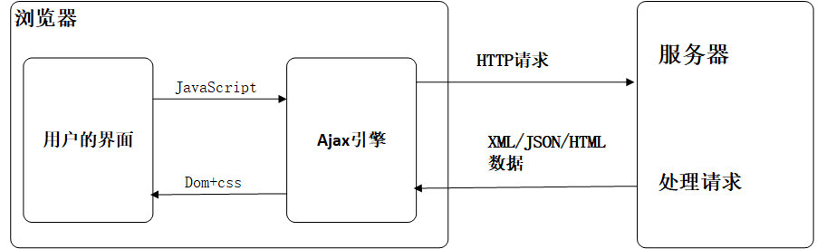
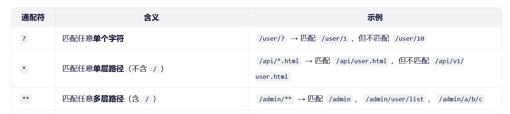
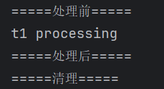

# SpringMVC

ssm： mybatis+Spring+SpringMVC MVC三层架构

MVC：模型（dao，service），视图（jsp），控制器（Servlet）

## 回顾Servlet

1. 新建一个maven项目，在项目中导入依赖

   ~~~xml
   <?xml version="1.0" encoding="UTF-8"?>
   <project xmlns="http://maven.apache.org/POM/4.0.0"
         xmlns:xsi="http://www.w3.org/2001/XMLSchema-instance"
            xsi:schemaLocation="http://maven.apache.org/POM/4.0.0 http://maven.apache.org/xsd/maven-4.0.0.xsd">
       <modelVersion>4.0.0</modelVersion>
   
       <groupId>org.wuming</groupId>
       <artifactId>SpringMVC</artifactId>
       <version>1.0-SNAPSHOT</version>
       <packaging>pom</packaging>
       <modules>
           <module>springmvc-01-servlet</module>
       </modules>
   
       <properties>
           <maven.compiler.source>21</maven.compiler.source>
           <maven.compiler.target>21</maven.compiler.target>
           <project.build.sourceEncoding>UTF-8</project.build.sourceEncoding>
       </properties>
   
   
       <dependencies>
           <dependency>
               <groupId>javax.servlet</groupId>
               <artifactId>javax.servlet-api</artifactId>
               <version>3.1.0</version>
           </dependency>
           <dependency>
               <groupId>junit</groupId>
               <artifactId>junit</artifactId>
               <version>4.13.1</version>
           </dependency>
           <dependency>
               <groupId>javax.servlet.jsp</groupId>
               <artifactId>javax.servlet.jsp-api</artifactId>
               <version>2.3.3</version>
           </dependency>
           <dependency>
               <groupId>javax.servlet</groupId>
               <artifactId>jstl</artifactId>
               <version>1.2</version>
           </dependency>
           <dependency>
               <groupId>taglibs</groupId>
               <artifactId>standard</artifactId>
               <version>1.1.2</version>
           </dependency>
       </dependencies>
   
   </project>
   ~~~
   
2. 编写一个servlet类，用来处理用户请求

   ~~~java
   package org.wuming.servlet;
   
   import javax.servlet.ServletException;
   import javax.servlet.http.HttpServlet;
   import javax.servlet.http.HttpServletRequest;
   import javax.servlet.http.HttpServletResponse;
   import java.io.IOException;
   
   public class HelloServlet extends HttpServlet {
       @Override
       protected void doGet(HttpServletRequest req, HttpServletResponse resp) throws ServletException, IOException {
           //获取前端参数
            String method = req.getParameter("method");
            if("add".equals(method)){
                req.setAttribute("msg", "调用了add方法");
            }
            else if("delete".equals(method)){
                req.setAttribute("msg", "调用了delete方法");
            }
           //调用服务层业务
           //页面转发或重定向
           req.getRequestDispatcher("/jsp/dispatcher.jsp").forward(req,resp);
       }
   
       @Override
       protected void doPost(HttpServletRequest req, HttpServletResponse resp) throws ServletException, IOException {
           doGet(req, resp);
       }
   }
   ~~~

3. 配置web.xml

   ~~~xml
   <?xml version="1.0" encoding="UTF-8"?>
   <web-app xmlns="http://xmlns.jcp.org/xml/ns/javaee"
            xmlns:xsi="http://www.w3.org/2001/XMLSchema-instance"
            xsi:schemaLocation="http://xmlns.jcp.org/xml/ns/javaee http://xmlns.jcp.org/xml/ns/javaee/web-app_4_0.xsd"
            version="4.0">
   
       <welcome-file-list>
           <welcome-file>index.jsp</welcome-file>
       </welcome-file-list>
   
       <servlet>
           <servlet-name>test</servlet-name>
           <servlet-class>org.wuming.servlet.HelloServlet</servlet-class>
       </servlet>
       <servlet-mapping>
           <servlet-name>test</servlet-name>
           <url-pattern>/hello</url-pattern>
       </servlet-mapping>
   
   <!--    <session-config>-->
   <!--        <session-timeout>15</session-timeout>-->
   <!--    </session-config>-->
   </web-app>
   ~~~

4. 定制转发页面

   ~~~jsp
   <%--
     Created by IntelliJ IDEA.
     User: Lenovo
     Date: 2025/11/2
     Time: 13:33
     To change this template use File | Settings | File Templates.
   --%>
   <%@ page contentType="text/html;charset=UTF-8" language="java" %>
   <html>
   <head>
       <title>test</title>
   </head>
   <body>
       
dispacher success

       
转发成功

       ${pageContext.request.getAttribute(msg)}
   <%--    ${msg}--%>
   </body>
   </html>
   ~~~

## MVC介绍

MVC框架要做哪些事情：

1. 将url映射到java类或java类的方法
2. 封装用户提交的数据
3. 处理请求--调用相关的业务处理--封装相应数据
4. 将相应的数据进行渲染：jsp、html等表示层数据

为什么要学习SpringMVC？

- 轻量级，简单易学
- 高效，基于请求响应的MVC框架
- 与Spring兼容性好，无缝结合
- 约定大于配置
- 功能强大：RESTful、数据验证、格式化、本地化、主题等
- 简洁灵活
- 使用的人多

 Spring MVC和其他许多Web框架一样，是围绕前端控制器模式设计的，其中一个中央 `Servlet`，即 `DispatcherServlet`，为请求处理提供了一个共享算法，而实际工作则由可配置的委托组件执行。这种模式很灵活，支持多样化的工作流程。 

## SpringMVC执行流程

1. 用户请求发送到**前端控制器 DispatcherServlet**。
2. 前端控制器 DispatcherServlet 接收到请求后，DispatcherServlet 会使用 HandlerMapping 来处理，**HandlerMapping 会查找到具体进行处理请求的 Handler 对象**。
3. HandlerMapping 找到对应的 Handler 之后，并不是返回一个 Handler 原始对象，而是一个 Handler  执行链（HandlerExecutionChain），在这个执行链中包括了拦截器和处理请求的 Handler。HandlerMapping  返回一个执行链给 DispatcherServlet。
4. DispatcherServlet 接收到执行链之后，会**调用 Handler 适配器去执行 Handler**。
5. Handler 适配器执行完成 Handler（也就是 Controller）之后会得到一个 ModelAndView，并返回给 DispatcherServlet。
6. DispatcherServlet 接收到 HandlerAdapter 返回的 ModelAndView 之后，会根据其中的视图名调用 ViewResolver。
7. **ViewResolver 根据逻辑视图名解析成一个真正的 View 视图**，并返回给 DispatcherServlet。
8. DispatcherServlet 接收到视图之后，会根据上面的 ModelAndView 中的 model 来进行视图中数据的填充，也就是所谓的**视图渲染**。
9. 渲染完成之后，DispatcherServlet 就可以将结果返回给用户了。

### 过滤器是怎样作用的？

**一个标准的Web请求：**

1. 客户端发送一个HTTP请求
2. 过滤器链执行
   - 请求首先经过web.xml中配置的过滤器链，比如CharacterEncodingFilter
   - CharacterEncodingFilter将会设置：
     - request.setCharacterEncoding("UTF-8")
     - response.setCharacterEncoding("UTF-8")
3. 进入DispatcherServlet
4. DispatcherServlet找到对应的@Controller和方法，执行方法并返回一个视图名称
5. 视图渲染
   - DispatcherServlet找到对应视图
   - 视图对象开始渲染：调用resp.getWriter()来获取PrintWriter对象并输出，而首次调用resp.getWriter()时就会根据之前设置的编码格式初始化writer对象
6. 响应返回

**使用了@ResponseBody/@RestController的请求：**

1. 请求到达

2. 过滤器链执行

3. 进入DispatcherServlet

4. Controller方法执行，由于标记了@ResponseBody，它会返回一个字符串或对象

5. HTTP消息转换：DispatcherServlet发现返回值不是视图名，而是需要直接写入响应的内容，它会委托给**HttpMessgeConverter**来处理，对于字符串，通常使用**StringHttpMessageConverter**。它将直接获取HttpServletResponse的输出流，然后写入

6. 在写入时它会这样做：

   - 检查content-type是否设置
   - 没有设置则将设置一个，可能采取java默认编码
   - 然后调用resp.getWriter()或resp.getOuputStream()来写入数据

### 方法参数解析

**controller方法参数解析：** 通过一个叫做 **`HandlerMethodArgumentResolver`（处理器方法参数解析器）** 的组件家族，自动地将HTTP请求中的信息（如查询参数、表单数据、路径变量、请求头等）转换并注入到方法声明的参数中 。

#### 第一步：请求到达与分发

1. HTTP请求到达 `DispatcherServlet`（前端控制器）。
2. `DispatcherServlet` 根据请求URL，通过 `HandlerMapping` 找到对应的 `Controller` 和方法，封装为一个 `HandlerMethod` 对象。

#### 第二步：准备执行方法（核心）

1. `DispatcherServlet` 将请求交给一个 `HandlerAdapter`（例如 `RequestMappingHandlerAdapter`）来处理。
2. `RequestMappingHandlerAdapter` 会创建一个 `ServletInvocableHandlerMethod` 对象来包装已经封装好的`HandlerMethod`。这个对象是方法执行的核心。
3. **关键步骤：** `ServletInvocableHandlerMethod` 会持有一个 **`HandlerMethodArgumentResolver` 组合（List）**。这个组合里包含了Spring MVC预注册的几十种不同的参数解析器。

#### 第三步：遍历参数并解析（`invokeForRequest` 方法）

当真正要执行Controller方法时，会调用 `ServletInvocableHandlerMethod.invokeForRequest()` 方法。

1. **获取方法参数值：** 在这个方法内部，会遍历你Controller方法中的每一个参数。
2. **寻找支持的解析器：** 对于每个参数，它都会遍历 `ArgumentResolver` 组合，询问：**“你支持解析这个参数吗？”** （调用 `supportsParameter(Parameter parameter)` 方法）。
3. **解析参数：** 一旦找到第一个声称支持该参数的解析器，就会调用该解析器的 `resolveArgument(...)` 方法。这个方法会：
   - **从HTTP请求的相应位置（如 `HttpServletRequest`、`@PathVariable`、`@RequestParam` 等）提取出原始数据（通常是String或String[]）。**
   - **进行必要的类型转换**（使用 `ConversionService` 或 `PropertyEditor`）。例如，将字符串 "123" 转换为 `Integer` 类型的 123。
   - 返回转换后的对象。
4. 将解析好的参数值收集到一个参数数组 `args` 中。

#### 第四步：方法调用与返回

1. 使用上一步组装好的参数数组 `args`，通过Java反射机制（`method.invoke(controller, args)`）调用Controller方法，此时参数已经被正确注入。
2. 最后，将方法返回值交给 `HandlerMethodReturnValueHandler` 去处理，生成最终的HTTP响应。

**注意：**注意spring、servlet、tomcat，jdk间的版本兼容性问题

- spring 5.3.x只支持到Java 17，依赖javax.servlet
- Spring6.0+才支持Java 17+，Spring 6.1+才支持Java 21，但是依赖jakarta.servlet
- tomcat8/9 支持Java 8~17，Java 19~21可运行不保证兼容

## SpringMVC初步使用

1. 导入相关依赖

   ~~~xml
       <dependencies>
           <dependency>
               <groupId>javax.servlet</groupId>
               <artifactId>javax.servlet-api</artifactId>
               <version>3.1.0</version>
           </dependency>
           <dependency>
               <groupId>junit</groupId>
               <artifactId>junit</artifactId>
               <version>4.13.1</version>
           </dependency>
           <dependency>
               <groupId>javax.servlet.jsp</groupId>
               <artifactId>javax.servlet.jsp-api</artifactId>
               <version>2.3.3</version>
           </dependency>
           <dependency>
               <groupId>javax.servlet</groupId>
               <artifactId>jstl</artifactId>
               <version>1.2</version>
           </dependency>
           <dependency>
               <groupId>taglibs</groupId>
               <artifactId>standard</artifactId>
               <version>1.1.2</version>
           </dependency>
           <!-- https://mvnrepository.com/artifact/org.springframework/spring-webmvc -->
           <dependency>
               <groupId>org.springframework</groupId>
               <artifactId>spring-webmvc</artifactId>
               <version>5.3.18</version>
           </dependency>
       </dependencies>
   ~~~

2. 配置web.xml

   ~~~xml
   <?xml version="1.0" encoding="UTF-8"?>
   <web-app xmlns="http://xmlns.jcp.org/xml/ns/javaee"
            xmlns:xsi="http://www.w3.org/2001/XMLSchema-instance"
            xsi:schemaLocation="http://xmlns.jcp.org/xml/ns/javaee http://xmlns.jcp.org/xml/ns/javaee/web-app_4_0.xsd"
            version="4.0">
   
       <welcome-file-list>
           <welcome-file>index.jsp</welcome-file>
       </welcome-file-list>
   
       <servlet>
           <servlet-name>springmvc</servlet-name>
           <servlet-class>org.springframework.web.servlet.DispatcherServlet</servlet-class>
           <init-param>
               <param-name>contextConfigLocation</param-name>
               <param-value>classpath:springmvc-servlet.xml</param-value>
           </init-param>
           <!--启动级别-->
           <load-on-startup>1</load-on-startup>
       </servlet>
       <!--/匹配所有的请求不包括.jsp-->
       <!--/*匹配所有的请求，包括.jsp-->
       <servlet-mapping>
           <servlet-name>springmvc</servlet-name>
           <url-pattern>/</url-pattern>
       </servlet-mapping>
   </web-app>
   ~~~

3. 配置spring相关beans文件

   ~~~xml
   <?xml version="1.0" encoding="UTF-8"?>
   <beans xmlns="http://www.springframework.org/schema/beans"
          xmlns:mvc="http://www.springframework.org/schema/mvc" xmlns:context="http://www.springframework.org/schema/context"
          xmlns:xsi="http://www.w3.org/2001/XMLSchema-instance"
          xsi:schemaLocation="
           http://www.springframework.org/schema/beans
           http://www.springframework.org/schema/beans/spring-beans.xsd
           http://www.springframework.org/schema/mvc
           http://www.springframework.org/schema/mvc/spring-mvc.xsd
           http://www.springframework.org/schema/context
           http://www.springframework.org/schema/context/spring-context.xsd">
   
       <bean class="org.springframework.web.servlet.handler.BeanNameUrlHandlerMapping"/>
       <bean class="org.springframework.web.servlet.mvc.SimpleControllerHandlerAdapter"/>
   
       <!--    视图解析器，解析DispatcherServlet传递的ModelAndView-->
       <bean class="org.springframework.web.servlet.view.InternalResourceViewResolver" id="internalResourceViewResolver">
           <property name="prefix" value="/jsp/"/>
           <property name="suffix" value=".jsp"/>
       </bean>
   
   </beans>
   ~~~

4. 创建相应controller，并注册到spring中

   ~~~java
   package org.wuming.controller;
   
   import org.springframework.web.servlet.ModelAndView;
   import org.springframework.web.servlet.mvc.Controller;
   
   import javax.servlet.http.HttpServletRequest;
   import javax.servlet.http.HttpServletResponse;
   
   public class HelloController implements Controller {
       @Override
       public ModelAndView handleRequest(HttpServletRequest request, HttpServletResponse response) throws Exception {
           ModelAndView mv = new ModelAndView();
   
           mv.addObject("msg", "hello SpringMVC!");
           mv.setViewName("hello");	//根据视图名称找到对应的页面
           return mv;
           //真实页面地址：视图解析器前缀+viewName+视图解析器后缀
       }
   }
   ~~~

   ~~~xml
   <!--id就是url访问路径，也是相应的Controller的对象-->
   <bean id="/hello" class="org.wuming.controller.HelloController"/>
   ~~~

5. 创建相应view并启动测试

   ~~~jsp
   <%@ page contentType="text/html;charset=UTF-8" language="java" %>
   <html>
   <head>
       <title>Title</title>
   </head>
   <body>
       ${msg}
   </body>
   </html>
   ~~~

可能遇到的问题：

1. javax.servlet......ClassNotFound，可能是servlet与spring版本冲突，一般降级spring即可
2. 降级后可能出现org.apache.springframnework......ClassNotFound，大概率是因为打包的spring没有更新，lib库中没有降级后的spring版本，可以考虑重建lib目录并将项目资源导入

**注意：**考虑把jsp文件全部放在WEB-INF文件夹下，因为客户端无法直接访问；如果有时修正了错误却没有反应，可能是需要clean之后重新构建

## SpringMVC注解使用

1. 配置web.xml注册DispatcherServlet【**不变**】

   ~~~xml
   <?xml version="1.0" encoding="UTF-8"?>
   <web-app xmlns="http://xmlns.jcp.org/xml/ns/javaee"
            xmlns:xsi="http://www.w3.org/2001/XMLSchema-instance"
            xsi:schemaLocation="http://xmlns.jcp.org/xml/ns/javaee http://xmlns.jcp.org/xml/ns/javaee/web-app_4_0.xsd"
            version="4.0">
       <servlet>
           <servlet-name>springmvc</servlet-name>
           <servlet-class>org.springframework.web.servlet.DispatcherServlet</servlet-class>
           <init-param>
               <param-name>contextConfigLocation</param-name>
               <param-value>classpath:springmvc-config.xml</param-value>
           </init-param>
           <load-on-startup>1</load-on-startup>
       </servlet>
       <servlet-mapping>
           <servlet-name>springmvc</servlet-name>
           <url-pattern>/</url-pattern>
       </servlet-mapping>
   </web-app>
   ~~~

2. 配置spring配置文件【**核心**】

   ~~~xml
   <?xml version="1.0" encoding="UTF-8"?>
   <beans xmlns="http://www.springframework.org/schema/beans"
          xmlns:mvc="http://www.springframework.org/schema/mvc" xmlns:context="http://www.springframework.org/schema/context"
          xmlns:xsi="http://www.w3.org/2001/XMLSchema-instance"
          xsi:schemaLocation="
           http://www.springframework.org/schema/beans
           http://www.springframework.org/schema/beans/spring-beans.xsd
           http://www.springframework.org/schema/mvc
           http://www.springframework.org/schema/mvc/spring-mvc.xsd
           http://www.springframework.org/schema/context
           http://www.springframework.org/schema/context/spring-context.xsd">
   
       <!--自动扫描包，将包下所有注解类交给Spring管理-->
       <context:component-scan base-package="org.wuming.controller"/>
   
       <!--让SpringMVC不处理静态资源 .css .html .js .mp3-->
       <mvc:default-servlet-handler/>
   
       <!--
           支持mvc注解驱动
           在spring中曹勇@RequestMapping注解来完成映射关系
           要像是@RequestMapping生效
           必须在上下文中注册DefaultAnnotationHandlerMapping和
           一个AnnotationMethodHandlerAdapter实例
           这两个实例分别在类级别和方法级别进行处理
           annotation-driven配置可以帮助我们自动完成上述两个实例的注入
       -->
   
       <mvc:annotation-driven/>
   
       <!--视图解析器-->
       <bean class="org.springframework.web.servlet.view.InternalResourceViewResolver"
             id="internalResourceViewResolver">
           <property name="prefix" value="/WEB-INF/jsp/"/>
           <property name="suffix" value=".jsp"/>
       </bean>
   </beans>
   ~~~

3. 创建controller包及相关类

   ~~~java
   package org.wuming.controller;
   
   import org.springframework.stereotype.Controller;
   import org.springframework.ui.Model;
   import org.springframework.web.bind.annotation.RequestMapping;
   import org.springframework.web.bind.annotation.RestController;
   
   @Controller	//代表这个类会被Spring接管，其中所有返回String的方法会自动被视图解析器解析
   //@RequestMapping("/h")
   public class HelloController {
   
       //映射路径，相当于给方法注册一个bean，bean的id为/hello
       @RequestMapping("/hello")   //如果类上没有父级路径，则这就是访问路径，若有父路径，则直接拼接
       //方法中的Model参数可以直接获取到，其余参数放在前面并可以依次由前端传参赋值，无须request的getParameter方法，需要注意参数名字和前端传递的参数名字要对应
       public String hello(Model model){
           model.addAttribute("msg","hello,springmvc");
           return "hello";     //会被视图解析器处理为页面资源
       }
   }
   ~~~

   

回忆spring组件：

- Component，组件
- Service，服务
- Repository，dao
- Controller，控制

**注意**：model.addAttribute()<==>request.setAttribute()，**model传递的数据将会经过视图解析器渲染，而response传递的数据则是通过输出流直接写入响应体，不经过视图解析器。**

## Restful风格

传统url：localhost:8080/method?add=1&...

restful风格：localhost:8080/method/add/1/2/3/4

**REST**全称Representational State Transfer，直接翻译就是表现层状态转化，通俗来说就是资源在网络中以某种表现形式进行状态转化。

**资源**是Restful中的核心概念之一，在该风格中，互联网中每一样信息都是资源，每份资源对弈一个特定唯一的URI（统一资源定位符）

客户端可以通过某些操作使服务器端的资源发生变化，这个过程也就是**表现层状态转化**。在HTTP中提供了四种常见的操作方式：

- GET，获取资源
- POST，新建资源或更新资源
- PUT，更新资源
- DELETE，删除资源

传统方式实现增删改查(全部通过GET和POST方法实现)：

- .../addUser?id=1&...
- .../deleteUser?id=1
- .../updateUser?id=1&...
- .../getUser>id=1&...

**使用Restful风格操作资源：**通过不同的请求方式实现不同的效果！如下：请求地址相同，但功能可以不同：

- http://localhost/item/1，查询，GET
- http://localhost/item，新建，POST
- http://localhost/item/1，更新，PUT
- http://localhost/item/1，删除，DELETE

如何使用Restful风格编码呢？

**核心：** 

- 利用@PathViable为变量注解，将路径分隔符间的内容作为参数传递

  ~~~java
  package org.wuming.controller;
  
  import org.springframework.stereotype.Controller;
  import org.springframework.ui.Model;
  import org.springframework.web.bind.annotation.PathVariable;
  import org.springframework.web.bind.annotation.RequestMapping;
  
  @Controller
  public class RestfulController {
  
      //原来 http://localhost:8080/add?a=1&b=1,不添加@PathVariable只设置函数参数时
      //现在 http://localhost:8080/add/1/1，在参数前添加注解后
      @RequestMapping("/add/{a}/{b}")
      //如果@PathVariable没有指定value，则默认参数名必须对应花括号内的相同变量名，例如a对应{a}，否则会报错
      //如果指定了value，则按照value的名字寻找花括号对应的变量，此时参数名可以随意取
      public String add(@PathVariable int a, @PathVariable int b, Model model) {
          int result = a+ b;
          model.addAttribute("msg", "add结果为" + result);
          return "hello";
      }
  }
  ~~~

- 指定客户端的请求方法，这种方式可以实现相同url不同效果

  ~~~java
  //@RequestMapping(value="/hello/{a}/{b}", method=RequestMethod.GET),这种方式等价与上面这种方式
      @GetMapping("/hello/{a}/{b}")
      public String hello(@PathVariable int a, @PathVariable int b, Model model){
          int result = a+ b;
          model.addAttribute("msg","结果为"+result);
          return "hello";
      }
  ~~~

  HTML表单限制只支持GET和POST方法，但是实际上现代浏览器和HTTP客户端都支持所有HTTP方法，，可以在js文件通过ajax/fetch使用，如果一定要使用HTML表单，可以在表单中模拟一个字段` <input type="hidden" name="_method" value="DELETE">`然后再Spring配置文件中配置`HiddenHttpMehodFilter`来提取

## 重定向和转发

1. 返回**ModelAndView**对象，通过视图解析器跳转，详见 [springmvc初步使用](##SpringMVC初步使用)

2. 使用**ServletAPI**

   ~~~java
   package org.wuming.controller;
   
   import org.springframework.stereotype.Controller;
   import org.springframework.ui.Model;
   import org.springframework.web.bind.annotation.RequestMapping;
   
   import javax.servlet.ServletException;
   import javax.servlet.http.HttpServletRequest;
   import javax.servlet.http.HttpServletResponse;
   import java.io.IOException;
   
   @Controller
   public class ServletController {
   
       @RequestMapping("/p")
       public void print(HttpServletRequest req, HttpServletResponse resp) throws IOException {
           resp.getWriter().println("hello");
       }
   
       @RequestMapping("/s")
       public void redirect(HttpServletRequest req, HttpServletResponse resp, Model model) throws IOException {
           model.addAttribute("msg", "sendRedirect");
           resp.sendRedirect(req.getContextPath()+"/index.jsp");
       }
   
       @RequestMapping("/d")
       public void dispatch(HttpServletRequest req, HttpServletResponse resp) throws ServletException, IOException {
           req.setAttribute("msg", "dispatch");
           req.getRequestDispatcher("/WEB-INF/jsp/hello.jsp").forward(req, resp);
       }
   }
   ~~~

## SpringMVC 处理提交数据

[SpringMVC中controller接收请求参数的常见方式](https://www.cnblogs.com/xfeiyun/p/17938484)

1. 正常方式直接获取

   普通方式提交数据：http://localhost:8080/hello?name=wuming

   处理方法：

   ~~~java
   @RequestMapping("/hello")
   public String hello(String name){
       System.out.println(name);
       return "hello";
   }
   ~~~

   对象方式提交数据：http://localhost:8080/user?name=wuming&age=18&gender=male

   处理方法：

   ~~~java
   @RequestMapping("/user")
   public String hello(User user){
       System.out.println(user.getName()+": "+user.getAge());
       return "hello";
   }
   ~~~

2. 通过HttpServletRequest获取请求参数，详见javaweb

3. 通过@RequestParam注解接收请求参数

   RequestParam作用：将请求中指定名称的参数传递给控制器方法中的形参，有点类似mybatis中的@Param可以改变名称映射

   注解属性：

   - value：请求参数中的名称，即=前面的键
   - required：请求参数是否必须提供该参数，默认为true
   - defaultvalue：设置默认值，仅当对应请求参数为空时生效

   ~~~java
   @RequestMapping("/hello")
   public String hello(@RequestParam(value="name",required=false) String username){
       System.out.println("username");
       return "hello";
   }
   ~~~

4. 通过@PathVariable注解接收请求参数

   注解作用：将控制器方法中的形参绑定url中的占位符代表的值

   注解属性value：指定url中的占位符名称

   详见[restful风格]()中的具体应用

## 解决乱码问题

使用spring提供的字符编码过滤器，在web.xml中进行配置

~~~xml
    <filter>
        <filter-name>encoding</filter-name>
        <filter-class>org.springframework.web.filter.CharacterEncodingFilter</filter-class>
        <init-param>
            <param-name>encoding</param-name>
            <param-value>UTF-8</param-value>
        </init-param>
    </filter>
	<!--注意这里必须为/*,处理包含jsp文件在内的乱码问题-->
    <filter-mapping>
        <filter-name>encoding</filter-name>
        <url-pattern>/*</url-pattern>
    </filter-mapping>
~~~

## JSON

json最初是用来存储JavaScript对象的轻量级数据交换格式，基于两种结构构件：键值对{}与值列表[]

在前端使用`JSON.stringify(Object)`和`JSON.parse(String)`实现对象与字符串格式的转换

### Jackson

~~~xml
<!-- https://mvnrepository.com/artifact/tools.jackson.core/jackson-databind -->
<dependency>
    <groupId>tools.jackson.core</groupId>
    <artifactId>jackson-databind</artifactId>
    <version>3.0.1</version>
</dependency>
~~~

~~~java
package org.wuming.controller;

import com.fasterxml.jackson.core.JsonProcessingException;
import com.fasterxml.jackson.databind.DeserializationFeature;
import com.fasterxml.jackson.databind.ObjectMapper;
import com.fasterxml.jackson.databind.SerializationFeature;
import org.springframework.stereotype.Controller;
import org.springframework.web.bind.annotation.RequestMapping;
import org.springframework.web.bind.annotation.ResponseBody;
import org.springframework.web.bind.annotation.RestController;
import org.wuming.pojo.User;

import java.util.ArrayList;
import java.util.Date;

@Controller
public class UserController {

    @RequestMapping(value = "/j1")   //设置produces格式防止乱码
    @ResponseBody //加上这个注释就不会去找视图解析器，直接返回字符串
    public String json1() throws JsonProcessingException {
        User user = new User();
        user.setId(1);
        user.setName("wuming");
        user.setSex("男");

        //jackson, ObjectMapper将对象转为字符串
        ObjectMapper mapper = new ObjectMapper();
        String str = mapper.writeValueAsString(user);
        return  str;
    }

    @RequestMapping("/j2")
    @ResponseBody
    public String json2() throws JsonProcessingException {
        User u1 = new User(1, "wuming", "male");
        User u2 = new User(1, "wuming", "male");
        User u3 = new User(1, "wuming", "male");
        User u4 = new User(1, "wuming", "male");
        User u5 = new User(1, "wuming", "male");

        ArrayList<User> users = new ArrayList<User>();
        users.add(u1);
        users.add(u2);
        users.add(u3);
        users.add(u4);
        users.add(u5);

        ObjectMapper mapper = new ObjectMapper();
        return mapper.writeValueAsString(users);
    }

    @RequestMapping("j3")
    @ResponseBody
    public String json3() throws JsonProcessingException {
        ObjectMapper mapper = new ObjectMapper();
        return mapper.writeValueAsString(new Date());
    }

}
~~~

但是每一个非视图名称字符串都要手动配置produces太麻烦了，可以在spring配置文件中的注解驱动内配置，这是根据DispatcherServlet转发字符串原理来配置的：

~~~xml
<mvc:annotation-driven>
        <mvc:message-converters>
            <!--自定义String编码-->
            <bean class="org.springframework.http.converter.StringHttpMessageConverter">
                <constructor-arg value="UTF-8"/>
            </bean>
            <!--自定义Jackson配置-->
            <bean class="org.springframework.http.converter.json.MappingJackson2HttpMessageConverter" id="converter">
                <property name="objectMapper">
                    <bean class="org.springframework.http.converter.json.Jackson2ObjectMapperFactoryBean">
                        <property name="failOnEmptyBeans" value="false"/>
                    </bean>
                </property>
            </bean>
        </mvc:message-converters>
    </mvc:annotation-driven>
~~~

`<mvc:annotation-driven/>`将默认自动注册一组消息转换器（包括Json，String，Form等），但是显式配置了`<mvc:message-converters>`将移除默认消息转换器，除非设置`register-defaults=true`将保留默认的。

除了方法上的`@ResponseBody` 还有类上的`@RestController`让某个方法或某个类的所有方法返回字符串而非视图名称

**注意：**如果返回值不只有字符串还有对象时，spring会自动通过HttpMessageConverter将对象序列化为json，此时如果没有导入jackson的包就会报错，，spring默认会自动检测和注册jackson对应的converter，如果是其他json包，就需要手动进行配置converter。

### Fastjson

专门用于JavaBean与json格式之间的转换，跨语言较差，阿里系中间件常用，但Spring Boot默认使用Jackson，推荐使用Jackson

~~~xml
<!-- https://mvnrepository.com/artifact/com.alibaba.fastjson2/fastjson2 -->
<dependency>
    <groupId>com.alibaba.fastjson2</groupId>
    <artifactId>fastjson2</artifactId>
    <version>2.0.0</version>
</dependency>
~~~

三个主要类：

- JSONObject，代表json对象
- JSONArray，代表json对象数组
- JSON，实现了JSONObject和JSONArray之间得到转化

~~~java
//JSON.toJsonString(Object)		java对象到JSON字符串
//JSON.parseObject(String, User.class)	JSON字符串到java对象
//JSON.parseArray(String, User.class)

//JSON.toJSON(Object)	java对象到JSON对象
//JSON.toJavaObject(JSON, User.class)
~~~

## 整合

整合Mybatis、Spring、SpringMVC

1. 搭建项目基本结构：

   - 创建一个空项目，添加web支持

   - 删除无关内容，增加resources文件夹

   - 在pom.xml中导入相关依赖，添加静态资源导出

   - 建立包结构：pojo,mapper,service,controller,utils,filter等

   - 在resources下增加mybatis和spring基本配置文件：mybatis-config.xml,applicationContext.xml

   - 开始正式编写代码：

     - 编写实体类
     - 编写实体类对应mapper层接口和mybatis配置并注册
     - 编写实体类对应service层业务（注意mapper注入）

   - 整合spring配置：
     - 配置spring-mapper.xml
       - 关联数据库配置文件
       - 配置数据源
       - 声明式事务配置
       - 配置SqlSessionFactory
       - 扫描包以动态注册接口实现类
     - 配置spring-service.xml
       - 扫描包并注册实现类的bean即可（注意依赖注入）
     
   - 整合SpringMVC：
     - 配置web.xml
       - 配置DispatcherServlet：ContextConfigLocation和load-on-startup
       - 配置字符编码过滤器
     - 配置ContextConfigLocation设置的文件：
       - 注解驱动
       - 静态资源处理
       - 扫描包注册
       - 视图解析器
   
   - Controller与前端联调：明确好一个需求后编写一个Controller方法对应修改前端页面或新增页面
   
     

**依赖导入：**

~~~xml
<project xmlns="http://maven.apache.org/POM/4.0.0" xmlns:xsi="http://www.w3.org/2001/XMLSchema-instance"
         xsi:schemaLocation="http://maven.apache.org/POM/4.0.0 http://maven.apache.org/xsd/maven-4.0.0.xsd">
    <modelVersion>4.0.0</modelVersion>
    <parent>
        <groupId>org.wuming</groupId>
        <artifactId>SpringMVC</artifactId>
        <version>1.0-SNAPSHOT</version>
    </parent>

    <artifactId>SpringMVC-conclude</artifactId>
    <packaging>jar</packaging>

    <name>SpringMVC-conclude</name>
    <url>http://maven.apache.org</url>

    <properties>
        <project.build.sourceEncoding>UTF-8</project.build.sourceEncoding>
    </properties>

    <dependencies>
        <dependency>
            <groupId>junit</groupId>
            <artifactId>junit</artifactId>
            <version>3.8.1</version>
            <scope>test</scope>
        </dependency>
        <dependency>
            <groupId>com.mysql</groupId>
            <artifactId>mysql-connector-j</artifactId>
            <version>9.4.0</version>
        </dependency>
        <!-- c3p0 数据库连接池 -->
        <dependency>
            <groupId>com.mchange</groupId>
            <artifactId>c3p0</artifactId>
            <version>0.9.5.5</version>
        </dependency>
        <dependency>
            <groupId>javax.servlet</groupId>
            <artifactId>javax.servlet-api</artifactId>
            <version>4.0.1</version>
        </dependency>
        <dependency>
            <groupId>javax.servlet.jsp</groupId>
            <artifactId>javax.servlet.jsp-api</artifactId>
            <version>2.3.3</version>
        </dependency>
        <dependency>
            <groupId>javax.servlet</groupId>
            <artifactId>jstl</artifactId>
            <version>1.2</version>
        </dependency>
        <dependency>
            <groupId>org.projectlombok</groupId>
            <artifactId>lombok</artifactId>
            <version>1.18.30</version>
        </dependency>
        <dependency>
            <groupId>org.springframework</groupId>
            <artifactId>spring-webmvc</artifactId>
            <version>5.3.18</version>
        </dependency>
        <dependency>
            <groupId>org.springframework</groupId>
            <artifactId>spring-jdbc</artifactId>
            <version>5.3.18</version>
        </dependency>
        <dependency>
            <groupId>org.mybatis</groupId>
            <artifactId>mybatis</artifactId>
            <version>3.5.19</version>
        </dependency>
        <dependency>
            <groupId>org.mybatis</groupId>
            <artifactId>mybatis-spring</artifactId>
            <version>2.1.2</version>
        </dependency>
        <dependency>
            <groupId>org.aspectj</groupId>
            <artifactId>aspectjweaver</artifactId>
            <version>1.9.24</version>
        </dependency>
    </dependencies>

    <build>
        <resources>
            <resource>
                <directory>src/main/java</directory>
                <includes>
                    <include>**/*.xml</include>
                    <include>**/*.properties</include>
                </includes>
            </resource>
            <resource>
                <directory>src/main/resources</directory>
                <includes>
                    <include>**/*.xml</include>
                    <include>**/*.properties</include>
                </includes>
            </resource>
        </resources>
    </build>
</project>
~~~

###  Mybatis层

1. 建表

   ~~~sql
   drop database if exists ssmbuild;
   
   create database ssmbuild;
   use ssmbuild;
   
   create table books(
   	book_id int(10) not null auto_increment COMMENT 'book id',
   	book_name varchar(100) not null comment 'book name',
   	book_counts int(10) not null comment 'number of book',
   	detail varchar(200) not null comment 'description',
   	primary key(book_id)
   )engine=INNODB default charset=utf8mb4;
   
   insert into books VALUES
   (1,'Java',1,'从入门到放弃'),
   (2,'Mysql',10,'从删库到跑路'),
   (3,'Linux',5,'从进门到坐牢');
   ~~~

2. BookMapper.xml

   ~~~xml
   <?xml version="1.0" encoding="UTF-8" ?>
   <!DOCTYPE mapper
           PUBLIC "-//mybatis.org//DTD Config 3.0//EN"
           "https://mybatis.org/dtd/mybatis-3-mapper.dtd">
   <mapper namespace="org.wuming.mapper.BookMapper">
       <insert id="addBook" parameterType="books">
           insert into books
           values(#{bookName,#{bookCount},#{detail})
       </insert>
   
       <delete id="deleteBook">
           delete from books
           where book_id=#{id}
       </delete>
   
       <update id="updateBook" parameterType="books">
           update books
           set book_name=#{bookName},book_count=#{bookCount},detail=#{detail}
           where book_id=#{bookId}
       </update>
   
       <select id="getBookById">
           select * from books
           where book_id=#{id}
       </select>
   
       <select id="getBooks" resultType="books">
           select * from books
       </select>
   </mapper>
   ~~~

### Spring层

spring-mapper.xml:

~~~xml
<?xml version="1.0" encoding="UTF-8"?>
<beans xmlns="http://www.springframework.org/schema/beans"
       xmlns:xsi="http://www.w3.org/2001/XMLSchema-instance"
       xmlns:context="http://www.springframework.org/schema/context"
       xsi:schemaLocation="
           http://www.springframework.org/schema/beans
           https://www.springframework.org/schema/beans/spring-beans.xsd
           http://www.springframework.org/schema/context
           https://www.springframework.org.schema/context/spring-context.xsd">

    <!-- 负责数据库相关事项 -->

    <!-- 1.关联数据库配置文件 -->
    <context:property-placeholder location="classpath:database.properties"/>

    <!-- 2.连接池
        dbcp: 半自动化不能自动连接
        c3p0: 自动化操作（自动加载配置文件）
        druid，hikari
     -->
    <bean id="dataSource" class="com.mchange.v2.c3p0.ComboPooledDataSource">
        <property name="driverClass" value="${jdbc.driver}"/>
        <property name="jdbcUrl" value="${jdbc.url}"/>
        <property name="user" value="${jdbc.username}"/>
        <property name="password" value="${jdbc.password}"/>

        <property name="minPoolSize" value="10"/>
        <property name="maxPoolSize" value="30"/>
        <!--关闭连接后不自动commit-->
        <property name="autoCommitOnClose" value="false"/>
        <!--连接超时时间-->
        <property name="checkoutTimeout" value="1000"/>
        <!--当获取连接失败重试次数-->
        <property name="acquireRetryAttempts" value="2"/>
    </bean>
    <!--声明式事务配置,需要单独导入spring-jdbc包才能使用-->
    <bean id="transactionManager" class="org.springframework.jdbc.datasource.DataSourceTransactionManager">
        <property name="dataSource" ref="dataSource"/>
    </bean>
    <!-- 3.SqlSessionFactory-->
    <bean id="sqlSessionFactory" class="org.mybatis.spring.SqlSessionFactoryBean">
        <property name="dataSource" ref="dataSource"/>
        <property name="configLocation" value="classpath:mybatis-config.xml"/>
    </bean>
    
    <!--4.配置mapper接口扫描包,动态实现mapper接口并注入到spring，相当于包下的接口都将生成一个Impl类-->
    <bean class="org.mybatis.spring.mapper.MapperScannerConfigurer">
        <property name="sqlSessionFactoryBeanName" value="sqlSessionFactory"/>
        <property name="basePackage" value="org.wuming.mapper"/>
    </bean>
</beans>
~~~

spring-service.xml:

~~~xml
<?xml version="1.0" encoding="UTF-8"?>
<beans xmlns="http://www.springframework.org/schema/beans"
       xmlns:xsi="http://www.w3.org/2001/XMLSchema-instance"
       xmlns:context="http://www.springframework.org/schema/context"
       xsi:schemaLocation="
           http://www.springframework.org/schema/beans
           https://www.springframework.org/schema/beans/spring-beans.xsd
           http://www.springframework.org/schema/context
           https://www.springframework.org/schema/context/spring-context.xsd">

    <!-- 扫描service包下的类 -->
    <context:component-scan base-package="org.wuming.service"/>

    <!--也可以在实现类上加@Service，在依赖上加@Autowired注解实现-->
    <bean id="bookService" class="org.wuming.service.BooksServiceImpl">
        <property name="bookMapper" ref="bookMapper"/>
    </bean>
    
</beans>
~~~

### SpringMVC

web.xml：

~~~xml
<?xml version="1.0" encoding="UTF-8"?>
<web-app xmlns="http://xmlns.jcp.org/xml/ns/javaee"
         xmlns:xsi="http://www.w3.org/2001/XMLSchema-instance"
         xsi:schemaLocation="http://xmlns.jcp.org/xml/ns/javaee http://xmlns.jcp.org/xml/ns/javaee/web-app_4_0.xsd"
         version="4.0">

    <servlet>
        <servlet-name>springmvc</servlet-name>
        <servlet-class>org.springframework.web.servlet.DispatcherServlet</servlet-class>

        <init-param>
            <param-name>contextConfigLocation</param-name>
            <param-value>classpath:spring-mvc.xml</param-value>
        </init-param>
        <load-on-startup>1</load-on-startup>
    </servlet>
    <servlet-mapping>
        <servlet-name>springmvc</servlet-name>
        <url-pattern>/</url-pattern>
    </servlet-mapping>

    <filter>
        <filter-name>encoding</filter-name>
        <filter-class>org.springframework.web.filter.CharacterEncodingFilter</filter-class>
        <init-param>
            <param-name>encoding</param-name>
            <param-value>UTF-8</param-value>
        </init-param>
    </filter>
    <filter-mapping>
        <filter-name>encoding</filter-name>
        <url-pattern>/*</url-pattern>
    </filter-mapping>

    <session-config>
        <session-timeout>10</session-timeout>
    </session-config>
</web-app>
~~~

spring-mvc.xml:

~~~xml
<?xml version="1.0" encoding="UTF-8"?>
<beans xmlns="http://www.springframework.org/schema/beans"
       xmlns:xsi="http://www.w3.org/2001/XMLSchema-instance"
       xmlns:mvc="http://www.springframework.org/schema/mvc"
       xmlns:context="http://www.springframework.org/schema/context"
       xsi:schemaLocation="http://www.springframework.org/schema/beans
           https://www.springframework.org/schema/beans/spring-beans.xsd
           http://www.springframework.org/schema/mvc
           http://www.springframework.org/schema/mvc/spring-mvc.xsd
           http://www.springframework.org/schema/context https://www.springframework.org/schema/context/spring-context.xsd">

    <!--注解驱动-->
    <mvc:annotation-driven/>
    <!--静态资源过滤-->
    <mvc:default-servlet-handler/>
    <!--扫描包-->
    <context:component-scan base-package="org.wuming.controller"/>

    <bean class="org.springframework.web.servlet.view.InternalResourceViewResolver">
        <property name="prefix" value="/WEB-INF/jsp/"/>
        <property name="suffix" value=".jsp"/>
    </bean>
</beans>
~~~

### 功能完善

1. 展示所有书籍：只需要写前端页面即可

   ~~~jsp
   <%--
     Created by IntelliJ IDEA.
     User: Lenovo
     Date: 2025/11/6
     Time: 20:50
     To change this template use File | Settings | File Templates.
   --%>
   <%@ page contentType="text/html;charset=UTF-8" language="java" %>
   <%@ taglib prefix="c" uri="http://java.sun.com/jsp/jstl/core" %>
   <html>
   <head>
       <title>书籍展示</title>
   <%--    使用bootstrap库--%>
       <link rel="stylesheet" href="https://cdn.jsdelivr.net/npm/bootstrap@3.3.7/dist/css/bootstrap.min.css"
             integrity="sha384-BVYiiSIFeK1dGmJRAkycuHAHRg32OmUcww7on3RYdg4Va+PmSTsz/K68vbdEjh4u" crossorigin="anonymous">
   
   </head>
   <body>
   
   

       

           

               

                   <h1>
                       <small>书籍列表----显示所有书籍</small>
                   </h1>
               

           

       

   
       

           

               <table class="table table-hover table-striped">
                   <thead>
                       <tr>
                           <th>书籍编号</th>
                           <th>书籍名称</th>
                           <th>书籍数量</th>
                           <th>书籍详情</th>
                       </tr>
                   </thead>
   
                   <tbody>
                       <c:forEach var="book" items="${list}">
                           <tr>
                               <td>${book.bookId}</td>
                               <td>${book.bookName}</td>
                               <td>${book.bookCount}</td>
                               <td>${book.detail}</td>
                           </tr>
                       </c:forEach>
                   </tbody>
               </table>
           

       

   

   </body>
   </html>
   ~~~

2. 新增书籍

   ~~~java
   @RequestMapping("/toAdd")
       public String toAddBook(){
           return "addBook";
       }
   ~~~

   ~~~jsp
   

               

                   <a class="btn btn-primary" href="${pageContext.request.contextPath}/toAdd">新增书籍</a>
               

           

   ~~~

   ~~~java
   @RequestMapping("/add")
       public String addBook(Books book){
           bookService.addBook(book);
           return "redirect:/all";
       }
   ~~~

   ~~~jsp
   <%@ page contentType="text/html;charset=UTF-8" language="java" %>
   <html>
   <head>
       <title>增加书籍</title>
       <link rel="stylesheet" href="https://cdn.jsdelivr.net/npm/bootstrap@3.3.7/dist/css/bootstrap.min.css"
             integrity="sha384-BVYiiSIFeK1dGmJRAkycuHAHRg32OmUcww7on3RYdg4Va+PmSTsz/K68vbdEjh4u" crossorigin="anonymous">
   </head>
   <body>
       

           

               

                   <h1>
                       <small>新增书籍</small>
                   </h1>
               

           

       

   
       <form action="${pageContext.request.contextPath}/add" method="post">
           

               <label for="bookName">书籍名称：</label>
               <input type="text" class="form-control" name="bookName" required>
           

           

               <label for="bookCount">书籍数量：</label>
               <input type="text" class="form-control" name="bookCount" required>
           

           

               <label for="bookDetail">书籍详情：</label>
               <input type="text" class="form-control" name="detail" required>
           

           

               <input type="submit" class="btn btn-primary" value="add">
           

       </form>
   </body>
   </html>
   ~~~

3. 更新和删除书籍

   ~~~java
   @RequestMapping("/toUpdate/{bookId}")
       public String toUpdateBook(@PathVariable("bookId") int bookId, Model model){
           model.addAttribute("book", bookService.getBookById(bookId));
           return "updateBook";
       }
   @RequestMapping("/update")
       public String updateBook(Books book){
           bookService.updateBook(book);
           return "redirect:/all";
       }
   
       @RequestMapping("/delete/{bookId}")
       public String deleteBook(@PathVariable("bookId") int id){
           bookService.deleteBook(id);
           return "redirect:/all";
       }
   ~~~

   ~~~jsp
    <td>
                                   <a href="${pageContext.request.contextPath}/toUpdate/${book.bookId}">修改</a>
                                   &nbsp; |&nbsp;
                                   <a href="${pageContext.request.contextPath}/delete/${book.bookId}">删除</a>
                               </td>
   ~~~

   ~~~jsp
   <%--
     Created by IntelliJ IDEA.
     User: Lenovo
     Date: 2025/11/7
     Time: 10:59
     To change this template use File | Settings | File Templates.
   --%>
   <%@ page contentType="text/html;charset=UTF-8" language="java" %>
   <html>
   <head>
       <title>修改书籍</title>
       <link rel="stylesheet" href="https://cdn.jsdelivr.net/npm/bootstrap@3.3.7/dist/css/bootstrap.min.css"
             integrity="sha384-BVYiiSIFeK1dGmJRAkycuHAHRg32OmUcww7on3RYdg4Va+PmSTsz/K68vbdEjh4u" crossorigin="anonymous">
   </head>
   <body>
       

           

               

                   <h1>
                       <small>修改书籍</small>
                   </h1>
               

           

       

       <form action="${pageContext.request.contextPath}/update" method="post">
           <input type="hidden" name="bookId" value="${book.bookId}">
           

               <label for="bookName">书籍名称：</label>
               <input type="text" class="form-control" name="bookName" value="${book.bookName}" required>
           

           

               <label for="bookCount">书籍数量：</label>
               <input type="text" class="form-control" name="bookCount"  value="${book.bookCount}" required>
           

           

               <label for="bookDetail">书籍详情：</label>
               <input type="text" class="form-control" name="detail" value="${book.detail}" required>
           

           

               <input type="submit" class="btn btn-primary" value="update">
           

       </form>
   </body>
   </html>
   ~~~

   

### 排错

1. 初始项目无法启动，缺少aot啥依赖，主要是由于mybatis-spring3.x使用到了这个依赖，而spring5.x没有这个包，所以首先考虑降低mybatis-spring的版本到2.x版本
2. 创建bookController bean失败，原因是无法注入bookService，排错步骤：
   - 通过测试类获取bookService查看是否正确创建（OK）
   - 发现web.xml绑定的是spring-mvc.xml文件，而这个文件中没有bookService bean对象，所以我们需要更改绑定文件为applicationContext.xml
   - 发现死活都跳转不过去，一直报404，最终发现是没有将spring-mvc.xml引入最终配置文件中

## Ajax

异步 JavaScript 和 XML (AJAX) 是 Web 应用程序开发技术的组合，可使 Web  应用程序对用户交互的响应速度更快。每当您的用户与 Web  应用程序进行交互时，例如当他们**点击按钮或复选框**时，浏览器都会与远程服务器交换数据。数据交换可能导致页面重新加载并中断用户体验。使用  AJAX，Web 应用程序可以在后台发送和接收数据，因此只有一小**部分页面会根据需要刷新**。

**执行流程：**动作触发事件--->找到对应事件并执行（一般就是有ajax向指定的url发送请求，后端对应controller中的方法执行后返回数据给该事件，并根据执行结果执行相应的回调函数（一般看到的效果就是回调函数执行的结果）

  

**注意：**ajax的data是从响应体中解析出来的，所以只能由后端通过**reponse写入或@ResponseBody**来限定返回值

### ajax异步加载数据

后端只需要返回需要的数据即可

~~~java
@RequestMapping(value = "/u", produces="application/json")
    public List<User> u(){
        List<User> list = new ArrayList<>();

        list.add(new User("wuming1", 18, "male"));
        list.add(new User("wuming2", 18, "female"));
        list.add(new User("wuming3", 18, "male"));

        return list;
    }
~~~

前台：

~~~jsp
<%@ page contentType="text/html;charset=UTF-8" language="java" %>
<html>
<head>
    <title>Title</title>
    
    
</head>
<body>
    <input type="button" value="load data" id="btn">
    <table>
        <tr>
            <td>姓名</td>
            <td>年龄</td>
            <td>性别</td>
        </tr>
        <tbody id="content">

        </tbody>
    </table>
</body>
</html>
~~~

### ajax实现数据异步验证

~~~java
@RequestMapping("auth")
    public String auth(String name, String pwd){
        String msg = "";
        if (name != null){
            if("admin".equals(name)){
                msg = "OK";
            }
            else{
                msg = "用户名有误";
            }
        }
        if(pwd != null){
            if("admin123".equals(pwd)){
                msg = "OK";
            }
            else{
                msg = "密码有误";
            }
        }
        return msg;
    }
~~~

~~~jsp
<%@ page contentType="text/html;charset=UTF-8" language="java" %>
<html>

<head>
    <title>Title</title>
</head>
<body>
    

        用户名：<input type="text" id="name" onblur="authName()">
        
    

    

        密码：<input type="text" id="name" onblur="authPwd()">
        
    

</body>
</html>
~~~

## 拦截器

过滤器和拦截器的区别：拦截器是AOP思想的具体应用

过滤器：

- 是Servlet规范中的一部分，任何javaweb工程都可以使用
- 在url-pattern中配置/*后可以对任意资源进行过滤

拦截器：

- 是SpringMVC框架的一部分，只有使用了SpringMVC框架的工程才能使用
- 只会拦截对控制器方法的访问，不会拦截jsp、html、css、image、js等其他访问

拦截器简单使用：

1. 编写实现`HandlerInterceptor`接口的类并根据需要重写对应的方法
2. 将该拦截器注册到spring核心配置文件中

~~~java
@GetMapping("/t1")
    public String t1(){
        System.out.println("t1 processing");
        return "t1";
    }
~~~

~~~java
package org.wuming.interceptor;

import org.springframework.web.servlet.HandlerInterceptor;
import org.springframework.web.servlet.ModelAndView;

import javax.servlet.http.HttpServletRequest;
import javax.servlet.http.HttpServletResponse;

public class CustomInterceptor implements HandlerInterceptor {
    @Override
    public boolean preHandle(HttpServletRequest request, HttpServletResponse response, Object handler) throws Exception {
        System.out.println("=====处理前=====");
        //return true将会执行下一个拦截器，即放行
        return true;
    }

    @Override
    public void postHandle(HttpServletRequest request, HttpServletResponse response, Object handler, ModelAndView modelAndView) throws Exception {
        System.out.println("=====处理后=====");
    }

    @Override
    public void afterCompletion(HttpServletRequest request, HttpServletResponse response, Object handler, Exception ex) throws Exception {
        System.out.println("=====清理=====");
    }
}
~~~

~~~xml
    <mvc:interceptors>
        <!--与servlet中过滤器器的配置类似：过滤器的类及拦截路径-->
        <mvc:interceptor>
            <!--
            /**表示拦截所有controller方法，
            /admin/**表示拦截/admin开头的所有方法请求，
            /admin/*表示只拦截一级的，不拦截/admin/1/2这种多级路径
            -->
            <mvc:mapping path="/**"/>   <!--指明拦截那些方法-->
            <bean class="org.wuming.interceptor.CustomInterceptor"/>    <!--指明使用什么拦截器拦截-->
        </mvc:interceptor>
    </mvc:interceptors>
~~~

使用拦截器实现登录拦截：

~~~java
public class LoginInterceptor implements HandlerInterceptor {
    public boolean preHandle(HttpServletRequest request, HttpServletResponse response, Object handler) throws Exception {
        if(request.getSession().getAttribute("username") != null)
            return true;

        if(request.getRequestURI().contains("login"))
            return true;

        request.getRequestDispatcher(request.getContextPath()+"/WEB-INF/jsp/login.jsp").forward(request, response);
        return true;
    }
}
~~~

~~~xml
<mvc:interceptor>
            <mvc:mapping path="/**"/>
            <bean class="org.wuming.interceptor.LoginInterceptor"/>
        </mvc:interceptor>
~~~

~~~java
@RequestMapping("/login")
    public String login(String username, String password, HttpSession session, Model model){
        if(StringUtils.isEmpty(username) || StringUtils.isEmpty(password)){
            return "login";
        }
        model.addAttribute("username",username);
        session.setAttribute("username",username);
        return "main";
    }

    @RequestMapping("/logout")
    public String logout(HttpSession session){
        session.removeAttribute("username");
        return "main";
    }
~~~

~~~jsp
<h1>登录页面</h1>

    <form action="${pageContext.request.contextPath}/login" method="post">
        <input type="text" name="username">
        <input type="password" name="password">
        <input type="submit">
    </form>
~~~

~~~jsp
<h1>首页</h1>
    ${username}
    <a href="${pageContext.request.contextPath}/logout">注销</a>
~~~

~~~jsp
	<h1>欢迎页面</h1>
    <a href="${pageContext.request.contextPath}/main">首页</a>
    <a href="${pageContext.request.contextPath}/tologin">登录/注册</a>
~~~

拦截所有请求，对已经登录过或正在登录的请求放行，其余请求均转发到登录界面

## 文件上传和下载

### 原生方式（Servlet）

~~~xml
<!-- https://mvnrepository.com/artifact/commons-io/commons-io -->
        <dependency>
            <groupId>commons-io</groupId>
            <artifactId>commons-io</artifactId>
            <version>2.20.0</version>
        </dependency>
        <!-- https://mvnrepository.com/artifact/commons-fileupload/commons-fileupload -->
        <dependency>
            <groupId>commons-fileupload</groupId>
            <artifactId>commons-fileupload</artifactId>
            <version>1.6.0</version>
        </dependency>
    </dependencies>
~~~

~~~java
import org.apache.commons.fileupload.FileItem;
import org.apache.commons.fileupload.FileUploadException;
import org.apache.commons.fileupload.ProgressListener;
import org.apache.commons.fileupload.disk.DiskFileItemFactory;
import org.apache.commons.fileupload.servlet.ServletFileUpload;

import javax.servlet.ServletException;
import javax.servlet.annotation.WebServlet;
import javax.servlet.http.HttpServlet;
import javax.servlet.http.HttpServletRequest;
import javax.servlet.http.HttpServletResponse;
import java.io.*;
import java.util.List;
import java.util.UUID;

@WebServlet("/fu.do")
public class FileUploadServlet extends HttpServlet {

    @Override
    protected void doPost(HttpServletRequest req, HttpServletResponse resp) throws ServletException, IOException {
        //1.判断上传的表单是普通表单还是带文件的表单
        if(!ServletFileUpload.isMultipartContent(req)){
            return;
        }
        //通过上面的if说明是带文件的表单
        //2.创建上传文件的保存路径,建议在WEB-INF下,用户无法直接访问
        String uploadPath = this.getServletContext().getRealPath("/WEB-INF/upload");
        File file = new File(uploadPath);
        //如果是第一次上传,则创建该目录
        if(!file.exists()){
            file.mkdir();
        }

        //如果文件较大,则存放在临时文件夹中,到期自动删除或提醒用户保存为永久
        String tmpPath = this.getServletContext().getRealPath("/WEB-INF/tmp");
        File file1 = new File(tmpPath);
        if(!file1.exists()){
            file1.mkdir();
        }

        //处理上传的文件,一般需要通过流来完成,可以使用request.getInputStream(),但是原生态的文件上传流获取十分麻烦
        //于是使用Apache的文件上传组件来实现, common-fileupload, 它依赖于common-io组件

        /*
         * ServletFileUpload负责处理上传的文件数据,并将表单中每个输入项封装成一个FileItem对象
         * 在使用ServletFileUpload对象解析请求时需要DiskFileItemFactory对象设置对应属性
         */
        try {
            DiskFileItemFactory factory = getDiskFileItemFactory(file1);
            ServletFileUpload upload = getServletFileUpload(factory);

            //5.处理上传的文件
            String msg = handle(req, upload, uploadPath);

            req.setAttribute("msg", msg);
            req.getRequestDispatcher("success.jsp").forward(req, resp);
        }
        catch (IOException e) {
            e.printStackTrace();
        }
    }

    public DiskFileItemFactory getDiskFileItemFactory(File file){
        //创建DiskFileItemFactory对象,处理文件上传路径或大小限制
        DiskFileItemFactory factory = new DiskFileItemFactory();
        //通过这个工厂设置一个缓冲区,当上传文件大小大于缓冲区时将其放入临时文件中
        factory.setSizeThreshold(1024*1024*2);
        factory.setRepository(file);
        return factory;
    }

    public ServletFileUpload getServletFileUpload(DiskFileItemFactory factory){
        //获取ServletFileUpload对象
        ServletFileUpload upload = new ServletFileUpload(factory);
        //监听文件上传进度
        upload.setProgressListener(new ProgressListener() {
            @Override
            public void update(long pBytesRead, long pContentLength, int arg2) {
                System.out.println("total size: "+pContentLength+", already upload size: "+pBytesRead);
            }
        });
        upload.setHeaderEncoding("UTF-8");
        //设置单个文件的最大值
        upload.setFileSizeMax(1024*1024*10);
        //设置单次能上传文件的最大值
        upload.setSizeMax(1024*1024*10);
        return upload;
    }

    public String handle(HttpServletRequest req, ServletFileUpload upload, String uploadPath) throws IOException {
        List<FileItem> fileItems = null;
        String msg = "";

        try{
            fileItems = upload.parseRequest(req);
        }
        catch (FileUploadException e){
            e.printStackTrace();
        }

        for(FileItem fileItem : fileItems) {
            //判断是普通表单还是带文件的表单
            if (fileItem.isFormField()) {
                //是普通表单
                String name = fileItem.getFieldName();   //表单控件的name属性
                String value = fileItem.getString("UTF-8");     //该控件传递的值
            } else {
                //处理文件
                String filePath = fileItem.getName();
                System.out.println("filePath : " + filePath);
                if (filePath.trim().equals("") || filePath == null) {
                    continue;
                }

                //获取文件名
                String fileName = filePath.substring(filePath.lastIndexOf("/") + 1);
                String ext = fileName.substring(fileName.lastIndexOf(".") + 1);
                System.out.println("fileName : " + fileName);
                System.out.println("ext : " + ext);

                //为每个文件生成唯一的文件路径,防止覆盖
                String uniqueFilePath = UUID.randomUUID().toString();
                System.out.println("uniqueFilePath : " + uniqueFilePath);

                //存放地址,为每个文件创建一个文件夹
                String realPath = uploadPath +"/"+  uniqueFilePath;
                File file2 = new File(realPath);
                if (!file2.exists()) {
                    file2.mkdir();
                }

                //文件传输
                InputStream inputStream = fileItem.getInputStream();
                String finalPath = realPath + "/" + fileName;
                FileOutputStream fos = new FileOutputStream(finalPath);
                byte[] buf = new byte[4096];
                int len = 0;
                while ((len = inputStream.read(buf)) != -1) {
                    fos.write(buf, 0, len);
                }

                fos.close();
                inputStream.close();

                msg = "文件上传成功";
                fileItem.delete();
            }
        }
        return msg;
    }
}
~~~

~~~java
import javax.servlet.ServletException;
import javax.servlet.annotation.WebServlet;
import javax.servlet.http.HttpServlet;
import javax.servlet.http.HttpServletRequest;
import javax.servlet.http.HttpServletResponse;
import java.io.*;

@WebServlet("/download.do")
public class FileDownloadServlet extends HttpServlet {
    @Override
    protected void doGet(HttpServletRequest req, HttpServletResponse resp) throws ServletException, IOException {
        String fileName = "test.txt";
        resp.setContentType(("text/plain"));
        resp.setHeader("Content-Disposition", "attachment; filename=" + fileName);
        try(
                InputStream is = getClass().getClassLoader().getResourceAsStream(fileName);
                OutputStream os = resp.getOutputStream();
        )
        {
            int len = 0;
            byte[] buffer = new byte[1024];
            while(true){
                assert is != null;
                if (!((len = is.read(buffer))>0)) break;
                os.write(buffer,0, len);
            }
        }
        catch(Exception ex){
            ex.printStackTrace();
        }
        //resp.sendRedirect(req.getContextPath()+"/index.jsp");
    }

    @Override
    protected void doPost(HttpServletRequest req, HttpServletResponse resp) throws ServletException, IOException {
        doGet(req, resp);
    }
}
~~~

~~~jsp
<%@ page isELIgnored="false" %>
<%@ page contentType="text/html;charset=UTF-8" language="java"%>
<html>
<body>
<h2>Hello World!</h2>
<a href="${pageContext.request.contextPath}/download.do">press</a>
 
<form action="${pageContext.request.contextPath}/fu.do" enctype="multipart/form-data" method="post">
    <label>
        <input type="text" name="uid">
    </label>
     
    <input type="file" name="fileName">
    

        <input type="submit"> | <input type="reset">
    

</form>
</body>
</html>
~~~

### SpringMVC方式

SpringMVC可以很好地支持文件上传，但是SpringMVC上下文中默认没有装配MultipartResolver，因此默认无法处理文件上传工作，需要配置MultipartResolver才能使用该功能。

前端表单要求：上传文件要求表单的method必须为POST，并且要设置enctype为multipart/form-data，只有这样浏览器才会把用户选择的文件二进制数据发送给服务器。

**enctype：**用于指定表单数据在提交到服务器之前如何编码，只对post方法生效

- application/x-www=form-urlencoded：默认方式， 它会在发送到服务器之前对所有字符进行编码，将空格转换为“+”符号，并将特殊字符转换为其十六进制值。 
- multipart/form-data：表单被拆分为多个部分，不编码任何字符，文件以二进制原始数据传输
- text/plain：除了把空格变成“+”外，其他字符都不做编码处理，适用于通过表单直接发送邮件

我们之前在servlet学习中通过Apache的Commons FileUpload组件完成过文件上传，SpringMVC也是通过将这个技术封装成一个MultipartResolver实现类：CommonsMultipartResolver，也就是说SpringMVC的文件上传还是要依赖这个组件。

文件上传：

~~~xml
	<dependency>
            <groupId>commons-fileupload</groupId>
            <artifactId>commons-fileupload</artifactId>
            <version>1.6.0</version>
        </dependency>
        <dependency>
            <groupId>javax.servlet</groupId>
            <artifactId>javax.servlet-api</artifactId>
            <version>4.0.1</version>
        </dependency>
~~~

~~~xml
<!--注意id不能写错，因为是由SpringMVC封装好的，调用不归我们管，可能在某个地方通过id调用了这个bean-->
    <bean class="org.springframework.web.multipart.commons.CommonsMultipartResolver" id="multipartResolver">
        <!--请求的编码格式，必须与jsp的pageEncoding属性一致，以便正确读取表单的内容，默认为ISO-8859-1-->
        <property name="defaultEncoding" value="utf-8"/>
        <property name="maxUploadSize" value="10485760"/>
        <property name="maxInMemorySize" value="40960"/>
    </bean>
~~~

~~~java
package org.wuming.controller;

import org.springframework.web.bind.annotation.RequestMapping;
import org.springframework.web.bind.annotation.RequestParam;
import org.springframework.web.bind.annotation.RestController;
import org.springframework.web.multipart.commons.CommonsMultipartFile;

import javax.servlet.http.HttpServletRequest;
import java.io.*;

@RestController
public class FileController {

    //@RequestParam("file")将name=file的表单控件得到的文件封装成CommonsMultipartFile对象
    //批量上传则指定为CommonsMultipartFile数组即可
    @RequestMapping("/upload")
    public String upload(@RequestParam("file") CommonsMultipartFile file, HttpServletRequest request) throws IOException {
        //获取文件名
        String fileName = file.getOriginalFilename();

        //如果文件名为空，直接回到首页
        if(fileName.isEmpty()){
            return "redirect:/index.jsp";
        }
        System.out.println("上传文件名"+fileName);

        //上传路径保存设置
        String path = request.getServletContext().getRealPath("/upload/1");
        File realPath = new File(path);
        if(!realPath.exists()){
            realPath.mkdir();
        }
        System.out.println("文件保存地址"+realPath);

        InputStream in = file.getInputStream();
        OutputStream out = new FileOutputStream(new File(realPath, fileName));

        int len = 0;
        byte[] buffer = new byte[4096];
        while ((len = in.read(buffer)) != -1) {
            out.write(buffer, 0, len);
        }
        out.flush();
        out.close();
        in.close();
        return "redirect:/index.jsp";
    }

    @RequestMapping("/upload2")
    public String upload2(@RequestParam("file") CommonsMultipartFile file, HttpServletRequest request) throws IOException {
        String path = request.getServletContext().getRealPath("/upload/2");
        File realPath = new File(path);
        if(!realPath.exists()){
            realPath.mkdir();
        }

        file.transferTo(new File(path, file.getOriginalFilename()));
        return "redirect:/index.jsp";
    }

    @RequestMapping("/upload3")
    //注意，由于这里是多文件上传，一定要加上@RequestParam
    //对于单个文件上传Spring发现参数类型是CommonsMultipartFile会尝试匹配表单中任意一个文件字段，又因为表单中只有一个文件上传，所以就能蒙对，但这是不规范的
    //对于此处的files，它发现files是数组类型，它无法确定数组对应哪个表单字段
    //更关键的是：没有注解的复杂类型（如数组，自定义对象）会被当作@ModelAttribute处理
    //Spring阐释调用new Co..Files[]来构造这个对象，但是数组无法new，于是抛出异常
    public String upload3(@RequestParam("files") CommonsMultipartFile[] files, HttpServletRequest request) throws IOException {
        String path = request.getServletContext().getRealPath("/upload/3");
        File realPath = new File(path);
        if(!realPath.exists()){
            realPath.mkdir();
        }
        for (CommonsMultipartFile file : files) {
            String fileName = file.getOriginalFilename();
            file.transferTo(new File(path, fileName));
        }
        return "redirect:/index.jsp";
    }
}
~~~

~~~jsp
<form enctype="multipart/form-data" method="post" action="${pageContext.request.contextPath}/upload">
        <input type="file" name="file" />
        <input type="submit" />
    </form>
    <form enctype="multipart/form-data" method="post" action="${pageContext.request.contextPath}/upload2">
        <input type="file" name="file" />
        <input type="submit" />
    </form>
    <form enctype="multipart/form-data" method="post" action="${pageContext.request.contextPath}/upload3">
        <input type="file" name="files" multiple/>
        <input type="submit" />
    </form>
~~~

**注意：**

- **对于单个文件上传**（如 `CommonsMultipartFile file`）：
   Spring 能通过参数类型识别这是一个文件，并尝试匹配表单中**任意一个文件字段**。如果表单里只有一个文件输入框，即使不加 `@RequestParam`，也可能“碰巧”绑定成功。但这属于**非规范行为**，依赖隐式匹配，不可靠。
- **对于多文件上传**（如 `CommonsMultipartFile[] files` 或 `MultipartFile[] files`）：
  - 参数是**数组类型**，Spring 无法自动判断它对应表单中的哪个字段名（比如是 `files`？还是 `images`？）。
  - 更严重的是：**没有注解的复杂类型（数组、集合、自定义对象）会被当作 `@ModelAttribute` 处理**。
  - Spring 会尝试通过反射调用类似 `new CommonsMultipartFile` 的方式来“构造”这个参数对象。
  - ❌ 但 **Java 数组没有构造函数**，因此抛出异常
  - 显式使用注解后，Spring能将该参数与前端传递的对应字段的数据对应

文件下载：

1. 设置response响应头
2. 读取文件
3. 写出文件
4. 执行相关操作
5. 关闭流

~~~java
@RequestMapping("/download")
    public String download(HttpServletRequest request, HttpServletResponse response) throws IOException {
        //要下载的文件地址
        String path = request.getServletContext().getRealPath("/upload/1");
        String fileName = "WallpaperEngineLockOverride_randomSGOWQG.jpg";

        //设置response响应头
        response.reset();   //设置页面不缓存，清空buffer
        response.setCharacterEncoding("UTF-8");
        response.setContentType(("multipart/form-data"));   //二进制传输数据
        //设置响应头
        response.setHeader("Content-Disposition", "attachment; filename=" +
                URLEncoder.encode(fileName, StandardCharsets.UTF_8));
        File file = new File(path, fileName);
        InputStream inputStream = new FileInputStream(file);
        OutputStream outputStream = response.getOutputStream();
        int len = 0;
        byte[] buffer = new byte[1024];
        while ((len = inputStream.read(buffer)) != -1) {
            outputStream.write(buffer, 0, len);
        }
        outputStream.flush();
        outputStream.close();
        inputStream.close();
        return "ok";
    }
~~~

