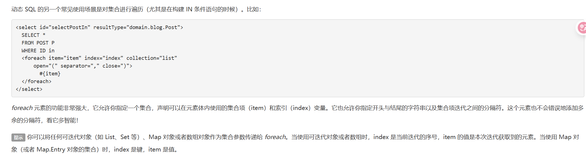

# 动态SQL

**什么是动态sql：**根据不同的条件生成不同的sql语句

~~~xml
如果你之前用过 JSTL 或任何基于类 XML 语言的文本处理器，你对动态 SQL 元素可能会感觉似曾相识。在 MyBatis 之前的版本中，需要花时间了解大量的元素。借助功能强大的基于 OGNL 的表达式，MyBatis 3 替换了之前的大部分元素，大大精简了元素种类，现在要学习的元素种类比原来的一半还要少。

if
choose (when, otherwise)
trim (where, set)
foreach
~~~

## 搭建环境

~~~sql
create table blog(
    id varchar(50) not null comment '博客id',
    title varchar(100) not null comment '博客标题',
    author varchar(30) not null comment '博客作者',
    create_time datetime not null comment '创建时间',
    views int(30) not null comment '浏览量'
)engine=Innodb default  charset=utf8
~~~

## IF

~~~xml
	<!--List<Blog> queryBlog(Map map)-->	
	<select id="queryBlog" parameterType="map" resultType="Blog">
        select * from blog where 1=1
        <if test="title != null">
            and title=#{title}
        </if>
        <if test="author != null">
            and author=#{author}
        </if>
    </select>
~~~

## choose(when, otherwise)

面对只想选择一个条件的情况，可以选择choose标签，下面这种情况otherwise标签可写可不写

~~~xml
	<select id="queryBlogChoose" parameterType="map" resultType="Blog">
        select * from blog where 1=1
        <choose>
            <when test="title != null">
                and title like #{title}
            </when>
            <when test="author != null">
                and author like #{author}
            </when>
            <otherwise>
                and 1=1
            </otherwise>
        </choose>
    </where>
    </select>
~~~

## trim（where， set）

由于where 1=1不可能实际应用，因此引入了where标签，where只会在子元素返回任何内容时才插入“where”，而且如果子句的开头是and或or时，会自动将它们去除

~~~xml
	<select id="queryBlogChoose" parameterType="map" resultType="Blog">
        select * from blog
        <where>
            <choose>
                <when test="title != null">
                    title like #{title}
                </when>
                <when test="author != null">
                    and author like #{author}
                </when>
            </choose>
        </where>
    </select>
~~~

为了应对更新数据时的逗号问题，类似的标签有set，当所有条件都不通过时，set不会被添加到语句中

~~~xml
	<update id="updateBlog" parameterType="map">
        update blog
        <set>
            <if  test="title != null">
                title = #{title},
            </if>
            <if test="author != null">
                author = #{author}
            </if>
            <if test="views != null">
                views = #{views},
            </if>
        </set>
        where id = #{id}
    </update>
~~~

可以使用自定义trim标签控制where和set的功能，例如：

~~~xml
<!--与where,set元素等价的trim元素-->
	<trim prefix="where" prefixOverrides="and |or ">
        ...
	</trim>
	<trim prefix="set" suffixOverrides=",">
		...
	</trim>
<!--
子句为trim元素包裹起来的sql语句(以|分隔，注意空格也参与匹配)
prefixOverrides：子句首的命中词列表，以|分隔，忽略大小写。如果命中（轮询命中词，最多只命中一次），会删除子句首命中的词；没命中就算了。
prefix：删除子句句首后，在子句最前边加上单个空格+prefix。
suffixOverrides：子句尾的命中词列表，以|分隔，忽略大小写。如果命中（轮询命中词，最多只命中一次），会删除子句尾命中的词；没命中就算了。
suffix：删除子句句尾后，在子句最后边加上单个空格+suffix。
-->
~~~

## SQL片段

将重复多次的代码提取出来成为一个公共的代码片段，在后面使用include包含

~~~xml
	<sql id="anyName">
        <if  test="title != null">
            title = #{title},
        </if>
        <if test="author != null">
        author = #{author}
        </if>
    </sql>

    <select id="queryBlog" parameterType="map" resultType="Blog">
        select * from blog where 1=1
       <include refid="anyName"/>
    </select>
~~~

注意事项：

- 最好基于单标来定义SQL片段
- 不要存在where标签

## foreach

解决类似`select * from user where 1=1 and id in (1,2,3)`类似问题

举例：

~~~xml
	select * from user where 1=1
	and
	<foreach item="id" collection="set"
             open="(" separator="or" close=")">
			id=#{id}
	</foreach>

	<!--结果将为select * from user where 1=1 and (id=1 or id=2 or id=3)-->

	<select id="queryBlogsByIds" parameterType="arraylist" resultType="Blog">
        select * from blog
        <where>
            <foreach item="id" collection="list" open="("
                separator="or" close=")">
                id = #{id}
            </foreach>
        </where>
    </select>
~~~

