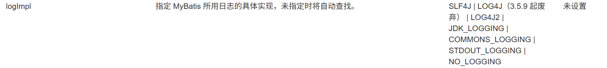
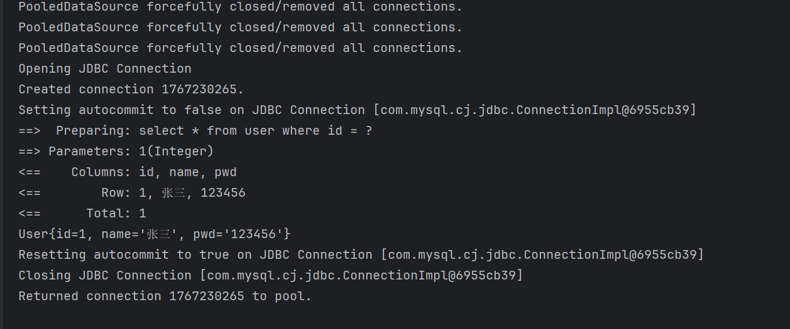

## 日志

### 日志工厂

如果一个数据库操作出现了异常需要排错，日志就是最好的助手。

曾经： sout、debug

现在： 日志工厂

- SLF4J
- LOG4J    【3.5.19已废弃】
- LOG4J2    【掌握】
- JDK_LOGGING
- COMMONS_LOGGING
- STDOUT_LOGGING 【掌握】
- NO_LOGGING

#### STDOUT_LOGGING

在mybatis核心配置文件中配置如下内容

~~~xml
<settings>
    <setting name="logImpl" value="STDOUT_LOGGING"/>
</settings>
~~~

效果：

#### LOG4J2

1.添加maven依赖

~~~xml
		<dependency>
            <groupId>org.apache.logging.log4j</groupId>
            <artifactId>log4j-core</artifactId>
            <version>2.14.1</version>
        </dependency>
        <dependency>
            <groupId>org.apache.logging.log4j</groupId>
            <artifactId>log4j-api</artifactId>
            <version>2.14.1</version>
        </dependency>
~~~

2.编写xml配置文件

~~~xml
<?xml version="1.0" encoding="UTF-8"?>
<Configuration status="WARN">
    <Appenders>
        <Console name="Console" target="SYSTEM_OUT">
            <PatternLayout pattern="%d{yyyy-MM-dd HH:mm:ss} [%t] %-5level %logger{36} - %msg%n"/>
        </Console>
    </Appenders>
    <Loggers>
        <Root level="info">
            <AppenderRef ref="Console"/>
        </Root>
    </Loggers>
</Configuration>
~~~

