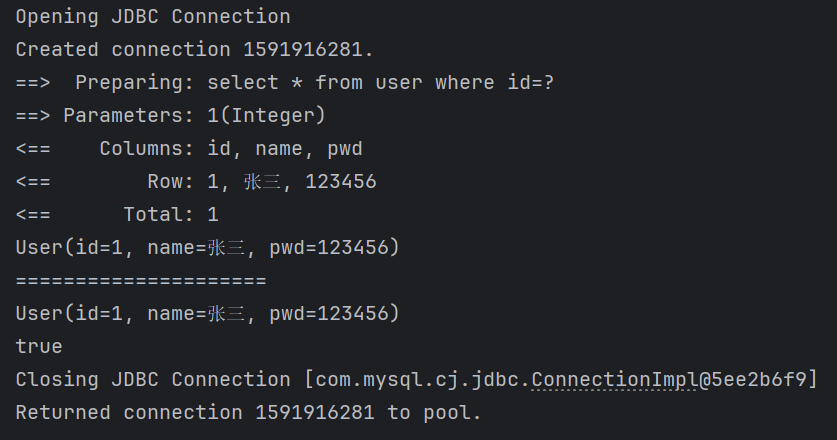
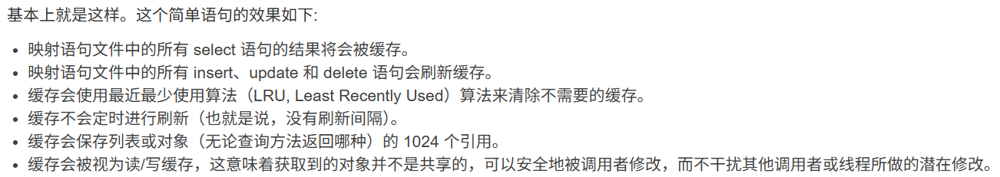
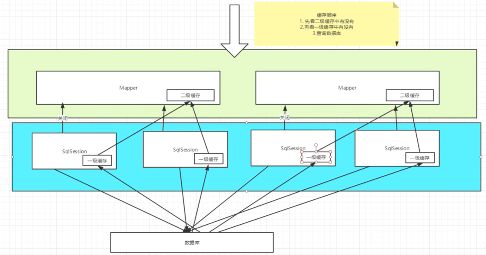

# 缓存

前言：由于查询需要连接数据库，十分耗资源，于是我们考虑将一次查询的结果暂存到一个可以直接取到的地方——内存作为缓存，当我们再次查询相同的数据时就可以直接从缓存中取出

1.什么是缓存？

- 存在内存中的临时数据
- 将用户经常查询的数据放在缓存中，用户去查询数据就不用从磁盘（关系型数据库数据文件）上查询，从缓存中查询，从而提高查询效率。解决高并发系统的性能问题

2.为什么使用缓存？

- 减少和数据库的交互次数，减少系统开销，提高系统效率

3.什么样的数据能使用缓存？

- 经常查询且不经常改变的数据

## Mybatis缓存

Mybatis系统中默认定义了两级缓存：一级缓存和二级缓存

- 默认情况下，只有一级缓存开启。（SqlSession级别的缓存，也称本地缓存）
- 二级缓存需要手动开启和配置，它是基于namespace级别的缓存
- 为了提高扩展性，Mybatis定义了缓存接口Cache，可以通过实现接口来自定义二级缓存

### 一级缓存

**仅在一个SqlSession期间有效**

~~~java
		SqlSession sqlSession = MybatisUtil.getSqlSession();
        UserMapper userMapper = sqlSession.getMapper(UserMapper.class);
        User user = userMapper.getUserById(1);
        System.out.println(user);
        System.out.println("=====================");
        User user2 = userMapper.getUserById(1);
        System.out.println(user2);

        System.out.println(user == user2);      //true
        sqlSession.close();

		//通过日志可以了解只访问了一次数据库
~~~

缓存失效的情况：

1. 查询不同的东西
2. 增删改操作，可能导致数据变化，缓存会刷新
3. 通过不同的Mapper查询
4. 手动清理缓存（sqlSession.closeCache())

### 二级缓存

二级缓存也叫全局缓存，是基于namespace级别的缓存，一个命名空间对应一个二级缓存

工作机制：

1. 一个会话查询一条数据，数据将被放置在一级缓存中
2. 会话关闭后该会话对应的一级缓存将被保存到二级缓存中
3. 新的会话查询信息将优先从二级缓存中获取内容
4. 不同的mapper查出的数据会放在自己命名空间对应的缓存中

在核心配置文件mybatis-config.xml中加上一行`<cache/>`即可成功开启二级缓存

步骤：

1. 开启全局缓存

   ~~~xml
   		<!--默认就是开启的，这里显式声明一下-->
           <setting name="cacheEnables" value="true"/>
   ~~~

2. 在SQL映射文件中开启二级缓存：加上一行`<cache/>`即可

可以自定义cache的相关行为

~~~xml
<cache
  eviction="FIFO"
  flushInterval="60000"
  size="512"
  readOnly="true"/>
<!--这个更高级的配置创建了一个 FIFO 缓存，每隔 60 秒刷新，最多可以存储结果对象或列表的 512 个引用，而且返回的对象被认为是只读的，因此对它们进行修改可能会在不同线程中的调用者产生冲突-->
~~~

3. 测试

~~~java
		SqlSession sqlSession = MybatisUtil.getSqlSession();
        SqlSession sqlSession2 = MybatisUtil.getSqlSession();
        UserMapper userMapper = sqlSession.getMapper(UserMapper.class);
        User user = userMapper.getUserById(1);
        System.out.println(user);
        System.out.println("=====================");
        User user2 = userMapper.getUserById(1);
        System.out.println(user2);

        System.out.println(user == user2);      //true
        sqlSession.close();

        userMapper = sqlSession2.getMapper(UserMapper.class);
        user = userMapper.getUserById(1);
        System.out.println(user);
        sqlSession2.close();
~~~

并且与一级缓存类似，这两个查询出来的对象是相等的

**注意：**当不使用复杂配置时，即只使用`<cache/>`可能会出现对象未序列化错误。原因剖析：当第一次查询时，会从数据库获取数据并创建实体类对象，存入缓存时mybatis会尝试将该对象序列化存入缓存，然后面临缓存命中时，又将从内存中取出相应字节流反序列成为对象；我们可以通过将相应类实现序列化接口来解决，也可以在开启缓存时配置`readOnly=“true”`，默认值为false，表示返回对象的深拷贝，需要序列化和反序列化，设置为true就将从缓存中返回对象的统一实例（引用）。

==谨慎使用二级缓存==：二级缓存适用于**读多写少**、**数据实时性要求不高**的场景。在分布式环境下，数据更新后，各个节点的缓存清理会变得复杂，容易产生脏数据。 对于复杂的应用，可以考虑直接使用Redis等分布式缓存，并配合更强大的序列化方案（如Kryo、Protobuf），而不是依赖MyBatis自带的二级缓存机制。 

### 缓存原理

查询顺序：二级缓存->一级缓存->数据库

### 自定义缓存——ehcache

 Ehcache是一种广泛使用的开源Java分布式缓存。主要面向通用缓存,[Java EE](https://baike.baidu.com/item/Java EE/2180381?fromModule=lemma_inlink)和[轻量级容器](https://baike.baidu.com/item/轻量级容器/3877340?fromModule=lemma_inlink)。 

使用步骤：

1. 导包

~~~xml
<!--还有一个非mybatis的版本的被广泛使用-->
<!-- https://mvnrepository.com/artifact/org.mybatis.caches/mybatis-ehcache -->
<dependency>
    <groupId>org.mybatis.caches</groupId>
    <artifactId>mybatis-ehcache</artifactId>
    <version>1.2.1</version>
</dependency>
~~~

2. 在cache中设置缓存策略

~~~xml
<cache type="org.mybatis.caches.ehcache.EhcacheCache"/>
~~~

3. 可以自定义ehcache配置，在资源文件夹中增加ehcache.xml文件

~~~xml
<?xml version="1.0" encoding="UTF-8"?>
<ehcache xmlns:xsi="http://www.w3.org/2001/XMLSchema-instance"
         xsi:noNamespaceSchemaLocation="http://ehcache.org/ehcache.xsd"
         updateCheck="false">

    <diskStore path="./tmpdir/Tmp_EhCache"/>

<!--    默认缓存策略，当ehcache找不到定义的缓存时则使用这个缓存策略-->
    <defaultCache
            eternal="false"
            maxElementsInMemory="10000"
            overflowToDisk="false"
            diskPersistent="false"
            timeToIdleSeconds="1800"
            timeToLiveSeconds="259200"
            memoryStoreEvictionPolicy="LRU"/>

<!--   定义缓存策略-->
<!--
    eternal:对象是否永久有效，一旦设为true，则timeout失效
-->
    <cache
            name="cloud_user"
            eternal="false"
            maxElementsInMemory="5000"
            overflowToDisk="false"
            diskPersistent="false"
            timeToIdleSeconds="1800"
            timeToLiveSeconds="1800"
            memoryStoreEvictionPolicy="LRU"/>
</ehcache>
~~~

同样可以自定义缓存，但没有必要：

~~~java
import org.apache.ibatis.cache.Cache;
public class MyCache implements Cache{

    @Override
    public String getId() {
        return "";
    }

    @Override
    public void putObject(Object key, Object value) {

    }

    @Override
    public Object getObject(Object key) {
        return null;
    }

    @Override
    public Object removeObject(Object key) {
        return null;
    }

    @Override
    public void clear() {

    }

    @Override
    public int getSize() {
        return 0;
    }
}
~~~

